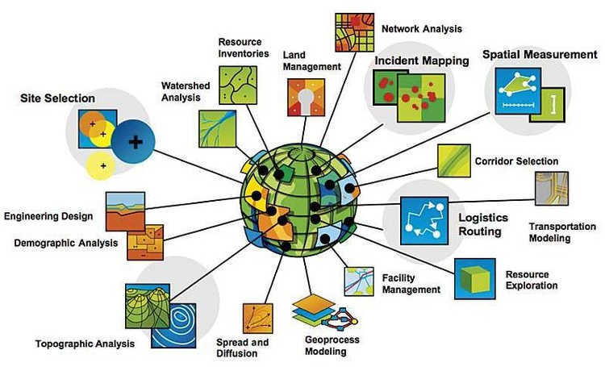

# Conceptos Básicos de SIG 
Keywords: `SIG` `GIS` `Data capture` `Storage data` `Spatial` `Geographic`

 

 <b>Universidad Escuela Colombiana de Ingeniería Julio Garavito</b>  
Juan David Rodríguez <a href="https://github.com/juanrodace/"><i>(ver GitHub)</i></a> 
Profesor del Centro de Estudios Hidráulicos 

## ¿Qué es un Sistema de Información Geográfica - SIG?

Un Sistema de Información Geográfica (SIG) se puede describir como un conjunto de herramientas o componentes que permiten recopilar, almacenar, procesar, analizar y representar información y/o datos geográficos. En otras palabras, un SIG es una herramienta que integra información espacial y atributiva para crear un contexto más completo y comprensible de la realidad.

 
 

### Componentes 

Un SIG generalmente se componen de software, hardware, datos geográficos y personal capacitado para operar y mantener el sistema. 

- **Hardware**: los componentes físicos que permiten el funcionamiento del SIG, como computadoras, impresoras, escáneres, etc.

- **Software**: los programas que permiten el manejo de los datos geográficos, como ArcGIS, QGIS, GRASS, etc. Algunas de las herramientas más populares de software en SIG son ArcGIS, QGIS y Google Earth. Estos sistemas han demostrado ser herramientas poderosas para comprender y gestionar el mundo que nos rodea a través del análisis y la interpretación de la información geoespacial.

- **Datos**: la información georreferenciada que se almacena y procesa en el SIG, como mapas, imágenes, tablas, etc.

- **Personas**: los usuarios y especialistas que utilizan el SIG para diferentes fines, como análisis, gestión, planificación, etc.

- **Procedimientos**: las normas y métodos que se aplican para el uso del SIG, como estándares, protocolos, manuales, etc.

## Potencial de los SIG

El potencial de los SIG es bastante amplio, donde podemos resaltar los siguientes usos: 

- **Captura de datos**: Recopilar datos geográficos de una amplia variedad de fuentes como encuestas, imágenes satelitales, fotografías aéreas, uso de tecnologías como GPS y teledetección.

- **Almacenamiento y organización**: Almacenar datos geográficos en una variedad de formatos, como bases de datos relacionales, bases de datos espaciales y formatos vectoriales, permitiendo su consulta y análisis eficiente.

- **Análisis espacial**: Realizar operaciones como superposición de capas, búsqueda de proximidad, análisis de redes y modelado espacial para extraer información e identificar tendencias y patrones significativos.

- **Visualización**: Crear mapas temáticos, escenas 3D, tablas, gráficas y visualizaciones interactivas para comunicar datos geográficos y patrones de manera efectiva.

- **Crear consultas interactivas**: Seleccionar y filtrar los datos geográficos según diferentes criterios, como atributos, localización, distancia, etc.

- **Compartir datos geográficos**: Compartir datos geográficos con otros usuarios a través de una variedad de medios, como Internet, intranets y correo electrónico.

- **Toma de decisiones**: Ayudar a tomar decisiones informadas al proporcionar un contexto espacial para problemas complejos.

## Aplicación de los SIG

Los SIG se han vuelto cada vez más populares en los últimos años debido a la creciente disponibilidad de datos geográficos y la mejora de la tecnología, potenciando la toma de decisiones informadas sobre el uso del espacio y los recursos. Hoy en día se utilizan en una amplia gama de industrias, incluidas el gobierno, la empresa privada y la educación. Así mismo, se aplican a diversos campos como el urbanismo, topografía, ingeniería, gestión del medio ambiente, agricultura, gestión del riesgo, arquitectura, navegación entre otros. 

 
 

- Planificación urbana: los planificadores urbanos utilizan los SIG para diseñar y gestionar el desarrollo urbano, incluyendo infraestructuras, zonas residenciales, parques, calles y servicios públicos. Pueden usar los SIG para identificar áreas que están subdesarrolladas o que están en riesgo de inundaciones.

- Gestión de recursos naturales: los SIG son usados para mapear recursos como el agua, suelos, bosques, vida silvestre y minerales. Pueden usar los SIG para identificar áreas que son vulnerables a la erosión o la contaminación. Así como para facilitar el monitoreo de cambios ambientales y la toma de decisiones para la conservación y el uso eficiente de los recursos.

- Cartografía: Los SIG son esenciales en la creación y actualización de mapas precisos. Permiten representar información geográfica en diferentes escalas y formatos, lo que es crucial para la navegación y la planificación.

- Marketing: las empresas utilizan los SIG para identificar clientes potenciales y ubicaciones para nuevas tiendas. Pueden usar los SIG para crear mapas que muestran la densidad de población, la tasa de desempleo y otros factores que pueden afectar las ventas.

- Seguridad pública: las agencias de policía y bomberos utilizan los SIG para rastrear delitos, planificar operaciones de búsqueda y rescate y responder a emergencias. Pueden usar los SIG para crear mapas que muestran las ubicaciones de las escuelas, las iglesias y otros lugares públicos que pueden ser objetivos potenciales para el crimen.

- Agricultura de Precisión: Los agricultores utilizan los SIG para optimizar el uso de recursos agrícolas como fertilizantes y agua. Los datos geoespaciales ayudan a identificar áreas con problemas, determinar patrones de rendimiento de cultivos y aplicar tratamientos específicos.

- Epidemiología y Salud Pública: Los SIG se utilizan para rastrear y analizar la propagación de enfermedades, mapear la distribución de casos y comprender cómo factores geográficos pueden influir en la salud de una población.

- Gestión de Desastres: Los SIG permiten la planificación y respuesta efectiva a desastres naturales como terremotos, inundaciones e incendios forestales. Ayudan a identificar áreas de riesgo, evaluar daños y coordinar los esfuerzos de socorro.

- Servicios de Emergencia: Los servicios de policía, bomberos y ambulancias utilizan SIG para la navegación precisa y la asignación de recursos en tiempo real. Los mapas actualizados y las rutas eficientes son cruciales para responder a emergencias.

- Gestión de Redes de Transporte: Los SIG ayudan en la planificación y mantenimiento de redes de carreteras, vías férreas y sistemas de transporte público. Permiten optimizar rutas, evaluar la congestión y planificar mejoras.

- Arqueología y Patrimonio Cultural: Los SIG se aplican en la localización y preservación de sitios arqueológicos y patrimonio cultural. Ayudan a analizar patrones espaciales y a tomar decisiones sobre excavaciones y conservación.

- Educación: Los SIG se utilizan en la enseñanza y el aprendizaje para ilustrar conceptos geográficos y permitir a los estudiantes explorar patrones y relaciones especiales.

## Tipos de herramienta SIG

Existen diferentes tipos de herramientas SIG según su funcionalidad, plataforma y licencia, cada una con sus propias características y enfoques. Algunos de los tipos de herramienta SIG más son:

-**Software SIG de escritorio**: son aplicaciones que se instalan en el ordenador y ofrecen una amplia gama de funciones para crear, editar, analizar y compartir datos geográficos. Algunos ejemplos son ArcGIS, QGIS, gvSIG, GRASS GIS, SAGA GIS, entre otros.

- **Complementos SIG en la nube**: son servicios web que se integran con el software SIG de escritorio y permiten acceder a datos, mapas y análisis en línea. Algunos ejemplos son ArcGIS Online, Google Earth Engine, Carto, entre otros.

- **Bases de datos espaciales**: son sistemas que almacenan y gestionan datos geográficos en forma de tablas, geometrías y atributos. Algunos ejemplos son PostgreSQL/PostGIS, Oracle Spatial y SQLite/SpatiaLite.

- **Librerías de programación**: son conjuntos de herramientas y funciones que se pueden utilizar para desarrollar aplicaciones SIG personalizadas o automatizar procesos geográficos. Algunos ejemplos son GDAL/OGR, GeoPandas y Shapely. 

- **Herramientas de visualización**: son aplicaciones que permiten visualizar y explorar datos geográficos sin necesidad de instalar ningún software. Algunos ejemplos son Explorer for ArcGIS, ArcReader, Google Earth, Google Maps.

- **Aplicaciones móviles SIG**: Estas son aplicaciones diseñadas para dispositivos móviles (como teléfonos y tabletas) que permiten a los usuarios recopilar datos geoespaciales en el campo y realizar análisis básicos. Algunos ejemplos son Collector for ArcGIS y Fulcrum.

- **Herramientas para sensores remotos**: Algunas herramientas SIG se especializan en el procesamiento y análisis de imágenes satelitales y otros datos obtenidos mediante sensores remotos, como el caso de ENVI, Ilwis y ERDAS Imagine.

### Control de versiones

| Versión | Descripción                                                    |                    Autor                    | Horas |
|:-------:|:---------------------------------------------------------------|:-------------------------------------------:|:-----:|
| 2023.08 | Versión inicial, definición de estructura general y contenido. | [juanrodace](https://github.com/juanrodace) |  1.0  |
| 2023.08 | Inclusión de conceptos, esquemas y ejemplos.                   | [juanrodace](https://github.com/juanrodace) |  2.0  |

| [:arrow_backward:Anterior](Readme.md) | [:house: Inicio](../../Readme.md) | [:beginner: Ayuda](https://github.com/juanrodace/MOHI/discussions) | [Siguiente:arrow_forward:](Fundamentos.md) |
|---------------------------------------|-----------------------------------|--------------------------------------------------------------------|--------------------------------------------|

_MOHI es de uso libre para fines académicos, conoce nuestra licencia, cláusulas, condiciones de uso y como referenciar los contenidos publicados en este repositorio, dando [clic aquí](../../License.md)._

_¡Encontraste útil este repositorio!, apoya su difusión marcando este repositorio con una ⭐ o síguenos dando clic en el botón Follow de [juanrodace](https://github.com/juanrodace) en GitHub._ 

