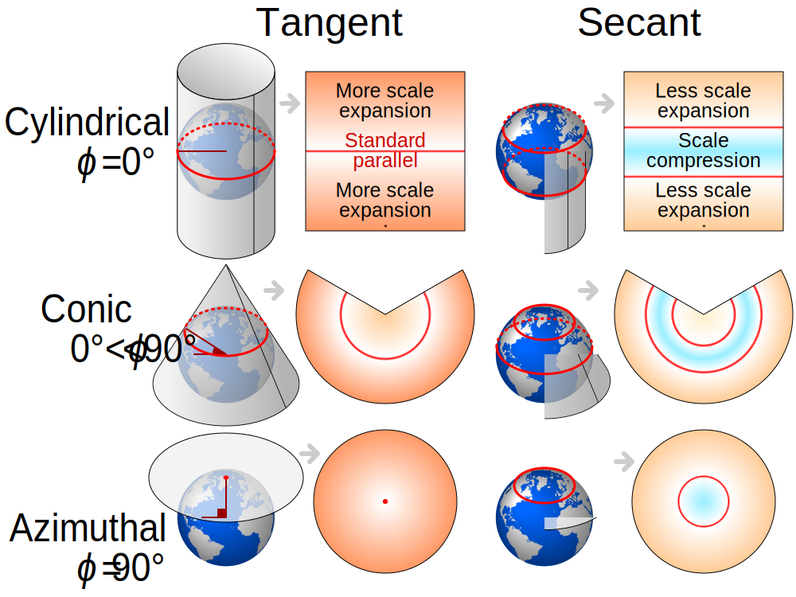
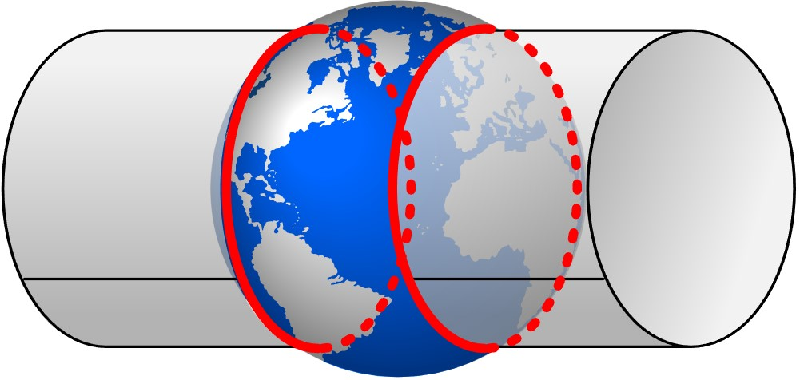
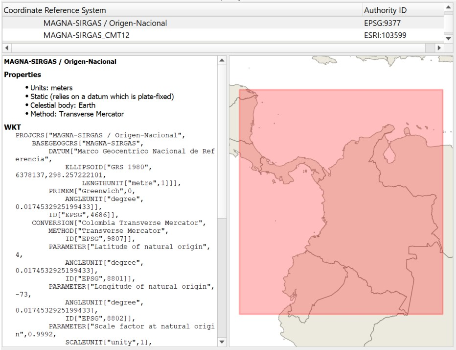
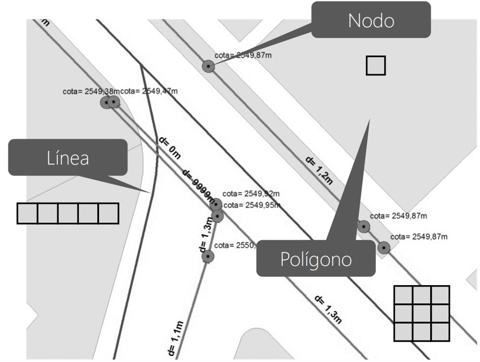
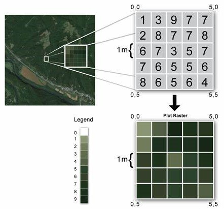

<div align="center"><a href="https://www.escuelaing.edu.co/es/investigacion-e-innovacion/centro-de-estudios-hidraulicos/" target="_blank"></a></div>

# Fundamentales Generales SIG 
Keywords: `SIG` `GIS` `Georeferencing` `Coordinate systems` `Data types` `Geographic`

<div align="center">
<br>

<br><b>Universidad Escuela Colombiana de Ingeniería Julio Garavito</b><br> 
Juan David Rodríguez <a href="https://github.com/juanrodace/"><i>(ver GitHub)</i></a><br>
Profesor del Centro de Estudios Hidráulicos<br>
</div>

## Georreferenciación

La georreferenciación es el proceso de asignar una ubicación espacial a una **entidad cartográfica** (incluyendo sus atributos), usando un sistema de coordenadas y un datum específicos. En otras palabras, es la técnica utilizada para vincular datos no geoespaciales con coordenadas geográficas para que puedan ser representados y analizados en un contexto espacial. Por ejemplo, se puede georreferenciar una imagen satelital, un mapa antiguo, un punto de interés, entre otros. 

La georreferenciación es un componente fundamental de la capacidad de los Sistemas de Información Geográfica (SIG) y otras herramientas que trabajan con datos espaciales, ya que permite la integración y el análisis efectivo de datos en un contexto geográfico.

Algunos ejemplos de cómo se aplica la georreferenciación incluyen:

- Cartografía digital: Convertir mapas físicos o imágenes en mapas digitales georreferenciados para su uso en sistemas de información geográfica (SIG).
- Fotografía aérea o satelital: Asociar imágenes capturadas desde el aire o desde satélites con coordenadas geográficas, lo que permite la superposición y análisis de datos en el contexto geoespacial.
- Levantamientos topográficos: Asignar coordenadas a puntos de elevación, líneas de contorno y otros elementos en un terreno para crear modelos digitales de elevación.
- Análisis de datos de campo: Registrar ubicaciones precisas donde se han tomado mediciones o recopilado datos para su análisis posterior en un contexto geográfico.
- Sistemas de navegación: Determinar la posición y la dirección de un vehículo o una persona en tiempo real utilizando señales GPS (Sistema de Posicionamiento Global).

> Una *entidad cartográfica* es un elemento que representa una característica geográfica en un mapa o en un SIG. Por ejemplo, un punto, una línea, un polígono, un píxel, etc. Cada entidad cartográfica tiene una geometría (forma y ubicación) y unos atributos (información descriptiva) asociados.

### Sistema de coordenadas geográficas

Un sistema de coordenadas geográficas es un sistema de referencia utilizado para ubicar puntos precisos en la superficie de la Tierra. Está basado en líneas imaginarias que dividen la Tierra en círculos y segmentos que permiten describir la posición de cualquier punto en términos de su latitud y longitud. Este tipo de sistema se utiliza para proporcionar una manera estándar y universal de expresar ubicaciones geográficas usando dos números: **latitud** y **longitud**. 

La latitud es la medida angular de la distancia al norte o al sur del ecuador de la Tierra. Se mide en grados, minutos y segundos, y varía desde 0° en el ecuador hasta 90° en los polos norte y sur. La latitud norte se representa con valores positivos y la latitud sur con valores negativos. Por su parte, la longitud es la medida angular de la distancia al este o al oeste del meridiano principal, que es el Meridiano de Greenwich (0° de longitud). También se mide en grados, minutos y segundos, y varía desde 0° hasta 180° hacia el este y hacia el oeste desde el meridiano principal.

<div align="center">
<br>
<br>
Esta imagen muestra cómo se determinan la latitud y la longitud utilizando el sistema de grados decimales.<br> 
<sub><i>Tomado de Preparation for Orienteering at the Priory. Geospatial Field Methods Couse. 2014.</i></sub><br>
</div>

La forma teórica que convencionalmente se utiliza para definir la Tierra es el Geoide qué se define teóricamente a partir del nivel medio de los mares. Debido a su forma irregular y para la definición de una forma geométrica que pueda ser resuelta matemáticamente de forma simple se utilizan los conceptos de esfera y elipsoide.

- Sistema de coordenadas geográficas esféricas: se basa en una superficie esférica que aproxima la forma de la Tierra, y se usa para fines astronómicos o de navegación. Las coordenadas se expresan en grados sexagesimales o centesimales1.
- Sistema de coordenadas geográficas elipsoidales: se basa en una superficie elipsoidal que se ajusta mejor a la forma real de la Tierra, y se usa para fines geodésicos o cartográficos. Las coordenadas se expresan en grados decimales.

<div align="center">
<br>
<br>
Relaciones geométricas entre la superficie topográfica de la Tierra, 
el geoide y el elipsoide, necesarias para una cartografía de precisión.<br>
<sub><i>Tomado de Albireo Topografía y Geomática. Topografía geoide y elipsoide. http://www.albireotopografia.es </i></sub><br>
</div>

Existen varios sistemas de coordenadas geográficas que se utilizan en todo el mundo para representar ubicaciones en la Tierra. En la siguiente tabla se presentan algunos los más comunes.

|                            Nombre                            | Descripción                                                                                                                                                                                                                                                                                                                                                                     |
|:------------------------------------------------------------:|:--------------------------------------------------------------------------------------------------------------------------------------------------------------------------------------------------------------------------------------------------------------------------------------------------------------------------------------------------------------------------------|
|              WGS84 (World Geodetic System 1984)              | Este es el sistema de referencia global utilizado por el Sistema de Posicionamiento Global (GPS) y muchos otros sistemas de navegación por satélite. Es ampliamente utilizado en aplicaciones de cartografía y geolocalización.                                                                                                                                                 |
|              NAD83 (North American Datum 1983)               | Este sistema es utilizado en América del Norte y es la base para muchos sistemas de referencia de coordenadas utilizados en los Estados Unidos y Canadá.                                                                                                                                                                                                                        |
| SIRGAS (Sistema de Referencia Geocéntrico para las Américas) | Utilizado en América Latina para la representación de ubicaciones geográficas.                                                                                                                                                                                                                                                                                                  |
|                  ED50 (European Datum 1950)                  | Utilizado en gran parte de Europa antes de la adopción del WGS84. Aunque ha sido en gran medida reemplazado por el WGS84, todavía puede encontrarse en algunos mapas y datos antiguos.                                                                                                                                                                                          |
|                             UTM                              | Es un sistema de coordenadas rectangulares que se utiliza para el mapeo. El sistema UTM se divide en 60 zonas, cada una de las cuales cubre 6 grados de longitud. Cada zona tiene un código de dos letras, que se basa en su ubicación geográfica. El sistema UTM se utiliza para una variedad de propósitos, como la navegación, la cartografía y la investigación científica. |

### Códigos EPSG

Las iniciales **EPSG** representan "European Petroleum Survey Group", que era un grupo de trabajo que originalmente se creó en Europa en la década de 1980 para desarrollar estándares y recomendaciones técnicas para la industria petrolera y del gas. Uno de los logros más notables del grupo fue la creación de un conjunto de códigos numéricos únicos llamados "Códigos EPSG" que se utilizan para identificar sistemas de referencia de coordenadas y transformaciones geodésicas en aplicaciones de Sistemas de Información Geográfica (SIG) y otros sistemas relacionados.

Estos códigos, conocidos como "Códigos EPSG" o "ID EPSG", proporcionan una forma estándar y global de identificar sistemas de coordenadas geográficas, sistemas de proyección cartográfica y transformaciones entre diferentes sistemas de referencia espacial. Cada sistema de coordenadas geográficas o proyección cartográfica tiene un código EPSG único asignado a él.

Aunque el grupo original EPSG ya no está activo, sus estándares y códigos siguen siendo ampliamente utilizados en la industria de los SIG y la cartografía. Los códigos EPSG son utilizados por muchos software y herramientas SIG para asegurarse de que los sistemas de coordenadas y las transformaciones geodésicas se interpreten correctamente en diferentes aplicaciones y plataformas. En la siguiente tabla se presentan algunos de los códigos EPSG más conocidos que representan sistemas de coordenadas geográficas y proyecciones cartográficas utilizadas en todo el mundo.

| Código EPSG | Sistema de Coordenadas / Proyección     | Descripción                                                                                            |
|:-----------:|-----------------------------------------|--------------------------------------------------------------------------------------------------------|
|    4326     | WGS 84 (Latitud y Longitud)             | Sistema global de coordenadas geográficas basado en el WGS 84.                                         |
|    3857     | WGS 84 / Pseudo-Mercator (Web Mercator) | Proyección utilizada en mapas web y aplicaciones de navegación en línea.                               |
|    3395     | WGS 84 / World Mercator                 | Proyección Mercator modificada para representar áreas polares con menos distorsión.                    |
|    32633    | WGS 84 / UTM zona 33                    | Sistema de coordenadas UTM para la zona 33 en Europa.                                                  |
|    26912    | NAD83 / UTM zona 12                     | Sistema de coordenadas UTM para la zona 12 en América del Norte.                                       |
|    23030    | ED50 / UTM zona 30                      | Sistema de coordenadas UTM para la zona 30 basado en el ED50.                                          |
|    25832    | ETRS89 / UTM zona 32                    | Sistema de coordenadas UTM para la zona 32 en Europa basado en el ETRS89.                              |
|    54009    | Mollweide                               | Proyección cartográfica utilizada para representar áreas extensas con distorsiones de forma reducidas. |
|   102013    | Albers Equal Area Conic                 | Proyección cónica utilizada para representar áreas con distorsiones de área mínimas.                   |
|    27700    | OSGB 1936 / British National Grid       | Sistema de coordenadas utilizado en el Reino Unido.                                                    |
|    32718    | WGS 84 / UTM zona 18 sur                | Sistema de coordenadas UTM para la zona 18 en el hemisferio sur.                                       |

### Sistema de proyección de coordenadas

Un sistema de proyección de coordenadas es un conjunto de reglas y fórmulas matemáticas que se utilizan para representar la superficie curva de la Tierra en un plano bidimensional, como un mapa. Debido a que la Tierra es tridimensional y curva, es necesario aplicar una proyección para representar su forma en un mapa plano, lo que puede resultar en distorsiones en áreas, formas, distancias o direcciones. Los sistemas de proyección son esenciales para la cartografía y la representación precisa de la información geográfica en un formato utilizable. Existen muchas proyecciones diferentes, cada una con sus propias características y aplicaciones específicas. Algunos tipos comunes de sistemas de proyección de coordenadas incluyen:

- Proyecciones cilíndricas: Estas proyecciones proyectan puntos desde la superficie de la Tierra sobre un cilindro imaginario que rodea el globo. Ejemplos incluyen la proyección de Mercator y la proyección de Lambert.

- Proyecciones cónicas: En estas proyecciones, los puntos se proyectan desde la superficie de la Tierra sobre un cono imaginario que se coloca sobre el globo. Ejemplos incluyen la proyección de Albers y la proyección de Lambert cónica conforme.

- Proyecciones pseudocilíndricas: Estas proyecciones buscan un equilibrio entre la distorsión de forma y área. Ejemplos incluyen la proyección de Mollweide y la proyección de Robinson.


<div align="center">
<br>
<br>
Comparación de proyecciones de mapas cilíndricos, cónicos y azimutales tangentes y secantes.<br>
<sub><i>Tomado de Comparison of tangent and secant cylindrical, conic and azimuthal map projections with standard parallels shown in red by CMG Lee. User:Cmglee, US government, Clindberg, Palosirkka. 2019.</i></sub><br>
</div>

No existe una proyección perfecta que sea adecuada para todas las situaciones, por lo que la elección depende de las necesidades específicas y los compromisos entre diferentes tipos de distorsiones.

## Georeferenciación en Colombia

### Sistema de coordenadas MAGNA-SIRGAS

Mediante resolución No. 068 de 2005 se adoptó como único datum oficial de Colombia el Marco Geocéntrico Nacional de Referencia - MAGNA, que por estar referida a SIRGAS, se denomina convencionalmente **MAGNA-SRIGAS**. El Instituto Geográfico Agustín Codazzi (IGAC), entidad gubernamental encargada de los sistemas geodésicos nacionales de referencia, promueve la adopción de MAGNA-SIRGAS como sistema de referencia oficial del país, en reemplazo del Datum BOGOTÁ, definido en 1941. **MAGNA-SIRGAS** garantiza la compatibilidad de las coordenadas colombianas con las técnicas espaciales de posicionamiento, por ejemplo los sistemas GNSS (Global Navigation Satellite Systems), y con conjuntos internacionales de datos georreferenciados. Los parámetros del sistema de coordenadas se presentan en la siguiente tabla.

<div align="center">

| Parámetro                 | Valor                                           |
|---------------------------|-------------------------------------------------|
| Código EPSG               | 4686                                            |
| Datum geodésico*          | MAGNA-SIRGAS*                                   |
| Elipsoide                 | GRS 1980                                        |
| Meridiano Principal       | Greenwich 0,000000000000000000 Grados decimales |
| Semieje mayor (a), metros | 6378137                                         | 
| Semieje menor (b), metros | 6356752.314                                     |
| ITRF                      | 1994, Época 1995.4                              |
</div>

La utilización del sistema **MAGNA-SIRGAS** está directamente relacionada con la definición de una superficie de referencia vertical (geoide) que permita obtener alturas clásicas (referidas al nivel medio del mar) a partir de información GPS. El Geoide en Colombia se ha determinado mediante la técnica remove/restore, la cual permite relacionar las características regionales (longitudes de onda larga) del campo de gravedad, expresadas en un Modelo Geopotencial Global (MGG), y sus detalles (longitudes de onda corta), obtenidos a través de la evaluación local del modelo físico matemático de Strokes (o Molodensky). Con ayuda de la herramienta QGIS podemos visualizar la información del sistema de coordenadas.

<div align="center">
<br><br>
</div>

### Sistema de proyección único Transversa de Mercator Secante

El sistema de proyección Transversa de Mercator Secante es un tipo de proyección cartográfica que se usa para representar regiones alargadas en dirección norte-sur. Esta proyección se basa en un cilindro que corta la Tierra en dos meridianos, creando una distorsión mínima en el área de interés. Esta proyección cartográfica es de tipo conforme, que prioriza ángulos garantizando así que un ángulo formado entre dos líneas sobre la superficie terrestre se conserve luego de aplicarse la proyección. Utiliza como superficie de referencia el área de un cilindro transverso, secante a la esfera, la escala de representación varía en función de la longitud y el parámetro de escala.

<div align="center">
<br>
<br>
Sistema de proyección Transversa de Mercator Secante.<br>
<sub><i>Tomado de Comparison of tangent and secant forms of Mercator map projections with standard parallels shown in red by CMG Lee. User:Cmglee, US government, Clindberg, Palosirkka. 2019.</i></sub><br>
</div>

En Colombia, el establecimiento de las condiciones técnicas mínimas que deben tener los productos básicos de cartografía oficial, han sido definidos de conformidad con lo dispuesto por la Resolución 471 del 14 de mayo de 2020 y la posterior Resolución 529 del 05 de junio de 2020, emitidas por el Instituto Geográfico Agustín Codazzi - IGAC, o la norma que la modifique y sustituya. Para ello y para garantizar la homogeneidad y continuidad en la representación de los elementos del territorio, así como facilitar los trabajos relacionados con la gestión de coordenadas en el país. En tal sentido, los proyectos, obras o actividades, sujetos al licenciamiento ambiental, deben ajustar su información geográfica a los lineamientos establecidos en la referida normatividad, para la evaluación y seguimiento de los estudios ambientales y/o presentación de los Informes de Cumplimiento Ambiental.

El sistema de proyección cartográfico para Colombia, con un **único origen**, consiste en una proyección cartográfica Transversa de Mercator Secante, cuyos parámetros están establecidos en el literal 'i' Sistema de Referencia del artículo 4 de la resolución 471 de 2020, los cuales pueden configurarse en software especializado para procesamiento de información geográfica. Los parámetros del sistema se presentan en la siguiente tabla.

El sistema de proyección EPSG 9377 es el sistema de proyección cartográfica oficial para Colombia, que se basa en el sistema de referencia geodésico MAGNA-SIRGAS y en la proyección transversal de Mercator. Los parámetros del sistema de proyección son los siguientes:

<div align="center">

| Parámetro                  |                  Valor                   |
|----------------------------|:----------------------------------------:|
| EPSG code                  |                   9377                   |
| Nombre                     |      MAGNA-SIRGAS / Origen-Nacional      |
| Proyección                 |     Transversa de Mercartor Secante      |
| Datum                      | Marco Geocentrico Nacional de Referencia |
| Elipsoide                  |                 GRS 1980                 |
| Latitud de origen          |                    4°                    |
| Meridiano central          |                   -73°                   |
| Falso este                 |                5000000 m                 |
| Falso norte                |                2000000 m                 |
| Factor de escala           |                  0.9992                  |
| Unidad                     |                  metro                   |

</div>

Este sistema de proyección facilita la integración de una única base de datos en coordenadas planas para todo el territorio y, permite representaciones desde escalas mayores 1:1000 hasta escalas regionales 1:1500000 usando una única proyección. Así mismo, promueve la interoperabilidad y uso de la información geográfica del país en los diferentes niveles territoriales y 
minimiza problemas de áreas de traslape entre regiones. Con ayuda de la herramienta QGIS podemos visualizar la información del sistema de coordenadas.

<div align="center">
<br><br>
</div>

```
PROJCS["MAGNA-SIRGAS_Origen-Nacional",
    GEOGCS["GCS_MAGNA",
        DATUM["D_MAGNA",
            SPHEROID["GRS_1980",6378137.0,298.257222101]],
        PRIMEM["Greenwich",0.0],
        UNIT["Degree",0.0174532925199433]],
    PROJECTION["Transverse_Mercator"],
    PARAMETER["False_Easting",5000000.0],
    PARAMETER["False_Northing",2000000.0],
    PARAMETER["Central_Meridian",-73.0],
    PARAMETER["Scale_Factor",0.9992],
    PARAMETER["Latitude_Of_Origin",4.0],
    UNIT["Meter",1.0]]
    
```

## Codificación y tipos de datos

La codificación de datos geográficos empleados en un SIG proviene de dos tipos de representaciones: vectorial y raster.

### Representación vectorial

Utiliza elementos o entidades de tipo punto, línea o polígono para la representación geográfica. Este tipo de datos se denomina discreto debido a que cada uno de ellos es independiente del otro. Por ejemplo un punto puede representar un pozo de inspección de alcantarillado, una línea un tramo de tubería o conducto, y un polígono el área de una subcuenca. 

<div align="center">
<br><br>
</div>

Los datos asociados a un elemento geográfico vectorial contenidos en los registros, pueden ser: 

- **Geométricos**: Tipo de elemento vectorial como Punto, Punto 3D, Línea, Línea 3D, Polígono, Polígono 3D.

- **Numéricos**: Tipo Binario o boolean (1 – 0), tipo fecha o date (Ej: 2010/06/01), enteros o integer (Ej:100) y reales simple o double (Ej:100 – 23.49). Son identificables fácilmente en la tabla de atributos debido a que el valor almacenado en el campo se alinea a la derecha. OID o ObjectID es un campo de sistema que se indexa de 0 a n en archivos de formas shapefile y de 1 a n en GDB o bases de datos geográficas de ArcGIS.

- **Texto (string)**: cadenas de caracteres usados para descripciones nominales o de cualidades de un elemento dentro de un registro.

- **Objetos**: archivos adjuntos, imágenes, hipervínculos, etc.

<div align="center">
<br><br>
</div>

### Representación raster

Se basa en una unidad fundamental llamada celda o píxel, los cuales definen toda una capa de información. Este tipo de datos se denomina continuo debido a que los valores son agrupados en celdas. Un ejemplo son las imágenes satelitales a partir de las cuales se pueden interpretar el valor de elevación y precipitación, temperatura, acidez en suelos, entre otros.

<div align="center">
<br><br>
</div>

### Formatos de Almacenamiento

- **Shapefile**: Archivo de formas nativo desarrollado por Esri que es utilizado por herramientas comerciales y de dominio público. Es el formato estándar para intercambio de información geográfica entre las diferentes plataformas. Cada cobertura o capa geográfica requiere de un sistema de proyección de coordenadas, no posee reglas topológicas directas y el formato de base de datos para almacenar atributos es dBase .dbf. Se compone de cuatro archivos:
  - (.dbf): Base o tabla de datos de atributos.
  - (.prj): Atributos de proyección geográfica. 
  - (.shp): Archivo de vectores.
  - (.shx): Archivo de índices.


- **KML/KMZ:** Formato utilizado para visualizar datos en aplicaciones de Google Earth. KML (Keyhole Markup Language) almacena datos de geometría y atributos, mientras que KMZ es un archivo comprimido que contiene datos KML y recursos relacionados.


- **DWG/DXF:**: Formatos utilizados en diseño asistido por computadora (CAD), pero también pueden contener información geoespacial. Son comunes en la industria de la ingeniería y la construcción.


- **GeoTIFF (.tif):** Formato de imagen raster georreferenciada que puede contener datos de elevación, imágenes aéreas, mapas topográficos y más.
 

- **ASCII:**


- **Geodatabase**: Base de datos geográfica que integra para cada conjunto de datos o Dataset, un único sistema de proyección de coordenadas, contiene reglas topológicas definidas, dominios y permite almacenar grandes volúmenes de información de forma eficiente y ágil que pueden ser editados simultáneamente por varios usuarios. Existen Geodatabases personales (.mdb PostgreSQL
postgis) y corporativas (.gdb, oracle).


- **NetCDF:** Formato utilizado para datos multidimensionales, como datos climáticos y oceánicos, que se pueden analizar y visualizar en SIG.


- **LAS/LAZ:** Formato utilizado para datos de nubes de puntos LiDAR (Light Detection and Ranging).

___

### Referencias
- LibroSIG: prendiendo a manejar los SIG en la gestión ambiental. Mancebo, S.; Ortega, E.;Martín, L.; Valentín, A. Madrid, España. 2009.  
- Sistemas de Información Geográfica. Olaya, Victor. Creative Commons Atribucion. 2012.
- References and Projection Used in the Colombian Cartograph. Serrato A., Pedro Karin. Perspectiva geográfica. 2009. 
- Cylindrical Projection: Mercator, Transverse Mercator and Miller. GISGeograpghy, _https://gisgeography.com_. 2022.
- Resolución No. 471 de 2020. Instituto Geográfico Agustín Codazzi - IGAC. Mayo 2020.
- Georreferenciación y sistemas de proyección de coordenadas. TSIG. Aguilar P., William. 2022.

### Control de versiones

| Versión | Descripción                                                    |                    Autor                    | Horas |
|:-------:|:---------------------------------------------------------------|:-------------------------------------------:|:-----:|
| 2023.08 | Versión inicial, definición de estructura general y contenido. | [juanrodace](https://github.com/juanrodace) |  1.0  |
| 2023.08 | Inclusión de conceptos, esquemas y ejemplos.                   | [juanrodace](https://github.com/juanrodace) |  4.0  |

| [:arrow_backward:Anterior](Conceptos.md) | [:house: Inicio](../../Readme.md) | [:beginner: Ayuda](https://github.com/juanrodace/MOHI/discussions) | [Siguiente:arrow_forward:](QGIS.md) |
|------------------------------------------|-----------------------------------|--------------------------------------------------------------------|-------------------------------------|

_MOHI es de uso libre para fines académicos, conoce nuestra licencia, cláusulas, condiciones de uso y como referenciar los contenidos publicados en este repositorio, dando [clic aquí](../../License.md)._

_¡Encontraste útil este repositorio!, apoya su difusión marcando este repositorio con una ⭐ o síguenos dando clic en el botón Follow de [juanrodace](https://github.com/juanrodace) en GitHub._