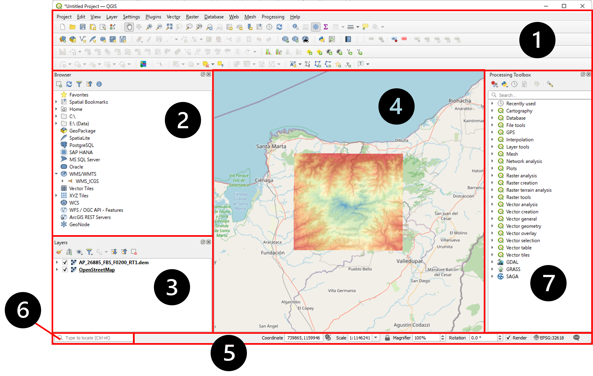

# QGIS. Generalidades, uso y estructura
Keywords: `GIS` `Software` `QGIS` `Data types` `Geographic`

 

 <b>Universidad Escuela Colombiana de Ingeniería Julio Garavito</b>  
Juan David Rodríguez <a href="https://github.com/juanrodace/"><i>(ver GitHub)</i></a> 
Profesor del Centro de Estudios Hidráulicos 

## ¿Qué es QGIS?

QGIS es un Sistema de Información Geográfica (SIG) de software libre y de código abierto, desarrollado como un proyecto oficial de Open Source Geospatial Foundation (OSGeo). Esta herramienta se encuentra disponible para diferentes sistemas operativos como GNU/Linux, Unix, macOS, Windows y Android. Este SIG soporta numerosos formatos raster y vectoriales, así como bases de datos. 

Algunas de las ventajas de utilizar QGIS como software que integra una gran variedad de herramientas y funciones SIG son:

- Instalar y usar el programa QGIS no tiene ningún costo.
- Si necesita alguna funcionalidad adicional en QGIS, puede patrocinar el desarrollo de una función o agregarla usted mismo si está familiarizado con la programación.
- Debido a que cualquiera puede agregar nuevas funciones y mejorar las existentes, QGIS nunca se estanca, sino que se mantiene en constante desarrollo. 
- Cuenta con amplia ayuda y documentación disponible que puede ser consultada con usuarios de QGIS o incluso a los desarrolladores.
- se puede instalar en MacOS, Windows y Linux.

### Estructura general

En la siguiente imagen, podemos identificar los principales componentes de la ventana principal de QGIS. A continuación encuentra una breve descripción para familiarizarse e iniciar a usar y explorar la interfaz QGIS. 

 
 

#### :one: Barra de herramientas (Toolbars).

Los conjuntos de herramientas que utiliza con más frecuencia se pueden convertir en barras de herramientas para un acceso básico. Por ejemplo, la barra de herramientas <kbd> Proyecto(Project)</kbd> le permite guardar, cargar, imprimir e iniciar un nuevo proyecto. Puede personalizar fácilmente la interfaz para ver solo las herramientas que utiliza con más frecuencia, agregando o eliminando barras de herramientas según sea necesario a través del menú <kbd> Ver(View)</kbd> ► <kbd>Barras de herramientas (Toolbars)</kbd>.

Incluso si no están visibles en una barra de herramientas, todas sus herramientas seguirán siendo accesibles a través de los menús. Por ejemplo, si elimina la barra de herramientas <kbd> Proyecto (Project)</kbd> (que contiene el botón Guardar), aún puede guardar su mapa haciendo clic en el menú Proyecto y luego haciendo clic en Guardar.

#### :two:  Panel de búsqueda o navegación (Browser panel).

Es un panel en QGIS que le permite navegar fácilmente en su base de datos. Puede tener acceso a archivos vectoriales comunes _(por ejemplo, archivos ESRI Shapefile o MapInfo)_, bases de datos _(por ejemplo, PostGIS, Oracle, SpatiaLite, GeoPackage o MS SQL Server)_ y conexiones WMS/WFS. También puede ver sus datos de GRASS.

Si ha guardado un proyecto, el Panel del navegador también le brindará acceso rápido a todas las capas almacenadas en la misma ruta del archivo del proyecto en el icono <kbd> Raíz del proyecto (Project Home)</kbd>.

Además, puede configurar una o varias carpetas como :star: **Favoritos**. Para esto, busque la ruta y una vez que haya encontrado la carpeta, haga clic derecho sobre ella y haga clic en <kbd> Agregar como favorito (Add as a Favorite)</kbd>. 

#### :three: Ventana de lista de capas (Layer list).

En la lista Capas se puede ver una lista de todas las capas disponibles en el proyecto. Igualmente, se pueden expandir elementos contraídos _(haciendo clic en la flecha o el símbolo más junto a ellos)_ y le proporcionará más información sobre la apariencia actual de la capa.

Al pasar el cursor sobre la capa, obtendrá información básica como nombre, tipo de geometría, sistema de referencia de coordenadas y la ruta completa de la ubicación en su dispositivo. Al hacer clic derecho en una capa, aparecerá un menú con muchas opciones adicionales.

#### :four: Lienzo del mapa (Map Canvas).

 Aquí es donde se muestra el mapa en sí y donde se cargan las capas. En el lienzo del mapa puedes interactuar con las capas visibles: acercar/alejar, mover el mapa, seleccionar entidades y muchas otras operaciones que veremos en profundidad en las siguientes secciones.

#### :five: Barra de estado (Status Bar).

Le muestra información sobre el mapa actual. También le permite ajustar la escala del mapa, la rotación del mapa y ver las coordenadas del cursor del mouse en el mapa.

#### :six: Barra de localización (Locator Bar).

Dentro de esta barra puede acceder a casi todos los objetos de QGIS: capas, características de capa, algoritmos, marcadores espaciales, etc. 

#### :seven: Herramientas de procesamiento (Processing Toolbox).

Aquí encuentras la lista de las herramientas de procesamiento integradas en el QGIS, así como las librerías de GDAL, GRASS y SAGA. 

## Almacenamiento

## Visualización y consultas

