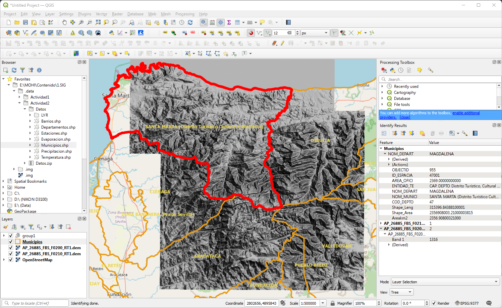

# QGIS. Herramientas de Geoprocesamiento
Keywords: `GIS` `Software` `QGIS` `Tools` `Geoprocessing`

 

 <b>Universidad Escuela Colombiana de Ingeniería Julio Garavito</b>  
Juan David Rodríguez <a href="https://github.com/juanrodace/"><i>(ver GitHub)</i></a> 
Profesor del Centro de Estudios Hidráulicos 

## Funciones espaciales o de geoprocesamiento

Una función espacial o de geoprocesamiento en un SIG es una operación o proceso que se aplica a datos geoespaciales para realizar análisis, manipulación o transformación de esos datos. Estas herramientas y funciones permiten a los usuarios realizar una variedad de tareas relacionadas con la gestión, análisis y visualización de datos geográficos. A continuación presento algunas de las herramientas y funciones espaciales más utilizadas en QGIS.

### Selección, identificación y medición

 Permite seleccionar entidades en capas vectoriales basándose en diferentes criterios, como la ubicación espacial o sus atributos. Así mismo, esas funciones permiten obtener información detallada sobre una entidad específica en una capa seleccionada. Igualmente, algunas funciones, permiten medir distancias, áreas, perímetros y ángulos en el mapa.

 
 
 
Selección e identificación en QGIS.

> Existen diferentes plugins que pueden ser instalados en QGIS y permiten la visualización de los datos y atributos por medio de gráficas.    Por ejemplo el plugin [**DataPloty**](https://github.com/ghtmtt/DataPlotly) sirve para crear gráficos interactivos con la biblioteca plotly en QGIS, puedes usar capas y tablas del proyecto como fuentes de datos y vincular el mapa con el gráfico, también puedes filtrar los objetos en el gráfico por el estado de selección o la visibilidad en el mapa principal.    Otro ejemplo es [**Line Profile**](https://github.com/wiscsims/line_profile) que permite crear gráficas de perfil a partir de capas vectoriales o archivos raster.

### Edición y digitalización

Crear, editar y modificar entidades geoespaciales, como puntos, líneas y polígonos, en una capa vectorial.

 
 
 
Edición y digitalización en QGIS.

Dentro de esta funcionalidad, se tienen varias herramientas de edición como las listadas a continuación:

- Recortar: Permite recortar entidades vectoriales para ajustarlas a una ubicación o límite específico.
- Unión: Combina dos o más capas vectoriales en función de un atributo común.
- Buffer: Crea zonas de influencia alrededor de entidades, útil para análisis de proximidad y disolución espacial.
- Intersección: Encuentra las áreas donde las entidades de dos capas vectoriales se cruzan o se superponen.
- Disolución: Combina entidades que comparten un atributo común en una capa vectorial.
- Fusionar Geometrías: Combina geometrías de entidades vecinas en una sola entidad en una capa vectorial.

También puedes utilizar estas herramientas de edición básicas con capas o archivos raster. Por ejemplo, puedes combinar o fusionar varias imágenes satelitales en un solo dataset raster de <kbd>mosaico</kbd> con la herramienta **i.image.mosaic** o **Merge**.

 
 
Edición de archivos raster en QGIS.

> Con ayuda del plugin [**QuickOSM**](https://github.com/3liz/QuickOSM) puedes acceder a los datos vectoriales de los mapas de Open Street Map. Debes tener en cuenta la identificación de los atributos, los cuales puedes consultar en ['Map features'](https://wiki.openstreetmap.org/wiki/Map_features).

### Análisis espacial

Realizar análisis espaciales como la superposición de capas, la delimitación de cuencas, el cálculo de áreas y perímetros, la identificación de vecinos más cercanos, la generación de buffers alrededor de entidades y la creación de mapas de calor.

Así mismo, pueden utilizarse modelos y algoritmos para simular fenómenos, como el flujo de agua, la modelización de la propagación de incendios forestales o la predicción de riesgos naturales.

 
 
Edición de archivos raster en QGIS.

> El conjunto de herramientas <kbd><b>Raster(*r)</b></kbd> de GRASS puede ser utilizado para la definición cuencas hidrográficas. En la siguiente tabla se presentan algunas de estas herramientas y su funcionalidad:

|                Proceso                 |   Herramienta    | Función                                                                                                                                                                                                                                                                                                                                        |
|:--------------------------------------:|:----------------:|:-----------------------------------------------------------------------------------------------------------------------------------------------------------------------------------------------------------------------------------------------------------------------------------------------------------------------------------------------|
|          Reacondicionamiento           |     r.carve      | Permite reacondicionar el MDT a partir de un archivo vectorial de las redes de drenaje.                                                                                                                                                                                                                                                        |
|           Relleno sumideros            |     r.fill.dir      | Permite eliminar imperfecciones y corregir el MDT. La función eleva las celdas 'sumidas' utilizando como referencia los valores de altura en celdas laterales.                                                                                                                                                                                 |
| Direcciones de flujo y flujo acumulado |     r.watershed     | Permite generar una capa de direcciones de flujo y de celdas de acumulación. La celda de direcciones de flujo define la dirección de la máxima pendiente del terreno para cada celda utilizando el modelo corregido "Fill". Y la capa de acumulación, calcula para una celda dada, el número de celdas de drenaje aguas arriba de dicha celda. |
|         Delimitación de cuenca         |                   r.water.outlet                    | Permite delimitar la cuenca hidrográfica a partir de la capa de acumulación _(que muestra la 'red hídrica')_ y del punto de salida o drenaje.                                                                                                                                                                                                  |
|   Segmentación de tramos de drenaje    |            r.stream.extract            | Permite obtener o definir la red hídrica de drenaje en formato vectorial o raster.                                                                                                                                                                                                                                                             |

> Para obtener el polígono de la cuenca puedes convertir el raster a vector tipo polígono, esto se lo puede hacer con la herramienta <kbd><b>r.to.vect</b></kbd>.     Por otro lado, la herramienta <kbd><b>r.watershed</b></kbd> permite generar subcuencas ajustando las opciones de “Tamaño mínimo de cuenca exterior (Minimum size of exterior watershed basin”. 

> Recuerde que los modelos reacondicionados, únicamente serán utilizados para resolver las direcciones y acumulaciones de flujo, por lo que no se recomienda utilizar estos modelos, para el cálculo de parámetros morfométricos en cuencas o en drenajes. 

### Estadísticas Espaciales

Las herramientas de estadística espacial permiten a analizar patrones y tendencias geoespaciales en conjuntos de datos. Estas herramientas proporcionan una variedad de estadísticas y técnicas para comprender la distribución espacial de los datos. Algunas de las características y funciones comunes de las herramientas de estadística espacial:

- Análisis de Vecinos Más Cercanos: Permite identificar y cuantificar la proximidad entre entidades geoespaciales. Esto es útil para analizar la agrupación o dispersión de puntos o áreas.

- Kriging: Un método de interpolación espacial que permite estimar valores en ubicaciones no muestreadas utilizando datos de muestreo cercanos y un modelo estadístico.

- Estadísticas Zonales: Calcula estadísticas (como suma, promedio, máximo, mínimo) para las entidades en una capa vectorial dentro de zonas definidas en otra capa. Esto es útil para el análisis de áreas geográficas específicas.

- Herramientas de Clasificación: Permiten la clasificación de datos en intervalos o categorías basadas en valores estadísticos. Esto es útil para la creación de mapas temáticos.

- Densidad de Puntos: Calcula la densidad de puntos en un área geográfica, lo que puede utilizarse para identificar áreas de alta o baja concentración de eventos de puntos.

- Análisis de Autocorrelación Espacial: Evalúa si existe autocorrelación espacial en los datos, es decir, si las entidades similares tienden a agruparse o dispersarse.

- Estadísticas de Líneas y Redes: Calcula estadísticas para entidades lineales, como carreteras o rutas, y puede ayudar a evaluar la longitud, la densidad o la conectividad.

- Estadísticas de Raster: Calcula estadísticas para datos raster, como valores promedio, mediana, desviación estándar, etc.

- Clasificación y Regresión Espacial: Se utiliza para identificar relaciones espaciales entre variables y puede ayudar a comprender la influencia espacial en la distribución de datos.

 
 
Edición de archivos raster en QGIS.

### Geoprocesamiento de imágenes

Las herramientas de geoprocesamiento de imágenes y sensores remotos en QGIS permiten a los usuarios trabajar con datos de imágenes satelitales, aéreas o de otros sensores remotos para realizar análisis y procesamiento de información geoespacial. Estas herramientas son fundamentales para tareas como la clasificación de imágenes, la corrección de datos, la extracción de información y el análisis de cambios en el paisaje. A continuación, se detallan algunas de las funciones y características comunes de las herramientas de geoprocesamiento de imágenes en QGIS:

- Importación de Imágenes: QGIS permite importar una amplia variedad de formatos de imágenes, incluyendo formatos raster comunes como GeoTIFF, JPEG, y formatos de imágenes de sensores remotos como Landsat, Sentinel y otros.

- Corrección Atmosférica: Herramientas para realizar correcciones atmosféricas en imágenes satelitales, lo que ayuda a mejorar la precisión de los datos.

- Realce de Imágenes: Herramientas de realce que permiten mejorar la calidad de las imágenes al resaltar características específicas, como bordes o áreas de interés.

- Clasificación de Imágenes: Ofrece capacidades para la clasificación supervisada o no supervisada de imágenes, lo que permite identificar y categorizar objetos en las imágenes.

- Algebra de mapas: Se utilizan para realizar operaciones matemáticas y lógicas en capas raster. Estas funciones permiten combinar y analizar datos raster de diversas maneras y son esenciales para el procesamiento y análisis de datos espaciales. Las funciones de álgebra de mapas pueden incluir operaciones como suma, resta, multiplicación, división y comparaciones lógicas (mayor que, igual a, menor que, etc.). Estas operaciones son especialmente útiles para reclasificación, combinación de capas, creación de índices, análisis de pendiente y orientación, modelado de fenómenos, entre otros. 

- Fusión de Bandas: Permite combinar bandas de imágenes multiespectrales para crear imágenes de color verdadero o falso color.
  - Índices de Vegetación: Cálculo de índices de vegetación como el NDVI (Índice de Vegetación de Diferencia Normalizada) a partir de imágenes multiespectrales.

- Análisis de Cambios: Facilita la comparación de imágenes de diferentes momentos para detectar cambios en el paisaje, como cambios en la cobertura terrestre o la vegetación.

- Extracción de Características: Herramientas para extraer características específicas de las imágenes, como carreteras, cuerpos de agua, edificios y vegetación.

- Segmentación de Imágenes: Divide las imágenes en segmentos o regiones homogéneas para facilitar el análisis de objetos o áreas específicas.

- Interpretación de Imágenes: Permite a los usuarios realizar la interpretación visual de imágenes para identificar objetos y características en la imagen.

- Herramientas de Mosaico: Facilita la creación de mosaicos de imágenes para combinar múltiples imágenes en una única capa continua.

- Análisis de Series Temporales: Permite el análisis de imágenes de series temporales, lo que es valioso para el seguimiento de cambios a lo largo del tiempo.

---

### Actividad
1. Delimitación de cuencas hidrográficas.
   - Cargue el archivo **MDT_Alos_Cesar.tif** y realice un recorte con ayuda del polígono del archivo **PoligonoAnalisis.shp**.
   - Con ayuda de las herramientas <kbd>Raster(r.*)</kbd> de GRASS, realice la delimitación de la cuenca hidrográfica al punto de drenaje ubicado en: [X:4954505.1, Y:2638060.0].
   - Genere subcuencas de mínimo 25 km2 asociadas. Para esto, parta de la capa con ajuste de sumideros (Fill) y recórtela al tamaño de la cuenca obtenida. Luego utilice la herramienta <kbd><b>r.watershed</b></kbd>.
2. A partir de los datos de precipitación y las herramientas estadísticas, determine la precipitación media en cada una de las subcuencas.
3. Utilice el geoprocesamiento de imágenes para determinar el índice NDVI en la cuenca de estudio.
---

### Referencias
- QGIS Training Manual. QGIS Documentation. 2023.
- GIS Applications for Water, Wastewater, and Stormwater Systems. Shamsi, U.M.Taylor & Francis Group. 2005.
- LibroSIG: prendiendo a manejar los SIG en la gestión ambiental. Mancebo, S.; Ortega, E.;Martín, L.; Valentín, A. Madrid, España. 2009.  
- Sistemas de Información Geográfica. Olaya, Victor. Creative Commons Atribucion. 2012.
- Getting Started with ArcGIS. Booth and Mitchell. ESRI. 2001

### Control de versiones

| Versión | Descripción                                                    |                    Autor                    | Horas |
|:-------:|:---------------------------------------------------------------|:-------------------------------------------:|:-----:|
| 2023.09 | Versión inicial, definición de estructura general y contenido. | [juanrodace](https://github.com/juanrodace) |  1.0  |
| 2023.10 | Inclusión de conceptos, esquemas y ejemplos.                   | [juanrodace](https://github.com/juanrodace) |  6.0  |

| [:arrow_backward:Anterior](QGIS.md) | [:house: Inicio](../../Readme.md) | [:beginner: Ayuda](https://github.com/juanrodace/MOHI/discussions) | [Siguiente:arrow_forward:](../2.HEC-HMS/Readme.md) |
|-------------------------------------|-----------------------------------|--------------------------------------------------------------------|----------------------------------------------------|

_MOHI es de uso libre para fines académicos, conoce nuestra licencia, cláusulas, condiciones de uso y como referenciar los contenidos publicados en este repositorio, dando [clic aquí](../../License.md)._

_¡Encontraste útil este repositorio!, apoya su difusión marcando este repositorio con una ⭐ o síguenos dando clic en el botón Follow de [juanrodace](https://github.com/juanrodace) en GitHub._ 
