

# Caudales Máximos e hidrogramas de escorrentía directa utilizando HEC-HMS

  

<b> Universidad Escuela Colombiana de Ingeniería Julio Garavito</b>
 

Andrés Humberto Otálora Carmona
 

Profesor del Centro de Estudios Hidráulicos
 

andres.otalora@escuelaing.edu.co
 

Keywords: `HEC-HMS` `Hidrograma` `Caudal Máximo` `Escorrentía` `Hidrograma Unitario`

## Introducción

En este módulo se resumen los conceptos fundamentales de los caudales máximos instantáneos que se presentan en una cuenca hidrográfica. Se recuerdan de manera general el concepto de un hidrograma unitario y de un hidrograma de escorrentía directa. Adicionalmente, se explica paso a paso el procedimiento necesario para determinar el hidrograma de escorrentía directa en una cuenca para un evento de lluvia particular y considerando un tránsito hidrológico.

## Objetivos

El objetivo general de esta actividad es permitirle al estudiante recordar los conceptos generales de un caudal máximo y los conceptos fundamentales que gobiernan hidrogramas de escorrentía directa para finalmente estimarlos en una cuenca hidrográfica utilizando un ejercicio práctico en HEC-HMS.

## Caudales máximos instantáneos
Un cauce natural puede transportar caudales con diferentes magnitudes dependiendo de la época del año, del ciclo hidrológico de la zona, de las características morfométricas de la cuenca, del tipo de suelo, del uso del suelo y de la cobertura vegetal de la cuenca. En un cauce natural se pueden presentar caudales mínimos, caudales medios y caudales máximos. Estos últimos corresponden a caudales que ocurren en muy corto tiempo, por lo cual son denominados caudales instantáneos. Estos caudales se presentan durante eventos extraordinarios generados por lluvias intensas con un cierto periodo de retorno.

## Hidrograma de escorrentía directa

Un hidrograma corresponde a la representación gráfica en un plano cartesiano convencional del caudal que escurre en un cauce o canal en un intervalo de tiempo determinado. En la siguiente figura se presenta un ejemplo de un hidrograma de un cauce natural. 

  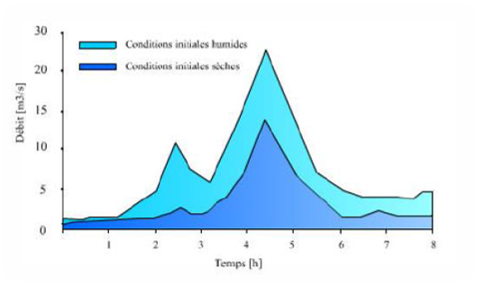 

Los hidrogramas de escorrentía directa corresponden hidrogramas generados por lluvias intensas en la cuenca. Son hidrograma de corta duración los cuales no tienen en cuenta el caudal o flujo base generado por la escorrentía subsuperficial que puede alimentar un cauce.

El agua de un hidrograma de escorrentía directa en un cauce es generado por los excedentes de escorrentía, una vez la precipitación ha superado las abstracciones iniciales (infiltración y encharcamiento) en una cuenca.

## Caudal base. Flujo subsuperficial

Corresponde al caudal transportado por una corriente natural cuyo flujo proviene de la escorrentía subsuperficial. Lo adecuado para obtener la magnitud del caudal base es a partir de mediciones de campo. También es posible estimar el caudal base a partir de ecuaciones y metodologías empíricas que estiman la magnitud del caudal base en función de la respuesta de la cuenca a largo plazo, considerando todas las entradas y salidas en la cuenca (balances hidrológicos)

## Método del hidrograma unitario

El hidrograma unitario corresponde al hidrograma construido para una cuenca que, para un evento de lluvia con una magnitud de una unidad 1.0 (1 cm/h, 1 pulg/h, etc.) genera una escorrentía en el cauce con una magnitud igual a una unidad de volumen (1 m³, 1 pie³, etc.). Conocido el hidrograma unitario y asumiendo condiciones de linealidad entre la precipitación y la escorrentía directa, es posible conocer el hidrograma de escorrentía directa al realizar el producto entre el hidrograma unitario y una lluvia definida.

## Método del hidrograma unitario adimensional

El hidrograma unitario adimensional o hidrograma unitario universal corresponde a un hidrograma unitario cuyas componentes no tienen unidades. Estos hidrogramas son obtenidos o generados por alguna institución, departamento o centro de investigación.

A partir del hidrograma unitario adimensional y conocidas las características morfométricas de la cuenca y del cauce, es posible determinar el hidrograma unitario de la cuenca en estudio.

El hidrograma unitario adimensional más usado en el mundo corresponde al hidrograma elaborado por el Cuerpo de Ingeniero de los Estados Unidos (SCS). 

En las siguientes figuras se presenta gráficamente y numéricamente el hidrograma unitario adimensional del SCS.

   

  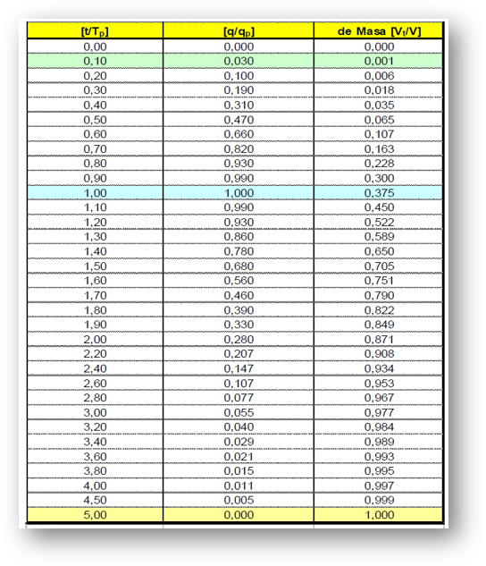 

## Ejercicio de aplicación para el desarrollo de la actividad

Con el objetivo de aprender a usar el software HEC-HMS para la estimación de un hidrograma de escorrentía directa, a continuación se presenta un ejercicio que se irá desarrollando:

Una empresa de ingeniería ha sido contratada para diseñar el vertedero que permitirá controlar los niveles en una bocatoma qe estará ubicada en el fondo de una corriente natural.

Desde el punto de control correspondiente a la ubicación de la bocatoma, se ha trazado una cuenca. Debido a los afluentes que ingresan al cauce principal, la cuenca se ha dividido en 4 subcuencas tal y como se presenta en la siguiente figura.

  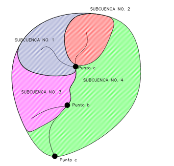 

Cada una de las subcuencas fue caracterizada, determinando sus características físicas y morfométricas. También se caracterizó el tipo y uso del suelo. En la siguiente tabla se resumen las principales características de las subcuencas.

| Subcuenca | Área (km²) | Longitud cauce principal (km) | Longitud axial (km) | Pendiente Media de la corriente (m/m) | CN | Condición de Humedad |
|:---------:|:----------:|:-----------------------------:|:-------------------:|:-------------------------------------:|:--:|:--------------------:|
|     1     |     34     |              3.5              |         3.8         |                   0.008857                  | 80 |        Normal        |
|     2     |     40     |              2.5              |         2.8         |                    0.001000                   | 82 |         Seca         |
|     3     |     50     |              4.2              |         5.0         |                    0.001905                  | 81 |        Húmeda        |
|     4     |     74     |              7.0              |         8.0         |                   0.001000                   | 89 |        Norma         |

Para la estimación del tiempo de concentración de cada subcuenca utilice la ecuación de Kirpich.

## Creación de un nuevo documento en HEC-HMS

Una vez se ha instalado el software y se han aceptado todas las condiciones, 
se recomienda crear una carpeta sin caracteres especiales, tales como:
"%,&,*;$,#,´,+,-,/,?,¡" entre otros. Adicionalmente la ruta de la carpeta
debe ser lo más corta posible. 

En la siguiente figura se presenta un ejemplo de lo mencionado. Se ha creado una
carpeta con el nombre "Qmax" en la carpeta documentos.

  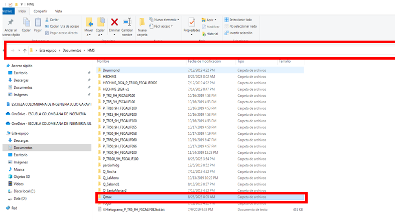 

Una vez creada la carpeta en la ruta, se creará un documento en blanco. 
Para realizar esto, en la barra de "herramientas y menús", buscar el botón "nuevo"
Al dar clic en este botón se abrirá una nueva ventana, la cual solicitará el nombre del proyecto,
el cual corresponderá al nombre de la cuenca, la ubicación del archivo y el sistema de unidades. 
En la siguiente figura se presenta lo mencionado.

  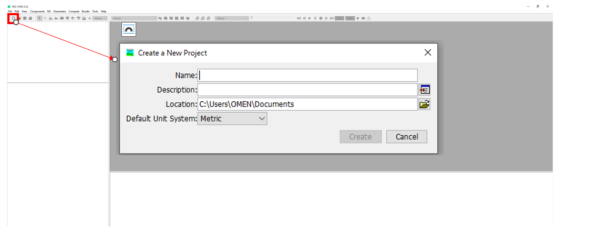 

Para este ejemplo, llamaremos "Ejercicio 1" el archivo principal de HEC - HMS.
La ruta donde se guardará el archivo corresponderá a la carpeta que acabamos de crear 
y el sistema de unidades corresponderá al sistema métrico o sistema internacional.

En la siguiente figura se presenta lo mencionado.

  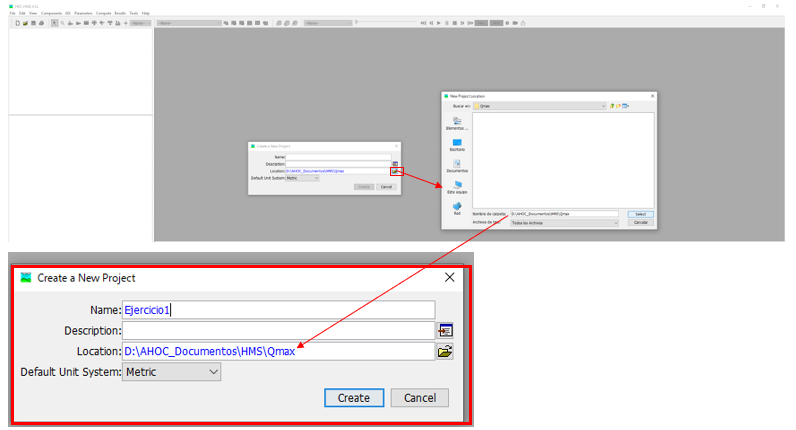 

Al realizar esto, se creará una carpeta con el mismo nombre del archivo en la barra de 
"exploración de cuenca". En la barra de estado (parte superior del software) se verá la ruta
de guardado del archivo principal.

En la siguiente figura se presenta lo mencionado.

  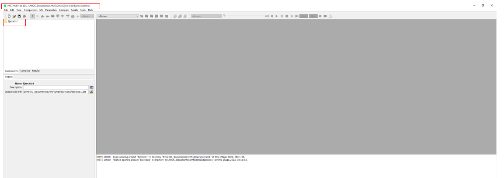 

Al abrir la carpeta donde se guardó el archivo, el usuario podrá notar que se crearon subcarpetas y otros archivos 
aparentemente en blanco y con distintas extensiones.
Estas subcarpetas y archivos corresponden a todos los archivos que HEC-HMS 
requiere para funcionar adecuadamente.

En la siguiente figura se presenta lo mencionado.

  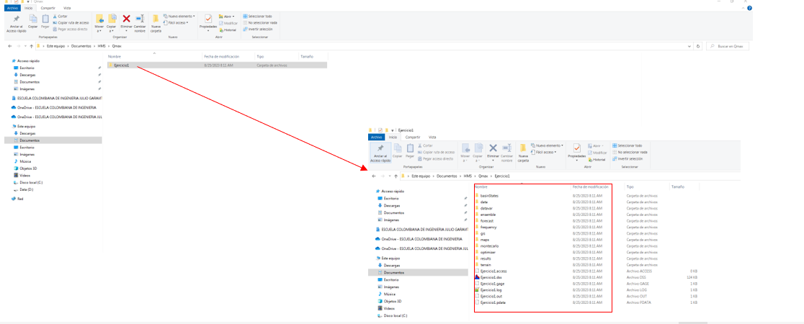 

## Características morfométricas y modelo lluvias escorrentía. Definición en HEC-HMS

Una vez creado el archivo principal, se deben crear las subcuencas que definen el sistema
hidrológico de la cuenca principal (subcuencas y la red fluvial).

Para realizar esto, inicialmente crearemos el espacio de trabajo que corresponderá a la cuenca principal. 
En la barra de herramientas y menús, damos clic en "Components" y en la subcategoría "Basic Model Manager"

En la siguiente figura se presenta lo mencionado:

  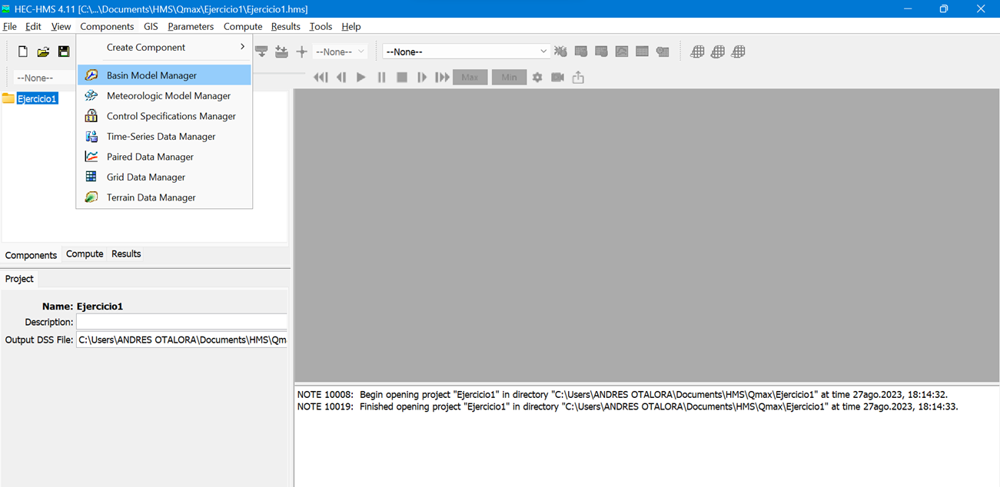 

Se abrirá un ventana, en la cual seleccionaremos la opción "New". Se abrirá una pequeña ventana
la cual solicitará el nombre de la cuenca. Para este caso, el nombre elegido es "Cuenca1"

En la siguiente figura se presenta lo mencionado:

  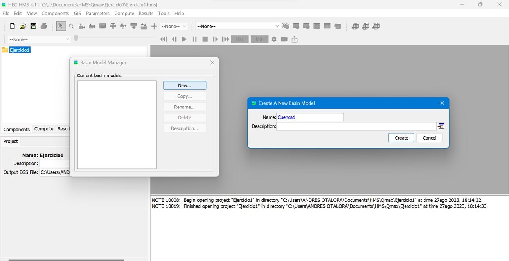 

Al realizar esto, en la barra de exploración de la cuenca, se creará un ícono que representa la cuenca principal. 
Adicionamente la zona o "ventana de mapa" cambiará de color gris a color blanco.

En la siguiente figura se presenta lo mencionado:

  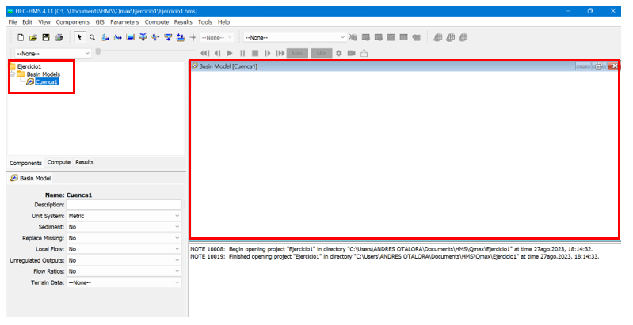 

Ahora, con la cuenca creada, se deberán definir las subcuencas. Para realizar esto, en la barra de herramientas y menús , 
seleccionaremos la ópción "Subbasin Creation Tool", tal como se presentan en la siguiente figura:

  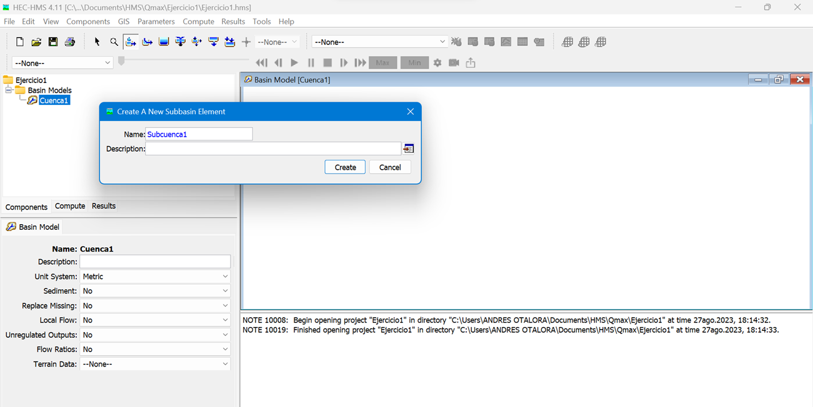 

Al dar clic en el botón "Subbasin Creation Tool" se debe picar sobre la ventana de mapa en el lugar deseado.
Para conocer la distribución aproximada de cada subcuenca (ubicación donde se debe picar) en la cuenca principal, 
se debe analizar con calma la figura definida en el ejercicio.

Una vez se pique sobre la ventana del mapa, se abrirá una ventana que solicita el nombre de la subcuenca. Para este
caso se definirán el mismo nombre indicado en el ejercicio: "Subcuenca1".

Se repetirá este procedimiento para cada una de las subcuencas que definen el problema.

La ventana de dibujo del mapa se debe ver similar al presentado en la siguiente figura:

  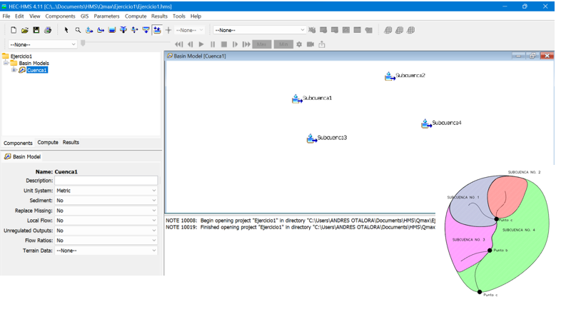 

Ahora, crearemos el punto de control donde descargarán todas las aguas de las subcuencas. Este punto corresponderá al 
punto final de la cuenca. 

Para realizar, esto nos dirigimos a la barra de herramientas y menús,
seleccionamos el botón "Create a New Sink Element", posteriormente se debe picar sobre la ventana de dibujo del mapa 
en el lugar que el usuario desee, en este caso, la zona más aguas abajo de la cuenca.

Se abrirá una nueva ventana, la cual solicitará el nombre del elemento. Para este caso, se seleccionará
como nombre "PuntoControl", tal como se presenta en las siguientes figuras:

  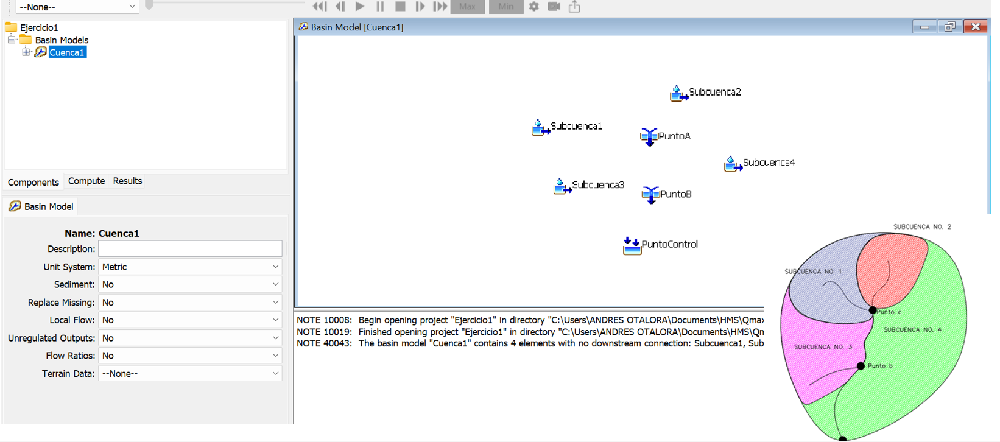 

  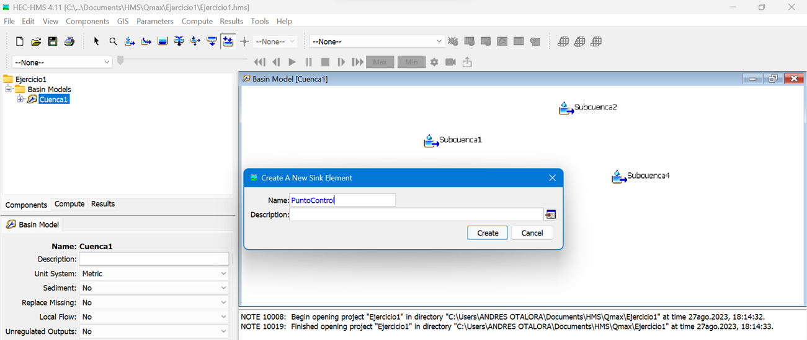 

Una vez realizado este procedimiento, la ventana de dibujo del mapa se debe ver similar al presentado en la 
siguiente figura:

  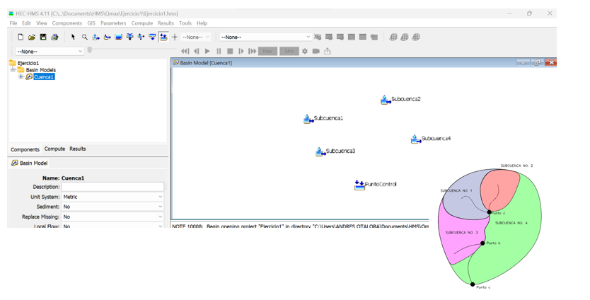 

Ahora, se crearán los puntos de unión de las corrientes que coinciden en un punto (corrientes que continuan sobre 
el cauce principal). Para realizar esto, en la barra de herramientas y menús, seleccionar el botón "Juction Creation Tool".
Una vez se pica sobre este botón, se debe picar sobre la ventana de dibujo, en la zona indicada por el ejercicio.
Posteriormente, se abrirá una ventana que solicitará el nombre del elemento. Para el primer elemento (primer nodo)
se definirá como nombre "PuntoA". 

En la siguiente figura se presenta lo mencionado.

  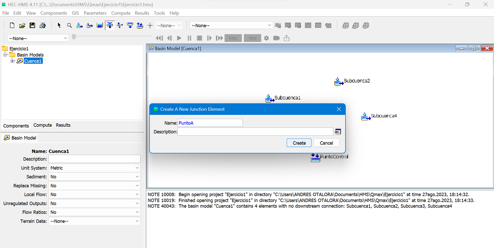 

Este procedimiento se debe realizar para el siguiente nodo (PuntoB). 
Una vez realizado este procedimiento, la ventana de dibujo del mapa se debe ver similar al presentado en la 
siguiente figura:

   

Al picar sobre el ícono de la "Cuenca1", se desplegará los íconos que representan las subcuencas, los nodos y el punto
final de la cuenca o punto de control, tal como se presenta en la siguiente figura.

  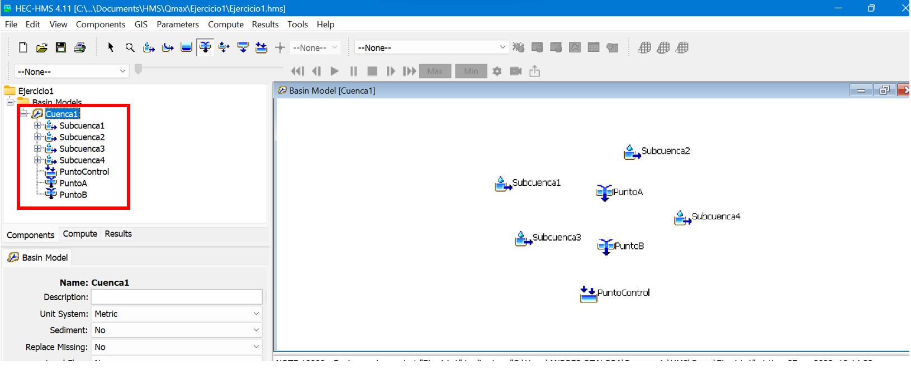 

Ahora, se debe definir el punto aguas abajo de cada elemento. Un punto aguas abajo puede corresponder a otro elemento.
Por ejemplo, la subcuenca 1, según el ejercicio, descarga al punto de unión "PuntoA". Para realizar esto, despliegue, 
desde el ícono de "Subcuenca1", en el elemento "Subbasin", en la harremienta "DownStream" y seleccionar el punto 
"PuntoA"

En la siguiente figura se presenta lo mencionado:

  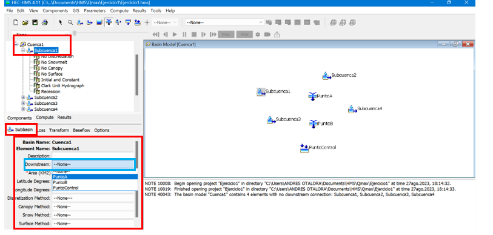 

Al realizar esto, en la ventana de dibujo del mapa, debe aparecer una línea simbólica que representa la descarga de un
elemento a otro, tal como se presentan en la siguiente figura:

  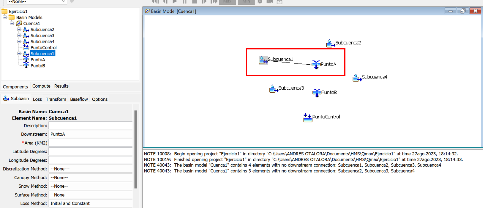 

Debe repetirse este procedimiento para cada una de las subcuencas.
En la siguiente figura se presenta el resultado de este procedimento:

  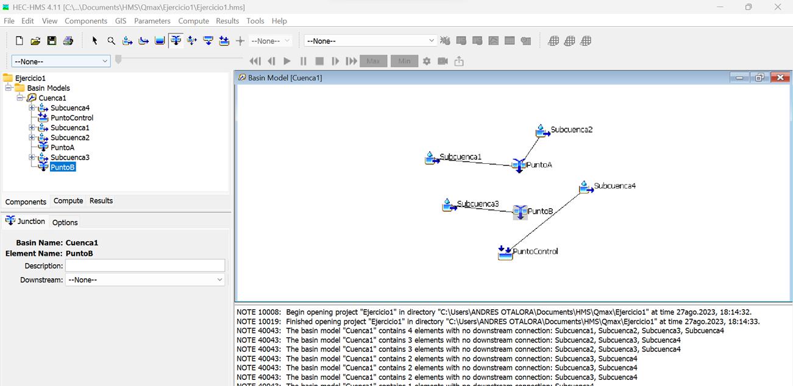 

Ahora, considerando el tránsito hidráulico del cauce principal desde los puntos de unión, se debe crear un tramo de 
cauce. Para realizar esto, en la barra de herramientas y menús, seleccionar el botón "Reach Creation Tool". Se deberá
picar el elemento que inicia el tramo y posteriormente el elemento final. 

En la siguiente figura se presenta lo mencionado:

  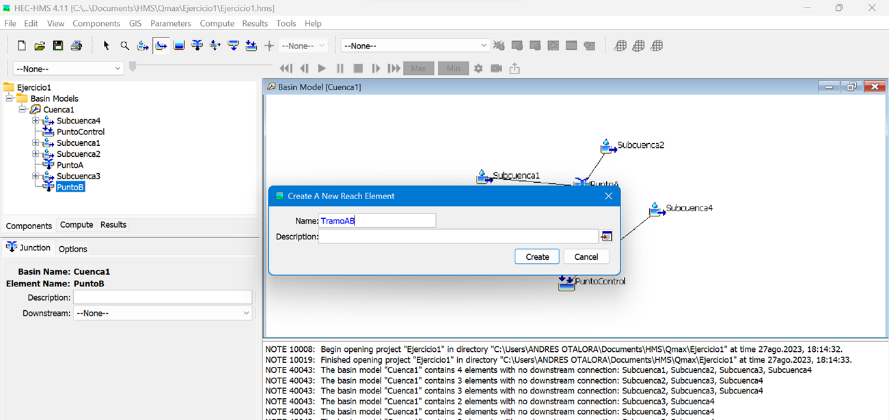 

Para el primer tramo, se picará el elemento "PuntoA "y el elemento "PuntoB".
Una vez se realiza esto, se abrirá una  ventana que solicitará el nombre. Para el primer tramo, se ha seleccionado el 
nombre "TramoAB". 

En la siguiente figura se presenta el resultado:

  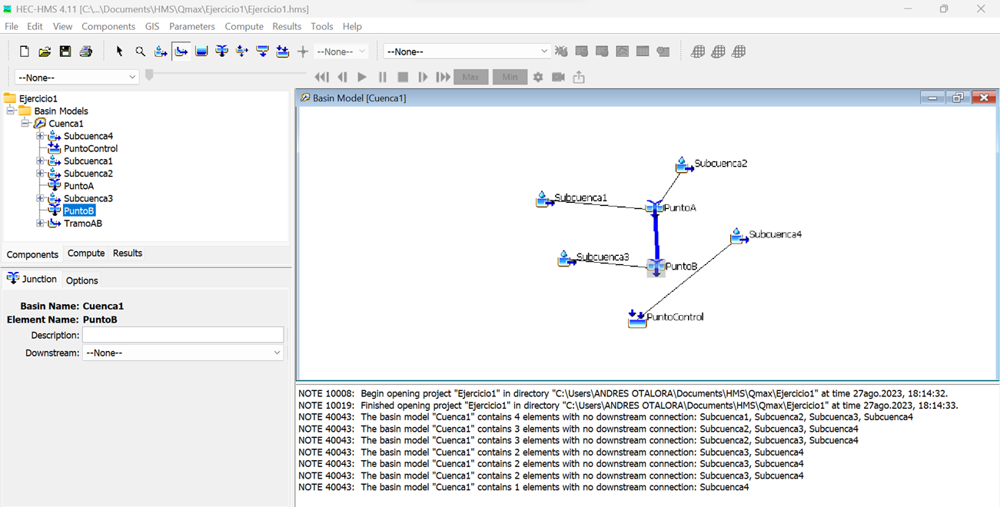 

Se debe repetir el procedimiento para el tramo que inicia desde el Punto B hasta el punto de control. 

Al finalizar este paso, la ventana de dibujo de la cuenca, se debe parecer a la presentada en la siguiente figura:

  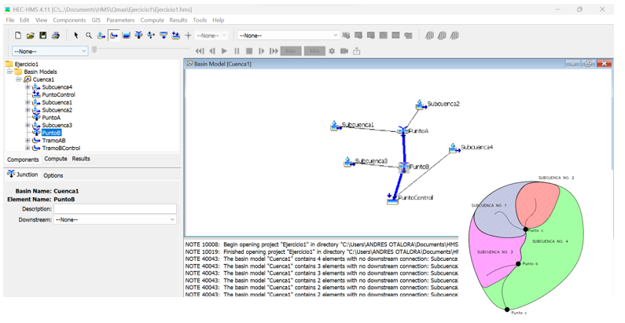 

Con las subcuencas creadas en la ventana de dibujo del mapa, el punto de control definido, las descargas o puntos aguas abajo y los tramos de tránsito trazados, se dispone a definir el área de drenaje de cada cuenca y las características del modelo lluvia-escorrentía definido. 

Para realizar esto, en la ventana de exploración de la cuenca, se debe seleccionar una de las subcuencas y en la parte inferior, en la ventana de componentes, seleccionar la categoría "Subbasin" y realizar los siguientes cambios:

a. Área (km²): Corresponde al área de la subcuenca definido en el ejercicio

b. Loss Method: Método utilizado para determinar las abstracciones inicial de la lluvia bruta. En este caso, seleccionar el método "SCS Curve Number"

   

c. Transform Method: Método utilizado para realizar la transformación de la lluvia (hietograma) a escorrentía superficial (hidrograma de escorrentía directa). En este caso, seleccionar el método "SCS Unit Hydrograph" que corresponde al método del hidrograma unitario del Cuerpo de Ingenieros de los Estados Unidos.

d. BaseFlow Method: Corresponde al caudal base o caudal aportado por el flujo subsuperficial y que no corresponde a la lluvia definida para la estimación del caudal. Para este caso, se asumirá que no existe caudal base o que es despreciable frente a la magnitud de los caudales máximos. 

En la siguiente figura se presenta el resumen de lo mencionado:

   

Se debe repetir el procedimiento para todas las subcuencas, llenado el espacio de "Área(km²)" con el valor respectivo definido en el ejercicio base. 

#### Tipo, uso de suelo y condición de humedad antecedente. Número de curva (CN)

Teniendo en cuenta que el método utilizado para la estimación de las abstracciones iniciales(encharcamiento e infiltración en la cuenca) se basa en el Número de Curva (CN) desarrollado por el Cuerpo de Ingenieros de los Estados Unidos. Es necesario definir y seleccionar este número a partir de las características de la cobertura, tipo de suelo y uso del  suelo de la cuenca.

En términos simples, el Número de Curva (CN) corresponde a un valor entre 0 y 100, que indica la capacidad de retención del suelo o la capacidad de dejar pasar la escorrentía. Entre mayor es el coeficiente CN, más alta es la capacidad del suelo a permitir escurrir. Un CN 100 es perfectamente liso e impermeable. Un CN de 0 es un orificio de altura infinita, que no permite escurrir nada, todo lo "atrapa".

El CN depende de diferentes factores, tales como el tipo de suelo, el uso del suelo (cobertura vegetal) y la condición de humedad antecedente. Estos conceptos están fuera del alcance del curso, pero es apropiado que el lector conozca los conceptos básicos antes de ingresar la información en el modelo y en el programa.

En el caso del ejercicio, el valor del CN de cada subcuenca ya está definido. Queda pendiente "ajustarlo" por la condición de humedad. Un CN tipo II, corresponde a una zona con humedad media. Un CN tipo I, corresponde a una zona propensa a épocas de estiaje (poca humedad y bajas precipitaciones). Un CN tipo III, corresponde a zona con alta humedad.

El enunciado del ejercicio menciona un suelo tipo II e indica las condiciones de humedad. Para ajustar el CN, se deben aplicar las siguientes ecuaciones:

##### CN_i

  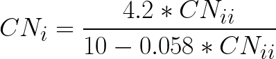 

##### CN_iii

  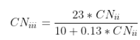 

  
 

 

Antes de ingresar los valores del CN al programa, se dispondrá a definir los valores "corregidos" y definitivos de cada cuenca:

**Subcuenca 1 (humedad normal):**

CN=80

**Subcuenca 2 (condición seca):**

  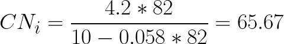 

**Subcuenca 3 (condición húmedad):**

  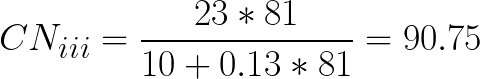 

**Subcuenca 4 (humedad normal):**

CN=89

Para realizar esto, en la ventana de exploración de la cuenca, se debe seleccionar una de las subcuencas y en la parte inferior, en la ventana de componentes, seleccionar la categoría "Loss" y en la ópción "Curve Number", escribir el valor del CN que corresponda. Para nuestras cuencas se tiene que:

#### Tiempo de concentración y tiempo de retardo en la cuenca (Tlag).

#### Modelo lluvia escorrentía y caudal base.

## Definición de los parámetros hidrológicos. Definición en HEC-HMS

### Lluvia de diseño. Hietograma.

## Definición de la lluvia en las subcuencas

## Definición de los parámetros de la ejecución

## Elaboración de una corrida

## Análisis de resultados

### Control de versiones

| Versión    | Descripción   | Autor                                      | Horas |
|------------|:--------------|--------------------------------------------|:-----:|
| 2023.08.23 | Versión No. 1 | [AndresOtalora92](https://github.com/AndresOtalora92)  |   4   |

_MOHI es de uso libre para fines académicos, conoce nuestra licencia, cláusulas, condiciones de uso y como referenciar los contenidos publicados en este repositorio, dando [clic aquí](../../License.md)._

_¡Encontraste útil este repositorio!, apoya su difusión marcando este repositorio con una ⭐ o síguenos dando clic en el botón Follow de [AndresOtalora92](https://github.com/AndresOtalora92?tab=repositories) en GitHub._

| [Anterior](Generalidades_HECHMS) | [:house: Inicio](../../Readme.md) | [:beginner: Ayuda / Colabora] | [Siguiente](CaudalesMedios.md) |
|--------------------------------|-----------------------------------|--------------------------------------------------------------------------------------------------|----------------------------------------------|

 Este curso guía ha sido desarrollado con el apoyo de la Escuela Colombiana de Ingeniería - Julio Garavito. Encuentra más contenidos en https://github.com/uescuelaing  
