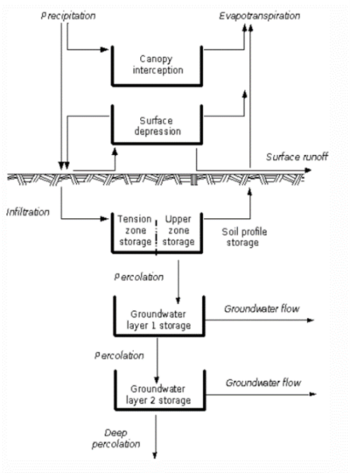

# Caudales Medios. Metodología de tanques sucesivos

  

<b> Universidad Escuela Colombiana de Ingeniería Julio Garavito</b>
 

Andrés Humberto Otálora Carmona
 

Profesor del Centro de Estudios Hidráulicos
 

andres.otalora@escuelaing.edu.co
 

Keywords: `HEC-HMS` `Hidrograma` `Caudal Máximo` `Escorrentía` `Hidrograma Unitario`

## Introducción

En el presente apartado se describirán los procedimientos y los conceptos necesarios para la estimación de caudales medios para diferentes intervalos de tiempo utilizando Hec-Hms. Se desarrollarán los conceptos a partir de un ejemplo práctico aplicado a una lluvia total diaria para una extensión superior a 20 años de registros. 

Se utilizarán los conceptos de balance de masas en una cuenca hidrográfica aplicando la metodología de los tanques sucesivos. La metodología se centrará en determinar el caudal medio diario para una extensión igual a la extensión de la lluvia media diaria.  

## Objetivos

El objetivo principal del presente apartado es comprender, analizar y aplicar las herramientas básicas de HEC-HMS para la determinación de caudales medios para diferentes intervalos de tiempo utilizando las herramientas incorporadas de HEC-HMS en su versión más reciente correspondiente al modelo de tanques sucesivos. 

## Caudales medios. Modelo de tanques

El modelo de tanques disponible en el software “HEC-HMS” es un modelo que permite estimar los caudales diarios tomando como valores de entrada una serie continua de registros de precipitación diaria y valores de evapotranspiración potencial y evapotranspiración real. Este modelo también necesita diferentes parámetros que dependen del tipo de cobertura vegetal y del tipo de suelo. 

El módulo de tanques del “Hec-Hms” divide el proceso de transformación de lluvia – escorrentía a nivel diario en cinco (5) tanques o etapas. Los dos primeros tanques corresponden a los procesos de retención y de escorrentía en la superficie. Los tres tanques restantes modelan los procesos de retención y escorrentía subsuperficial. En la Figura 12 se presenta un esquema general que representa las diferentes etapas o tanques que considera este modelo. 

En la siguiente figura se presenta gráficamente lo mencionado en el párrafo anterior:

   

Cada uno de los tanques del modelo de HECHMS corresponden subetapas que permiten simplificar los procesos de abstracción que ocurren en una cuenca. Los procesos de abstracción corresponde a la pérdida de masa de agua que sufre la precipitación desde el inicio de la lluvia, pasando por la retención en las plantas (canopy), seguido de las pérdidas en la superficie del suelo hasta finalizar por los diferentes procesos en el subsuelo hasta convertirse en escorrentía superficial y/o escorrentía subsuperficial. 

En la siguiente figura se define gráficamente lo mencionado en el párrafo anterior y que corresponde a los procesos de abstracción que el modelo HECHMS simplifica en los cinco tanques. 

   

### Tanque 1: Canopy Interception

Corresponde al tanque que simula la intercepción del agua de precipitación debido a la cobertura vegetal de las plantas. Uan fracción de la lluvia se pierde en este tanque (es retenido por las hojas y posteriormente se evapotranspira). La fracción no retenida continua al siguiente tanque.

### Tanque 2: Surface depression

Corresponde al tanque que simula el almacenamiento en las depresiones o imperfecciones de la superficie. En este tanque, las entradas corresponden a la fracción que sale del tanque 1 y las salidas corresponden a la infiltración del suelo (que ingresa al tanque 3) y a la evapotranspiración. Si la diferencia de las entradas y salidas es positivo (mayor a cero), generará escorrentía superficial. 

### Tanque 3: Primer almacenamiento en el suelo

Este tanque simula el suelo en la zona parcialmente saturada y que HEC-HMS divide en dos procesos: La retención permanente debido a la tensión superficial y que, posteriormente, se pierde en evapotranspiración y la retención temporal cuya fracción puede derivarse en percolación por el medio porozo, el cual corresponde a la entrada del tanque 4.

### Tanque 4: Segundo almacenamiento en el suelo. Acuífero superficial

El modelo de tanques incorporado en el HECHMS define los acuíferos en dos etapas: Una etapa superficial (tanque 4) y una etapa profunda (tanque 5). El tanque 4 permite la retención del flujo del agua proveniente de la percolación del tanque 3. Una parte continua por percolación al acuífero profundo y otra parte que fluye como caudal subsuperficial que hace parte del caudal base que finalmente se convierte en escorrentía superficial del cauce natural.  

### Tanque 5: Segundo almacenamiento en el suelo. Acuífero superficial

 El tanque 5 permite la retención del flujo del agua proveniente de la percolación del tanque 4. Una parte continua por percolación a una fracción del suelo que no genera escorrentía (agua que no retorna a la superficie) y otra parte que fluye como caudal subsuperficial que hace parte del caudal base que finalmente se convierte en escorrentía superficial del cauce natural.  

## Información. Calidad y cantidad de las variables conocidas

Para la elaboración de los modelos de balance de masas utilizando los tanques sucesivos, se deben conocer más de 18 variables del suelo, la evapotranspiración real y potencial en la cuenca y la precipitación media base en el sistema. Debido a la gran cantidad de información que este modelo requiere, se recomienda su aplicación con prudencia, ya que, es posible que sea necesario de información secundaria para determinar las variables del suelo. La cantidad y calidad de la información dependerá de la magnitud del proyecto, la caracterización de la cuenca y los recursos de tiempo y presupuesto disponibles.

## Ejercicio de aplicación

### Control de versiones

| Versión    | Descripción   | Autor                                      | Horas |
|------------|:--------------|--------------------------------------------|:-----:|
| 2023.09.10 | Versión No. 1 | [AndresOtalora92](https://github.com/AndresOtalora92)  |   4   |

_MOHI es de uso libre para fines académicos, conoce nuestra licencia, cláusulas, condiciones de uso y como referenciar los contenidos publicados en este repositorio, dando [clic aquí](../../License.md)._

_¡Encontraste útil este repositorio!, apoya su difusión marcando este repositorio con una ⭐ o síguenos dando clic en el botón Follow de [AndresOtalora92](https://github.com/AndresOtalora92?tab=repositories) en GitHub._

| [Anterior](CaudalesMaximos.md) | [:house: Inicio](../../Readme.md) | [:beginner: Ayuda / Colabora] | [Siguiente](Contenido/3.HEC-RAS/Readme.md) |
|-------------------------------|-----------------------------------|--------------------------------------------------------------------------------------------------|---------------------------------------------|

 Este curso guía ha sido desarrollado con el apoyo de la Escuela Colombiana de Ingeniería - Julio Garavito. Encuentra más contenidos en https://github.com/uescuelaing  
