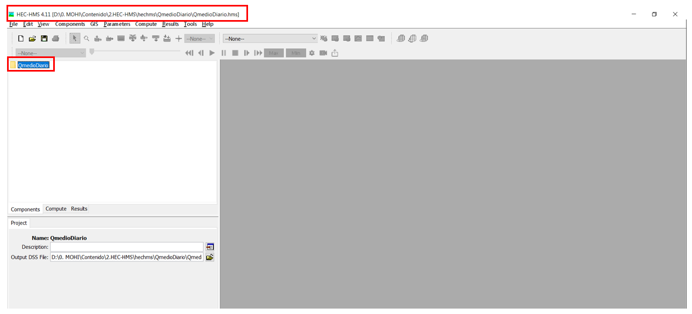

# Caudales Medios. Metodología de tanques sucesivos

  

<b> Universidad Escuela Colombiana de Ingeniería Julio Garavito</b>
 

Andrés Humberto Otálora Carmona
 

Profesor del Centro de Estudios Hidráulicos
 

andres.otalora@escuelaing.edu.co
 

Keywords: `HEC-HMS` `Hidrograma` `Caudal Máximo` `Escorrentía` `Hidrograma Unitario`

## Introducción

En el presente apartado se describirán los procedimientos y los conceptos necesarios para la estimación de caudales medios para diferentes intervalos de tiempo utilizando Hec-Hms. Se desarrollarán los conceptos a partir de un ejemplo práctico aplicado a una lluvia total diaria para una extensión superior a 20 años de registros. 

Se utilizarán los conceptos de balance de masas en una cuenca hidrográfica aplicando la metodología de los tanques sucesivos. La metodología se centrará en determinar el caudal medio diario para una extensión igual a la extensión de la lluvia media diaria.  

## Objetivos

El objetivo principal del presente apartado es comprender, analizar y aplicar las herramientas básicas de HEC-HMS para la determinación de caudales medios para diferentes intervalos de tiempo utilizando las herramientas incorporadas de HEC-HMS en su versión más reciente correspondiente al modelo de tanques sucesivos. 

## Caudales medios. Modelo de tanques

El modelo de tanques disponible en el software “HEC-HMS” es un modelo que permite estimar los caudales diarios tomando como valores de entrada una serie continua de registros de precipitación diaria y valores de evapotranspiración potencial y evapotranspiración real. Este modelo también necesita diferentes parámetros que dependen del tipo de cobertura vegetal y del tipo de suelo. 

El módulo de tanques del “Hec-Hms” divide el proceso de transformación de lluvia – escorrentía a nivel diario en cinco (5) tanques o etapas. Los dos primeros tanques corresponden a los procesos de retención y de escorrentía en la superficie. Los tres tanques restantes modelan los procesos de retención y escorrentía subsuperficial. En la Figura 12 se presenta un esquema general que representa las diferentes etapas o tanques que considera este modelo. 

En la siguiente figura se presenta gráficamente lo mencionado en el párrafo anterior:

   

Cada uno de los tanques del modelo de HECHMS corresponden subetapas que permiten simplificar los procesos de abstracción que ocurren en una cuenca. Los procesos de abstracción corresponde a la pérdida de masa de agua que sufre la precipitación desde el inicio de la lluvia, pasando por la retención en las plantas (canopy), seguido de las pérdidas en la superficie del suelo hasta finalizar por los diferentes procesos en el subsuelo hasta convertirse en escorrentía superficial y/o escorrentía subsuperficial. 

En la siguiente figura se define gráficamente lo mencionado en el párrafo anterior y que corresponde a los procesos de abstracción que el modelo HECHMS simplifica en los cinco tanques. 

   

### Tanque 1: Canopy Interception

Corresponde al tanque que simula la intercepción del agua de precipitación debido a la cobertura vegetal de las plantas. Uan fracción de la lluvia se pierde en este tanque (es retenido por las hojas y posteriormente se evapotranspira). La fracción no retenida continua al siguiente tanque.

### Tanque 2: Surface depression

Corresponde al tanque que simula el almacenamiento en las depresiones o imperfecciones de la superficie. En este tanque, las entradas corresponden a la fracción que sale del tanque 1 y las salidas corresponden a la infiltración del suelo (que ingresa al tanque 3) y a la evapotranspiración. Si la diferencia de las entradas y salidas es positivo (mayor a cero), generará escorrentía superficial. 

### Tanque 3: Primer almacenamiento en el suelo

Este tanque simula el suelo en la zona parcialmente saturada y que HEC-HMS divide en dos procesos: La retención permanente debido a la tensión superficial y que, posteriormente, se pierde en evapotranspiración y la retención temporal cuya fracción puede derivarse en percolación por el medio porozo, el cual corresponde a la entrada del tanque 4.

### Tanque 4: Segundo almacenamiento en el suelo. Acuífero superficial

El modelo de tanques incorporado en el HECHMS define los acuíferos en dos etapas: Una etapa superficial (tanque 4) y una etapa profunda (tanque 5). El tanque 4 permite la retención del flujo del agua proveniente de la percolación del tanque 3. Una parte continua por percolación al acuífero profundo y otra parte que fluye como caudal subsuperficial que hace parte del caudal base que finalmente se convierte en escorrentía superficial del cauce natural.  

### Tanque 5: Segundo almacenamiento en el suelo. Acuífero superficial

 El tanque 5 permite la retención del flujo del agua proveniente de la percolación del tanque 4. Una parte continua por percolación a una fracción del suelo que no genera escorrentía (agua que no retorna a la superficie) y otra parte que fluye como caudal subsuperficial que hace parte del caudal base que finalmente se convierte en escorrentía superficial del cauce natural.  

## Información. Calidad y cantidad de las variables conocidas

Para la elaboración de los modelos de balance de masas utilizando los tanques sucesivos, se deben conocer más de 18 variables del suelo, la evapotranspiración real y potencial en la cuenca y la precipitación media base en el sistema. Debido a la gran cantidad de información que este modelo requiere, se recomienda su aplicación con prudencia, ya que, es posible que sea necesario de información secundaria para determinar las variables del suelo. La cantidad y calidad de la información dependerá de la magnitud del proyecto, la caracterización de la cuenca y los recursos de tiempo y presupuesto disponibles.

## Ejercicio de aplicación para el desarrollo de la actividad

Con el objetivo de aprender a usar el software HEC-HMS para la estimación de caudales medios diarios, a continuación se presenta un ejercicio que se irá desarrollando:

Una empresa de ingeniería ha sido contratada para elaborar un estudio de impacto ambiental, en el que se requiere estimar la curva de duración de caudales medios diarios para la solicitud de un punto de demanda de agua superficial. 

Debido a que la cuenca no cuenta con registros de caudales medios diarios, es necesario la elaboración de un modelo lluvia escorrentía, que permita estimar el caudal medio diario en un punto de control utilizando registros de lluvia diaria con una extensión de 25 años. 

### Información disponible para el ejercicio

Con ayuda de información cartográfica se ha caracterizado la cuenca en estudio. En el siguiente cuadro se presentan las principales características de la cuenca:

| Característica               | Valor | Unidades | 
|------------------------------|:------|----------|
| Área                         | 2.12  | km²      | 
| Perímetro                    | 4.22  | km       | 
| Longitud del cauce principal | 1.80  | km       | 
| Longitud axial de la cuenca  | 1.92  | km       | 
| Tiempo de concentración      | 1.12  | horas    | 

Utilizando los registros de dos estaciones pluviométricas cercanas a la cuenca en estudio, se creó una serie anual de precipitación diaria con una extensión de 41 años, desde el 01 de enero de 1980 hasta el 31 de diciembre de 2020. En el siguiente link se encuentra la lluvia total diaria de la cuenca: <a href="https://github.com/AndresOtalora92/MOHI/tree/master/Contenido/2.HEC-HMS/diapositivas/RegistroPrecipitacion.csv"><i>Registros de Precipitacion Diaria</i></a>

Utilizando los registros de temperatura media diaria y a partir de ecuaciones empíricas, se determinó la evapotranspiración potencial mensual multianual de la cuenca. Los valores se presentan en la siguiente tabla:

| Mes        | Evapotranspiración   potencial (mm/mes) |
|------------|:--------------------------------------------|
| Enero      | 193.0                                       |
| Febrero    | 204.0                                       |
| Marzo      | 219.0                                       | 
| Abril      | 162.0                                       | 
| Mayo       | 140.0                                       | 
| Junio      | 140.0                                       | 
| Julio      | 162.0                                       | 
| Agosto     | 151.0                                       | 
| Septiembre | 131.0                                       | 
| Octubre    | 126.0                                       | 
| Noviembre  | 123.0                                       | 
| Diciembre  | 157.0                                       | 

Para la estimación de la evapotranspiración real mensual multianual en la cuenca, utilice un factor de 0.75 si la evapotranspiración mensual multianual es igual o menor que 157 mm/mes y 0.80 si es menor a 157 mm/mes.

Finalmente, a partir de información de campo y de planchas tomadas de diferentes fuentes de dominió público, se determinaron las principales características del suelo y de la cobertura vegetal de la cuenca. Las características se resumen en la siguiente tabla:

| Característica                                           | Valor | Unidades | 
|----------------------------------------------------------|:------|----------|
| Canopy:Almacenamiento inicial                            | 50    | %        | 
| Canopy:Máximo almacenamiento                             | 10    | mm       | 
| Almacenamiento inicial en el suelo                       | 50    | %        |
| Almacenamiento inicial acuífero superficial          | 10    | %        |
| Almacenamiento inicial acuífero profundidad          | 5     | %        |
| Máxima tasa de infiltración                              | 2     | mm/hr    |
| Área impermeable                                         | 10    | %        |
| Almacenamiento máximo de agua en el suelo                | 80    | mm       |
| Tensión superficial máxima                               | 5     | mm       |
| Tasa máxima de percolación del suelo al acuífero         | 0.35  | mm/hr    |
| Almacenamiento máximo en el acuífero superficial*        | 10    | mm       |
| Tasa máxima de percolación acuífero superficial*     | 3.5   | mm/hr |
| Tasa de retardo desde el acuífero a flujo subsuperficial | 2.0   | hr |

*Se asumirá que no existe acuífero profundo.

## Creación de un nuevo documento en HEC-HMS

Para iniciar con el modelo, se recomienda crear una carpeta sin caracteres especiales, tales como:"%,&,*;$,#,´,+,-,/,?,¡" entre otros. Adicionalmente, la ruta de la carpeta debe ser lo más corta posible. 

En la siguiente figura se presenta un ejemplo de lo mencionado. Se ha creado una carpeta con el nombre "hechms" en la carpeta documentos.

   

Una vez creada la carpeta en la ruta, se creará un documento en blanco. 
Para realizar esto, en la barra de "herramientas y menús", buscar el botón "nuevo". Al dar clic en este botón se abrirá una nueva ventana, la cual solicitará el nombre del proyecto, el cual corresponderá al nombre de la cuenca, la ubicación del archivo y el sistema de unidades.  En la siguiente figura se presenta lo mencionado.

   

Para este ejemplo, llamaremos "QmedioDiario" el archivo principal de HEC - HMS. La ruta donde se guardará el archivo corresponderá a la carpeta que se acaba de crear y el sistema de unidades corresponderá al sistema métrico o sistema internacional.

Al realizar esto, se creará una carpeta con el mismo nombre del archivo en la barra de "exploración de cuenca". En la barra de estado (parte superior del software) se verá la ruta de guardado del archivo principal.

En la siguiente figura se presenta lo mencionado.

   

Al abrir la carpeta donde se guardó el archivo, el usuario podrá notar que se crearon subcarpetas y otros archivos aparentemente en blanco y con distintas extensiones. Estas subcarpetas y archivos corresponden a todos los archivos que HEC-HMS requiere para funcionar adecuadamente.

En la siguiente figura se presenta lo mencionado.

   

## Características morfométricas y modelo lluvias escorrentía. Definición en HEC-HMS

Una vez creado el archivo principal, se deben crear la cuenca prinicipal y la subcuenca que define el sistema hidrológico. Para realizar esto, inicialmente se creará el espacio de trabajo que corresponderá a la cuenca principal. En la barra de herramientas y menús, damos clic en "Components" y en la subcategoría "Basic Model Manager"

En la siguiente figura se presenta lo mencionado:

   

Se abrirá una ventana en la cual seleccionaremos la opción "New". Se abrirá una pequeña ventana la cual solicitará el nombre de la cuenca. Para este caso, el nombre elegido es "Cuenca1"

En la siguiente figura se presenta lo mencionado:

   

Al realizar esto, en la barra de exploración de la cuenca, se creará un ícono que representa la cuenca principal. Adicionalmente, la zona o "ventana de mapa" cambiará de color gris a color blanco.

En la siguiente figura se presenta lo mencionado:

   

Ahora, con la cuenca creada, se deberán definir la subcuenca. Para realizar esto, en la barra de herramientas y menús, se debe selecionar la ópción "Subbasin Creation Tool", tal como se presentan en la siguiente figura:

   

Al dar clic en el botón "Subbasin Creation Tool" se debe picar sobre la ventana de mapa en el lugar deseado. Una vez se pique sobre la ventana del mapa, se abrirá una ventana que solicita el nombre de la subcuenca. Para este caso se definirán el mismo nombre indicado en el ejercicio: "Subcuenca1".

## Modelo lluvia - escorrentía. Modelo de pérdidas y modelo de balance.

Inicialmente, se diligenciará el campo del área hidráulica. Para realizar esto, se da clic sobre la subuenca creada y en la opción "Área(km²)" se define escribe el área de la subcuenca, tal como se presenta en la siguiente imagen.

   

Ahora se definirán los métodos de la determinación de la retención en la cobertura vegetal (canopy), el método de pérdidas (modelo de transformación lluvia escorrentía de tanques sucesivos: "Soil Moisture Accounting") y el método para la estimación del caudal base (BaseFlow Method).

Para realizar esto, en la misma ventana donde se ingresan los datos de área, en la parte inferior, se encuentran los elementos mencionados. Se seleccionan las opciones indicadas en el párrafo anterior, tal como se presenta en la siguiente imágen:

   

A continuación se definirán las variables que permiten la estimación de la retención de agua en las hojas de la cobertura vegetal en la cuenca. Para realizar esto, en la segunda opción "Canopy" se deben diligenciar los valores solicitados y que corresponden al "Almacenamiento inicial" (almacenamiento inicial de la retención en las hojas) "máximo almacenamiento" (en las hojas) y el coeficiente de cultivo o "Crop Coefficient", que describe la capacidad de evapotranspirar de la planta. Este último parámetro depende del tipo de cultivo presente en la cuenca y de la etapa de desarrollo. 

En las siguientes tablas se encuentra un consolidado de los coeficientes de cultivo (Kp) más usado disponibles en la literatura y que pueden servir de guía al lector para futuros trabajos o investigaciones:

   

   

   

   

   

En la siguiente imágen se presenta el resultado final de los datos ingresados:

   

Notas:

1. Para la estimación de la evapotranspiración del agua almacenada en los árboles, se ha definido que esta sea calculada tanto en épocas húmedas como en épocas secas.

2. El coeficiente de cultivo (Kp o "Drop Coefficient") se ha definido con un valor de Kp: 0.5, que corresponde a pastos bajos o maleza. 

Posteriormente, se deben definir las variables que definen las pérdidas de masa y la retención en los diferentes niveles (tanques) que definen el modelo de tanques sucesivos implementado en el HECHMS. Estos parámetros definirán la escorrentía superficial diaria. 

En la siguiente imágen se presenta el resultado final de los datos ingresados:

   

Nota: El cuadro verde resalta las variables que deben ingresarse al acuífero profundo. Si se deja en blanco las celdas, como en este caso, se está asumiendo que no existe acuífero profundo y la última etapa del balance finaliza en el acuífero superficial. 

### Control de versiones

| Versión    | Descripción   | Autor                                      | Horas |
|------------|:--------------|--------------------------------------------|:-----:|
| 2023.09.10 | Versión No. 1 | [AndresOtalora92](https://github.com/AndresOtalora92)  |   8   |

_MOHI es de uso libre para fines académicos, conoce nuestra licencia, cláusulas, condiciones de uso y como referenciar los contenidos publicados en este repositorio, dando [clic aquí](../../License.md)._

_¡Encontraste útil este repositorio!, apoya su difusión marcando este repositorio con una ⭐ o síguenos dando clic en el botón Follow de [AndresOtalora92](https://github.com/AndresOtalora92?tab=repositories) en GitHub._

| [Anterior](CaudalesMaximos.md) | [:house: Inicio](../../Readme.md) | [:beginner: Ayuda / Colabora] | [Siguiente](Contenido/3.HEC-RAS/Readme.md) |
|-------------------------------|-----------------------------------|--------------------------------------------------------------------------------------------------|---------------------------------------------|

 Este curso guía ha sido desarrollado con el apoyo de la Escuela Colombiana de Ingeniería - Julio Garavito. Encuentra más contenidos en https://github.com/uescuelaing  
