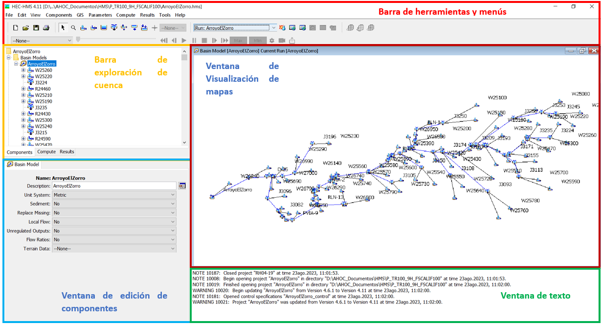

# Generalidades de HEC-HMS

  

<b> Universidad Escuela Colombiana de Ingeniería Julio Garavito</b>
 

Andrés Humberto Otálora Carmona
 

Profesor del Centro de Estudios Hidráulicos
 

andres.otalora@escuelaing.edu.co
 

Keywords: `HEC-HMS` `Ventanas` `Software` `herramientas`

## Introducción

En este módulo se describe con detalle las ventanas, herramientas, opciones y menús que componen el software HEC-HMS.

## Objetivos

El objetivo principal de esta actividad es permitir que el estudiante conozca los elementos que se usarán para la construcción del modelo, el manejo del programa y sus archivos y las diferentes herramientas de edición y alimentación de los objetos que componen la cuenca hidrográfica, los cauces y los elementos hidroclimatológicos.

## HEC-HMS. Generalidades

El software para modelación hidrológica (HEC-HMS) está diseñado para simular los procesos hidrológicos en cuencas hidrográficas dendríticas. El software incluye herramientas para desarrollar análisis hidrológicos tradicionales, tales como infiltración, hidrogramas unitarios y tránsito hidrológico. HEC-HMS incluye los procedimientos necesarios para realizar simulaciones continuas en el tiempo, en las que se incluyen: evapotranspiración, deshielo y estimación de la humedad del suelo. También tiene herramientas avanzadas para la simulación de la escorrentía especializada utilizando procesos de transformación de escorrentía lineal a sistemas distribuidos.

## HEC-HMS. Historia

El algoritmo de programación que domina el HEC-HMS y su interface gráfica fue elaborado por "US Army Corps of Engineer". Los inicios de este software datan de más de 30 años, el cual fue elaborado a partir de la experiencia de profesionales e ingenieros expertos en simulación hidrológica. 

Los primeros inicios de este software se remontan desde los primeros software de simulación: HEC-1 (HEC, 1998), HEC-1F (HEC, 1989), PRECIP (HEC, 1989) y HEC-IFH (HEC, 1992), los cuales se han modernizado y combinado con nuevos algoritmos para formar una biblioteca completa de rutinas de simulación. 

La versión inicial del programa se llamó HEC-HMS Versión 1.0 la cual incluía la mayoría de las herramientas de simulación de eventos de lluvia y de escorrentía disponibles en el programa HEC-1. Con esta primera versión se introdujeron varias mejoras notables con respecto al software inicial. Se incluyeron análisis de hidrogramas y la representación discreta de la escorrentía. Las herramientas para la estimación de parámetros con optimización eran mucho más flexibles que en programas anteriores. El lanzamiento inaugural también incluyó una serie de "primicias" para HEC, incluido el desarrollo orientado a objetos en el lenguaje C++ y soporte multiplataforma en un programa con una interfaz gráfica de usuario.

La segunda versión importante se llamó Versión 2.0 y se centró en la simulación continua. La adición del método para la estimación de la humedad del suelo se amplió a partir de un paquete de simulación de eventos con aplicaciones de simulación continua. El elemento "depósito" se amplió para incluir descripciones físicas de una descarga hidráulica teniendo en cuenta los desbordamientos (se agregó una opción de falla por desbordamiento de la presa).

La tercera versión importante se llamó Versión 3.0 e introdujo nuevas funciones de cálculo y una nueva interfaz gráfica de usuario. El modelo meteorológico se mejoró con nuevos métodos para el deshielo y la simulación de la evapotranspiración potencial. El modelo de cuenca se mejoró con métodos adicionales para representar la infiltración en el elemento de subcuenca y opciones computacionales adicionales en los elementos de desvío y reservorio. La nueva interfaz gráfica de usuario fue diseñada para simplificar la creación y gestión de muchos tipos de datos necesarios para la simulación hidrológica y para aumentar la eficiencia del usuario con un entorno de trabajo mejor integrado.

La cuarta versión importante se llamó versión 4.0 y se centró principalmente en nuevas funciones informáticas y en la integración de un marco SIG. Se agregó una amplia gama de características de erosión superficial y transporte de sedimentos a la subcuenca, el tramo, el embalse y en otros elementos. También se agregó una capacidad preliminar para la simulación de la calidad del agua. Se agregó un nuevo componente de simulación para facilitar las operaciones de pronóstico en tiempo real. Finalmente, se agregó al programa un marco SIG integrado que permite a los modeladores delinear subcuencas y tramos, discretizar elementos de subcuenca y realizar procesamientos espaciales.

## Link de descarga del software

En el siguiente link el lector podrán descargar de manera gratuita el software de modelación hidrológica HEC-HMS desde la plataforma del Cuerpo de Ingenieros de los Estados Unidos (US Army Corps of Engineers) en su última versión en inglés:

[LINK DE DESCARGA](https://www.hec.usace.army.mil/software/hec-hms/downloads.aspx)

## Herramientas, menús y botones del software HEC-HMS

En la siguiente figura se presentan las principales ventanas que conforman la interface gráfica del software HEC-HMS en su versión 4.11.

  

**1) Barra de herramientas y menus:** Barra que contiene los principales menús del software, tales como las herramientas de edición del archivo, las herramientas de presentación de los resultados, las herramientas para agregar los componentes, las herramientas de trabajo, el menú de ayudas, entre otros.

**2) Barra de exploración de cuencas:** Barra que contiene las características de la cuenca y de las subcuencas, las propiedades de los tramos de río, las propiedades de las variables hidroclimatológicas, las propiedades del suelo, las propiedades de modelación y las herramientas de enlace entre las subcuencas y la "metereología" (datos hidroclimatológicos).

**3) Ventana de visualización de mapas:** Ventana que representa la cuenca principal que se está modelando. En esta ventana se muestran los íconos que el usuario puede ir agregando a la cuenca principal. En esta ventana se puede ver: embalses, tanques, subcuencas, herramientas de metereología, uniones y tramos de rios con tránsitos.

**4) Ventana de edición de componentes:** Ventana que permite editar las propiedades de cada elemento que se muestra en la ventana de exploración de cuencas y en la ventana de visualización de mapas. En esta ventana, las propiedades se encuentran clasificadas en pestañas.

**5) Ventana de texto:** Ventana que muestra, en forma de texto, las diferentes acciones ejecutadas por el usuario en el software en cada una de las ventanas. En esta ventana también se presentan las sugerencias y los errores al ejecutar o correr una modelación.

A medida que el usuario va desarrollando las diferentes actividades presentadas en este módulo podrá comprender el uso de cada ventana y la aplicación de las principales herramientas que componen el uso básico del software.

### Principales Herramientas

Para que el usuario se vaya familiarizando con el uso de los principales íconos que se usarán en el software, a continuación se presenta una tabla resumen con la descripción general de los principales íconos de la barra de herramientas y menus 

| Herramienta/ícono                                     | Descripción                                                                                                                                                                                                                                                                                                     |
|--------------------------------------------------------|-----------------------------------------------------------------------------------------------------------------------------------------------------------------------------------------------------------------------------------------------------------------------------------------------------------------|
|    | Botón que permite crear un nuevo archivo.                                                                                                                                                                                                                                                                       |
|    | Botón que permite abrir un archivo de HEC-HMS previamente creado.                                                                                                                                                                                                                                               |
|    | Botón que permite seleccionar los componente de la ventana de visualización.                                                                                                                                                                                                                                    |
|    | Botón que permite modificar el zoom de los elementos presentados en la ventana de visualización.                                                                                                                                                                                                                |
|    | Botón que permite ingresar una subcuenca en la cuenca principal.                                                                                                                                                                                                                                                |
|    | Botón que permite agregar un tramo de rio entre dos subcuencas o una cuenca y un punto de entrega.                                                                                                                                                                                                              |
|    | Botón que permite crear un punto de descarga de una corriente o subcuenca. Este elemento permite la entrada de agua desde una corriente o una subcuenca y también permite calcular la descarga o salida de agua a partir de un tránsito hidráulico tomando como referencia una estructura de descarga definida. |
|    | Botón que permite crear un elemento tipo unión que une dos o más corrientes y las convierte en una sola.                                                                                                                                                                                                        |
|   | Botón que permite crear una derivación de una corriente en dos o más.                                                                                                                                                                                                                                           |
|   | Botón que permite crear una elemento de almacenamiento donde no es posible asignar entradas pero si permite asignar una descarga o salida de agua.                                                                                                                                                              |
|   | Botón que permite crear un punto de descarga de una corriente. Este elemento no permite el cálculo de descargas o salidas de agua. Este elemento es el más adecuado para finalizar el cálculo de un modelo de una corriente en un punto de control sobre el cauce.                                              |
|   | Botón que permite dividir el área de trabajo definido por un modelo de terreno tipo DEM. Este punto se puede considerar el punto de control del cálculo.                                                                                                                                                        |
|   | Botón que permite ejecutar una simulación previamente creada.                                                                                                                                                                                                                                                   |
|   | Botón que permite ejecutar procesos de optimización con base en los parámetros escogidos y teniendo en cuenta las simulaciones previamente creada.                                                                                                                                                              |
|   | Botón que permite ejecutar procesos creación de pronósticos con base en información hidroclimatológica previamente definidas en los elementos que alimentan las subcuencas.                                                                                                                                     |
|   | Botón que permite ejecutar una simulación previa de caudales máximos tomando como punto de partida una lluvia con un porcentaje de excedencia. Esta herramienta crea tormentas de diseño, en cada subcuenca, en función de un hietograma definido.                                                              |
|   | Botón que permite ejecutar simulaciones tipo Monte Carlo. Esta simulaciones estiman los errores probabilísticos asociados a las variables de entrada y como esa incertidumbre modifica la variable calculada.                                                                                                   |
|   | Botón que permite mostrar los resultados globales de la simulación en un elemento dentro de una cuenca.                                                                                                                                                                                                         |
|   | Botón que permite mostrar de manera resumida en una gráfica, los valores de entrada, las pérdidas de masa en la cuenca (abstracciones) y los resultados obtenidos de la simulación en un elemento dentro de una cuenca una vez se ejecuta la simulación.                                                        |
|   | Botón que permite mostrar de manera resumida en una tabla, los valores obtenidos de la simulación en un elemento dentro de una cuenca una vez se ejecuta la simulación.                                                                                                                                         |
|   | Botón que permite mostrar de manera detalla y para cada intervalo de tiempo definido previamente (dt), los valores hidrológicos de entrada y los resultados obtenidos una vez se ejecuta la simulación.                                                                                                         |

### Control de versiones

| Versión    | Descripción   | Autor                                      | Horas |
|------------|:--------------|--------------------------------------------|:-----:|
| 2023.08.23 | Versión No. 1 | [AndresOtalora92](https://github.com/AndresOtalora92)  |   4   |

_MOHI es de uso libre para fines académicos, conoce nuestra licencia, cláusulas, condiciones de uso y como referenciar los contenidos publicados en este repositorio, dando [clic aquí](../../License.md)._

_¡Encontraste útil este repositorio!, apoya su difusión marcando este repositorio con una ⭐ o síguenos dando clic en el botón Follow de [AndresOtalora92](https://github.com/AndresOtalora92?tab=repositories) en GitHub._

| [Anterior](../../../Readme.md) | [:house: Inicio](../../Readme.md) | [:beginner: Ayuda / Colabora] | [Siguiente](CaudalesMaximos.md) |
|--------------------------------|------------------------------------|--------------------------------------------------------------------------------------------------|----------------------------------------------|

 Este curso guía ha sido desarrollado con el apoyo de la Escuela Colombiana de Ingeniería - Julio Garavito. Encuentra más contenidos en https://github.com/uescuelaing  
