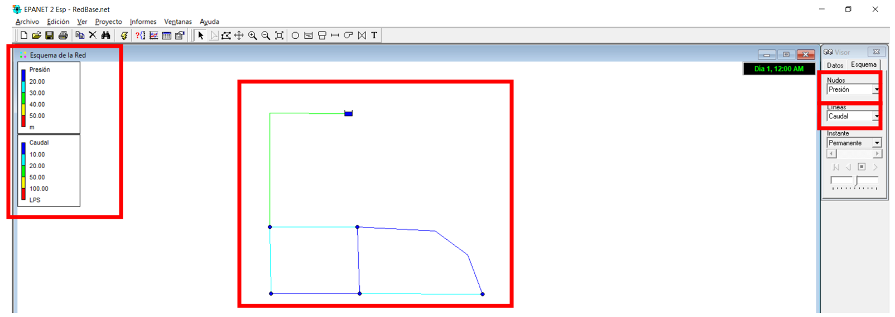
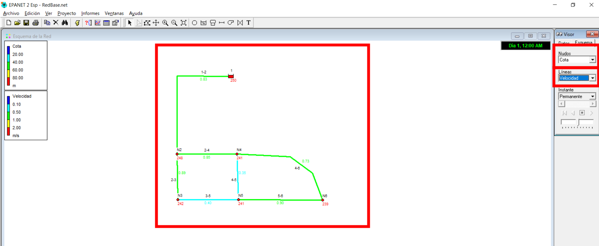
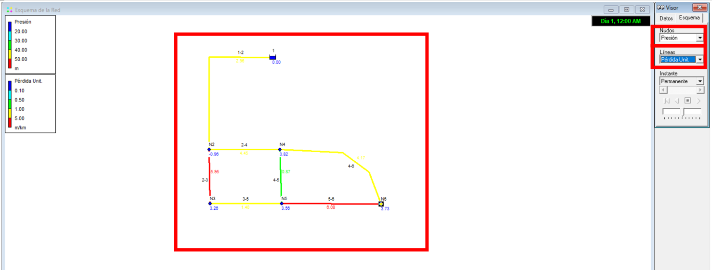
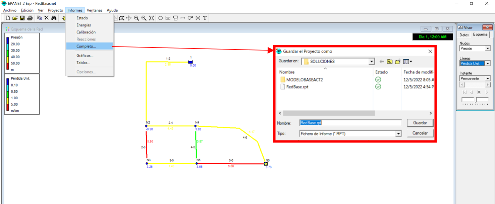
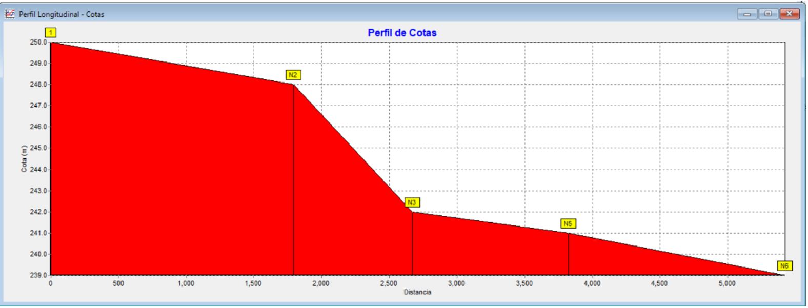
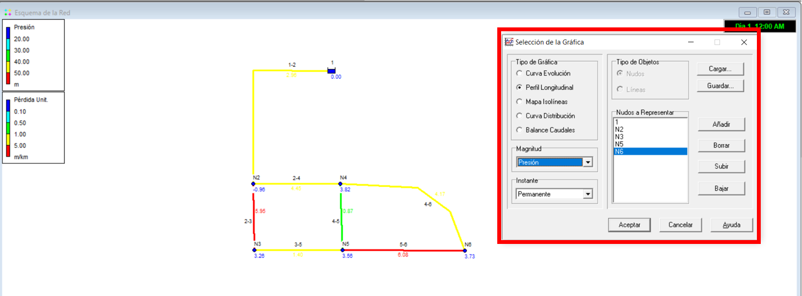
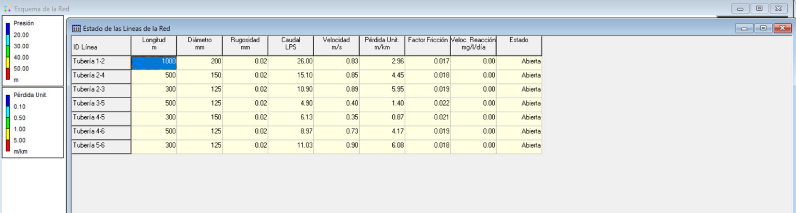

# Curso de Epanet - Módulo 2 - Resultados. Análisis y revisión.

  

<b> Universidad Escuela Colombiana de Ingeniería Julio Garavito</b>
 

Andrés Humberto Otálora Carmona
 

Profesor del Centro de Estudios Hidráulicos
 

andres.otalora@escuelaing.edu.co
 

Keywords: `Resultados` `Histogramas` `Análisis`

## Introducción

En este módulo se presentan algunas recomendaciones para la visualización y exportación de los resultados obtenidos en EPANET una vez se ha creado la geometría, se ha alimentado el modelo y ejecutado.

## Objetivos

El objetivo principal de esta actividad es permitirle al usuario tener diferentes herramientas de visualización de los resultados a partir del resumen de los mismos en tablas, contornos y gráficas, que pueden ser utilizados por el diseñador para tomar decisiones en una red hidráulica.

 

 

       

## Ejecutar el modelo hidráulico

_a. Una vez ingresado todos los objetos de la red con su respectiva información se procede a ejecutar el modelo. Para esto diríjase a la barra de menus de los atajos y de clic sobre el ícono en forma de rayo. Si todo está bien, le aparecerá una pantalla ue indica que la "Simulación es válida"_

  

_b. Una de las primeras metodologías para visualizar los resultados corresponde al uso de las leyendas. En este caso se ha seleccionado en la barra "Visor", para las tuberías la variable caudal y en los nodos la variable presión. En la parte izquierda de la ventana de trabajo aparecerá la leyenda con barra de colores, representados po una escala gradual._

  

_c. Para visualizar de mejor manera los resultados es posible indicarle al programa que engruese las líneas y muestre las etiquetas de los resultados tanto de los nodos y de las tuberías. Esto lo pueden realizar el buscar en la barra de herramientas "Ver" y en "opciones de Esquema" indicar la información que se desea mostrar_

  

_d. En la siguiente imagen se muestra el resultado de modificar las opciones de Esquema_

  

_e. A manera de ejemplos complementarios, a continuación se presentan dos esquemas con el uso de leyendas. En la primera imagen se asignó como variables en los nodos las cotas y en las tuberías las velocidades. En la segunda imagen se asignó en los nodos la presión y en las tuberías las pérdidas de energía por unidad de longitud_

  

  

_f. Otra manera de visualizar los resultados de la ejecución del modelo es exportándolo a un formato manipulable tipo: ".rpt" que puede ser abierto con un block de nota, un excel o un note++. En la barra de herramientas "informes" opción "Completp", puede exportar los resultados en la ruta que desee el usuario._

  

_g. Una vez lo haya guardado abra el archivo con uno de los software indicados anteriormente. En las siguientes dos imágenes se presentan los resultados obtenidos del informe generado por EPANET En este resume o reporte se puede encontrar los resultados en cada uno de los elementos que componen la red, en nuestro ejemplo los resultados en el tanque de alimentación, en los nodos y en las tuberías._

  

  

_g. También es posible representar los resultados utilizando la opción "gráfico" en la barra de herramientas "Informes" y seleccionando la categoría "Perfil Longitudinal". Para este caso debe seleccionar la ruta indicándola a partir de los nodos que conforma la ruta_

  

_h. En este ejemplo se ha seleccionado la opción de "Magnitud" la variable "Cota" y se ha definido la ruta representada por los nodos "Tanque 1", "Nodo 2", "Nodo 3", "Nodo 5", "Nodo 6". Los resultados se presentan a continuación:_

  

_i. A manera de ejemplo en las siguientes imágenes se presenta el perfil de presiones tomando como referencia la ruta definida por los nodos "Tanque 1", "Nodo 2", "Nodo 3", "Nodo 5", "Nodo 6". Con esta herramienta en muy fácil identificar los puntos críticos y su variación con respecto al espacio: _

  

  

_j. También es posible extraer información y analizarla adecuadamente utilizando tablas que resumen la información tanto en los nodos como en las tuberías. En la barra de herramientas "Informes" en la opción "Tablas" puede seleccionar las tablas para los Nodos y para las tuberías. A manera de ejemplo a continuación se muestra la creación de estas tablas en los nodos._

  

_k. En "Columnas" seleccionar la información que quiere mostrar en cada nodo y dar clic en aceptar._

  

_l. Al realizar esto se abrirá la tabla que resumen en cada uno de los nodos la información seleccionada. En este caso se presenta la cota, la demanda base, la demanda total, la altura de energía, la altura de presión y la calidad del fluido (NO APLICA PARA ESTE CURSO)_

  

_m. Repitiendo este mismo procedimiento pero ahora seleccionado en el "Tipo" la opción "Línea de la Red" (tuberías)_

  

_n. Indique en las opciones de "Columnas" las variables que desea presentar en la tabla resumen de cada tramo de tubería_

  

_o. Al realizar esto se abrirá la tabla que resumen en cada uno de las tuberías o tramos de tuberías con la información seleccionada. En este caso se presenta la longitud, el diámetro, la rugosidad absoluta, el caudal, la velocidad, las pérdidas por unidad de longitud, el factor de fricción y el estado de las posibles válvulas definidas en el modelo._

  

_p. También es posible exportar el esqueleto o geometría base a diferentes formatos que pueden ser abiertos en otros software como por ejemplo AutoCAD, Civil3D, ArcGis y QGis. A manera de ejemplo a continuación se presenta como exportar el esquema del sistema. En la barra de herramientas "Archivo" en la opción "Exportar" seleccione la categoría "Esquema". Seleccione la opción de formato "Fichero intercambio Dibujo (.dxf)"_

  

_q. Seleccione la ruta donde el usuario desee exportar la información. Respete la extensión ".dxf"_

  

_r. Para revisar la exportación y trabajar con el resultado, abra el archivo "dxf" utilizando uno de los software indicados anteriormente. En nuestro ejemplo se abrió el software Civil3D y se abrió el archivo_

  

_s. También es posible exportar el escenario lo cual corresponde a la geometría incluyendo los diámetros, la rugosidad de las tuberías y la demanda en los nodos. Esta exportación se cargará en formato: ".inp", formato que puede ser ejecutado desde otro archivo y otro dicumento de EPANET._

  

### Control de versiones`

| Versión    | Descripción   | Autor                                      | Horas |
|------------|:--------------|--------------------------------------------|:-----:|
| 2022.05.12 | Versión No. 1 | [AndresOtalora92](https://github.com/AndresOtalora92)  |   2   |
| 2022.06.12 | Versión No. 1 | [AndresOtalora92](https://github.com/AndresOtalora92)  |  2.5  |

_CursoEpanetBasico-Intermedio es de uso libre para fines académicos.

_¡Encontraste útil este repositorio!, apoya su difusión marcando este repositorio con una ⭐ o síguenos dando clic en el botón Follow de [AndresOtalora92](https://github.com/AndresOtalora92?tab=repositories) en GitHub._

| [Anterior](../ModuloNo.2/AlimentacionEPANET.md) | [:house: Inicio](../../README.md) | [:beginner: Ayuda / Colabora] | [Siguiente](../ModuloNo.3/DemandaVariableNodos.md) |
|----------------------------|-----------------------------------|--------------------------------------------------------------------------------------------------|----------------------------------------------------|

 Este curso guía ha sido desarrollado con el apoyo de la Escuela Colombiana de Ingeniería - Julio Garavito. Encuentra más contenidos en https://github.com/uescuelaing  
