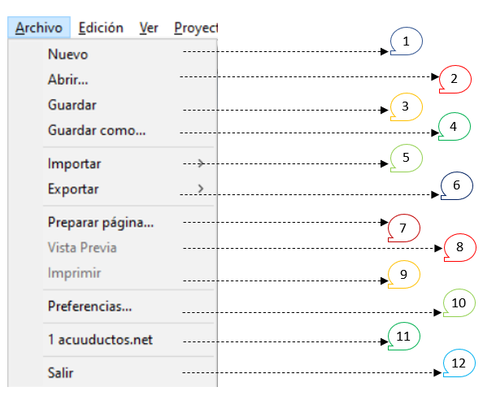
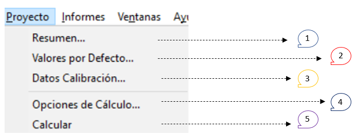
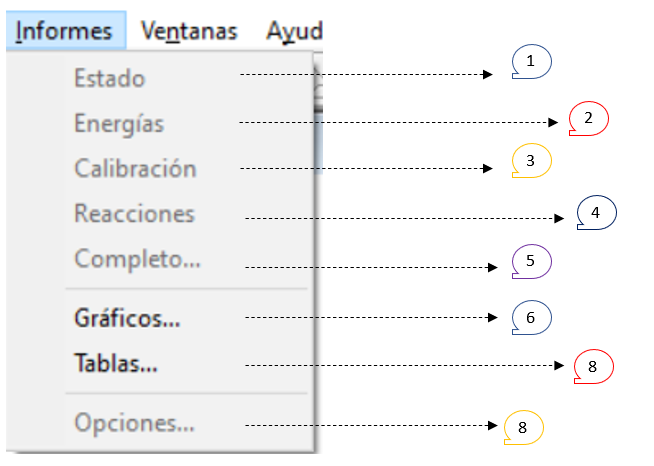
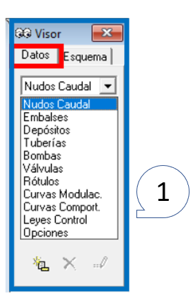
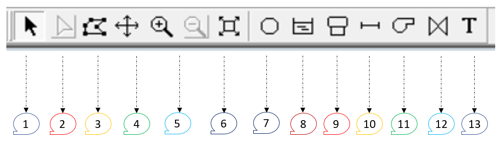

# Curso de Epanet - Módulo 2 - Generalidades de EPANET

  

<b> Universidad Escuela Colombiana de Ingeniería Julio Garavito</b>
 

Andrés Humberto Otálora Carmona
 

Profesor del Centro de Estudios Hidráulicos
 

andres.otalora@escuelaing.edu.co
 

Keywords: `EPANET` `Ventanas` `Software` `herramientas`

## Introducción

En este módulo se describe con detalle las ventanas, herramientas, opciones y menús que componen el software EPANET.

## Objetivos

El objetivo principal de esta actividad es permitir que el estudiante conozca con detalle los elementos que se usarán para la construcción del modelo, el manejo del programa y sus archivos y las diferentes herramientas de edición, calibración, complementación y alimentación de los objetos que componen la red.

 

 

       

## EPANET. Historia 

EPANET es un software de modelación hidráulica que permite desarrollar proyectos de sistemas con flujo a presión. 

Es un programa de dominio público desarrollado por la Agencia de Protección Ambiental de Estados Unidos (EPA por sus siglas en inglés) y difundido ampliamente en el mundo para el desarrollo de actividades de consultoría, investigación aplicada, investigación teórica y como software de gestión.

Si bien fue diseñado para el análisis de sistemas con agua potable, también puede ser utilizado para el análisis de cualquier fluido no compresible con flujo a presión.

La primera versión de EPANET fue lanzada en 1993. Posteriormente, se lanzó EPANET 2, versión que dispone de código libre en lenguaje C. 

El software permite realizar análisis hidráulicos en sistemas de tuberías presurizadas a partir de las características físicas de las tuberías longitud, material, coeficiente de rugosidad, diámetro) y las de los fluidos (densidad y viscosidad). Es un programa que solucionan las ecuaciones que se generan a la hora de determinar el flujo en una red abierta o cerrada.

El software permite integrar, además de las redes de tuberías y nodos, tanques de alimentación, sistemas de bombeos y accesorios a partir de la inclusión de coeficientes de pérdidas localizadas. 

Con el desarrollo de las herramientas computacionales, diseñadores y programadores de todo el mundo han elaborado distintas aplicaciones compatibles con el software original, permitiendo una interacción entre
otros programas tales como: AutoCAD, QGis, ArcGis, SWMM, Python, R, entre otros. Esta interacción de software ha permitido aumentar el número de procesamientos, acortando los procesos de construcción de la
geometría, la inclusión de información y los análisis simultáneos para distintos escenarios. 

La versión original del programa fue desarrollada en inglés pero su código fuente ha sido modificada y traducida al español por varias instituciones.

## Link de descarga del software

En el siguiente link podrán descargar de manera gratuita el software de EPANET en su última versión en inglés V2.2

[LINK DE DESCARGA](https://www.epa.gov/sciencematters/epanet-220-epa-and-water-community-collaboration)

En el siguiente link podrán descargar de manera gratuita el software de EPANET en su última versión en español V2.0

[LINK DE DESCARGA](http://www.instagua.upv.es/epanet/EpanetCastellano.htm)

## Herramientas, menús y botones del software EPANET

Al ejecutar el software, la primera ventana que el usuario ve corresponde a la ventana principal del programa, la cual integra las barras de menús, las principales herramientas de cálculo y dibujo, las leyendas y la barra para la representación gráfica (visor).

A continuación se describen los principales espacios que conforman la ventana principal del software en su versión 2.2 y posteriormente se describe cada uno de los componentes principales de los menus. 

### Barra de herramientas.

En la siguiente figura se presentan resaltados los elementos de la ventana principal de trabajo. 

  

**1) Barra de Menus:** Barra que contiene los principales menús del software, tales como las herramientas de edición del archivo, las herramientas de presentación de los resultados, las herramientas para la elaboración de informes y el menú de ayudas.

**2) Barra de Herramientas Estándar:** Barra que contiene las herramientas que permiten manipular, editar, guardar y abrir los archivos creados en EPANET y sus complementos. También se encuentran atajos para ejecutar el modelo y mostrar los resultados numéricos en tablas. 

**3) Barra de Herramientas del mapa:** Barra que contiene las herramientas para la creación de los objetos que hace parte de los accesorios y elementos que componen la red construida en el espacio de trabajo.

**4) Zona de trabajo y de dibujo:** Corresponde al espacio de trabajo que el usuario utiliza para dibujar su red con sus respectivos elementos y accesorios. En este espacio de dibujo también se representan los resultados a partir de la barra de visor y la barra de leyendas. 

**5) Visor:** Corresponde al conjunto de herramientas que permite mostrar los resultados de las modelaciones y de las características de los accesorios y tuberías. Es posible mostrar los resultados de manera numérica o a partir de la paleta de colores. Los resultados se pueden representar en los nodos o en las tuberías. 

**6) Barra de estado:** Barra que permite conocer las coordenadas de los puntos donde su ubica el cursor. También muestra las unidades en las cuales se está calculando el caudal y el porcentaje de ampliación de la ventana de trabajo y del área de trabajo.

### Barra de herramientas "Archivo"

En la siguiente figura se presentan resaltados las herramientas que hacen parte de la barra de Archivo.

  

**1) Nuevo:** Permite crear un nuevo archivo en blanco.  
**2) Abrir:** Permite abrir un archivo creado el cual se encuentre en el computador del usuario.  
**3) Guardar:** Permite guardar un archivo del avance de trabajo cuando ya se ha guardado por primera vez. 
**4) Guardar como:** Permite guardar por primera vez un archivo. 
_____________________________________________________________________________________
**5) Importar:** Permite traer o importar tres tipos de archivos generados previamente en un archivo tipo EPANET. 

**5.1)** Importar Esquema: Permite importar una imagen de fondo con formato ".map" 
**5.2)** Importar Escenario: Permite importar un escenario modelación de fondo con formato ".scn" 
**5.3)** Importar Red: Permite importar un esquema ya trazado de una red y sus accesorios con formato tipo ".inp" 

**6) Importar:** Permite exportar tres tipos de archivos generados previamente en el archivo de EPANET que se está trabajando. 

**6.1)** Exportar Esquema: Permite exportar una imagen de fondo con formato ".map" 
**6.2)** Exportar Escenario: Permite exportar un escenario modelación de fondo con formato ".scn" 
**6.3)** Exportar Red: Permite exportar un esquema ya trazado de una red y sus accesorios con formato tipo ".inp" 

_____________________________________________________________________________________

**7) Preparar página:** Al abrir esta aplicación se despliega una ventana que permite configurar las características del papel para su impresión y visualización. 

**8) Vista previa:** Permite visualizar la zona de impresión antes de ejecutar la impresión física o ser guardado como archivo tipo "pdf". 

**9) Imprimir:** Permite imprimir o guardar en formato tipo "pdf" la ventana de trabajo. 

_____________________________________________________________________________________

**10) Preferencias:** Permite definir con anticipación las preferencias de los formatos de texto y el número de decimales en los que se podrá ingresar la información y mostrar los resultados numéricos. 

_____________________________________________________________________________________

**11) Archivos recientes:** Atajo que muestra el archivo o los archivos más recientes trabajados por el usuario. 

_____________________________________________________________________________________

**12) Salir:** Permite salir del archivo que se está trabajando. No cierra el programa. 

### Barra de herramientas de "Edición"

En la siguiente figura se presentan resaltados las herramientas que hacen parte de la barra de Edición.

  

**1) Copiar a:** Permite copiar al portapapeles del computador la información de la red: La imagen de la zona de trabajo y las coordenadas de los nodos con sus principales resultados. 

_____________________________________________________________________________________

**2) Seleccionar Objeto:** Permite seleccionar un objeto particular de la red. 
**3) Seleccionar Vértice:** Permite seleccionar el vértice de una tramo o una malla de la red. 
**4) Seleccionar Region:** Permite seleccionar diferentes objetos o elementos al mismo tiempo. La selección se hace a partir de la identificación de los objetos que quedan dentro del polígono que el usuario debe crear temporalmente arrastrando el mouse. 
**5) Seleccionar Todo:** Permite seleccionar todos los elementos, nodos y objetos dibujados en la zona de trabajo que hace parte de la red. 
_____________________________________________________________________________________

**6) Editar Grupo:** Permite editar las características generales de un grupo de elementos, como por ejemplo la rugosidad de diferentes tramos de tuberías o ajustar la altura de diferentes nodos . 

### Barra de herramientas "Ver"

En la siguiente figura se presentan resaltados las herramientas que hacen parte de la barra Ver.

  

**1) Dimensiones:** Permite modificar las dimensiones del área de trabajo con referencia al vértice inferior izquierdo y al vértice superior derecho. También permite modificar las unidades de las dimensiones del área de trabajo: "Pies", "metros", "grados" y "ninguna". 

**2) Mapa de Fondo:** Permite importar imágenes de fondo con formato tipo ".bmp", ".emf" y "wmf".

Al desplegar las opciones de "Mapa de fondo" se encuentran las siguientes herramientas:

  

_1. Cargar:_ Podrá "carga" una imagen de fondo en los formatos mencionados.  
_2. Descargar:_ Podrá eliminar la imagen cargada. 
_3. Alinear:_ Podrá mover o alinear la imagen con respecto al área de trabajo. 
_4. Mostrar:_ Podrá mostrar y ocultar la imagen cargada sin la necesidad de "descargar" la imagen.  

**3) Desplazar:** Permite mover el centro de la ventana de trabajo.  

**4) Acerca:** Permite acercar una zona particular de la red en la ventana de trabajo.  

**5) Alejar:** Permite alejarse de una zona particular de la red en la ventana de trabajo.  

**6) Encuadre:** Permite que el sistema realice una "zoom" tal que se observe todos los objetos del dibujo que componen la red.  

_____________________________________________________________________________________

**7) Buscar:** Permite buscar a partir del código identificador (ID) un nodo, línea o fuente específica.  

**8) Consultar:** Permite buscar y seleccionar los nodos o tuberías que cumplan un parámetro utilizando las comparaciones de "menor que", "mayor que" e "igual que".  

_____________________________________________________________________________________

**9) Vista General:** Permite generar una segunda ventana que muestra el paneo general de todo el área de trabajo. Esta ventana es independiente de la ventana principal con un "zoom" distinto.  

**10) Leyenda:** Permite manipular las propiedades de las dos barras de leyendas dispuestas en la ventana de trabajo. Al desplegar las opciones de "Leyenda" se encuentran las siguientes herramientas:

  

_1. Apagar y encender leyendas en Nodos y líneas:_ Permite apagar y encender las leyendas de los resultados y propiedades de los nodos y de las líneas que se presentan en la ventana de trabajo. .  

_2. Modificar la visualización de las leyendas Nudos y líneas:_ Permite configurar la paleta de colores de la barra de leyenda. Es posible modificar los valores medios y extremos que definen el espectro de los resultados.  

_____________________________________________________________________________________

**11) Barra de herramientas:** Tal como se aprecia en la siguiente imagen, esta herramienta permite "apagar" y "encender" las barras de herramientas "Estándar" y "Esquema"

  

**12) Opciones de esquema:** Esta herramienta permite modificar las características de la presentación de los nodos, líneas, rótulos, etiquetas, símbolos, fechas y del fondo. En la siguiente imagen se muestran las opciones mencionadas las cuales se despliegan al abrir esta herramienta:

  

**Nota:** La barra de "Opciones de esquema" también puede ser desplegada dando clic derecho del mouse en cualquier zona de la ventana de trabajo.

### Barra de herramientas "Proyecto":

Permite conocer y editar las principales características del proyecto. Al desplegar las opciones de "Proyecto" se encuentran las siguientes herramientas:

  

**1) Resumen:** Permite abrir una nueva ventana que muestra el resumen de los elementos que componen la red dibujada en la zona de trabajo, las unidades del caudal, la fórmula utilizada para estimar las pérdidas por fricción y, si es el caso, las ecuaciones que rigen el parámetro de la calidad del agua. Un ejemplo del resumen que arroja la herramienta se presentan a continuación:

    Número de Nudos Caudal  0
    Número de Embalses      0
    Número de Depósitos     0
    Número de Tuberías      0
    Número de Bombas        0
    Número de Válvulas      0
    Unidades de Caudal      LPS
    Fórmula Pérdidas Carga  D-W
    Parámetro de Calidad    Ninguno

**2) Valores por defecto:** Herramienta que permite crear un prefijo para identificar los elementos que componen la red. Además, permite definir valores por defecto o iniciales (al crear un objeto). Entre las propiedades que se pueden definir por defecto se encuentra el diámetro de las tuberías, el diámetro de los depósitos, la longitud de las tuberías, la rugosidad de las tuberías entre otros. Finalmente, permite definir por defectos los parámetros hidráulicos, el módulo de solución (número de iteraciones y acción en el caso de no encontrar una solución), entre otros.

**3) Datos de Calibración:** Herramienta que permite definir los valores parámetro que permiten la calibración de un modelo hidráulica elaborado en EPANET. La calibración de un modelo puede realizar al indicarle al software que modifique una variable geométrica o variable hidráulica hasta alcanzar el o los valores parámetros. Los variables que pueden ser definidas como parámetros de calibración corresponden a: Demanda en nodos, altura de un tanque, presión en un nodo, el caudal y la velocidad en un tramo de tubería.  

_____________________________________________________________________________________

**4) Opciones de cálculo:** Herramienta que permite definir los parámetros predeterminados para la determinación de los métodos matemáticos (numéricos) que determinan el caudal y las pérdidas de energía entre tramos de una red. En esta herramienta se puede modificar las unidades del caudal, lás fórmulas para la estimación de las pérdidas (más adelante se describirán con detalle estas ecuaciones), la viscosidad y densidad como valores relativos de un fluido (patrones: densidad [1000 kg/m³] y densidad [1.007*E-6 m²/s]), el máximo número de iteraciones, el grado de precisión para detener la modelación (iteración) entre otros parámetros por defecto.

**4) Calcular:** Permite ejecutar o correr el modelo de la red una vez se hayan introducido y cargado todos los parámetros hidráulicos y geométricos. Al ejecutar el programa se abrirá una ventana emergente que muestra el estado que definirá los posibles errores de la modelación o el éxito de su ejecución.

### Barra de herramientas "Informe":

Permite presentar de manera gráfica (histogramas) y numérica (tablas) los resultados de las modelaciones realizadas en EPANET. Al desplegar las opciones de "Proyecto" se encuentran las siguientes herramientas:

  

**1) Estado:** Permite revisar el estado generar de la red analizando las variables que se ejecutarán. Esta herramienta permite revisar la calidad de la modelación una vez se ha ejecutado el programa. 

**2) Energía:** Una vez ejecutado el modelo, esta opción permite revisar la curva de eficiencia de la bomba o de las bombas que se agregaron en la red. 

**3) Calibración:** Permite definir los valores por defecto que serán utilizados para realizar la calibración de la red.

**4) Reacciones:** FUERA DEL ALCANCE DE ESTE CURSO.

**5) Completo:** Permite guardar los resultados y la ejecución de la modelación en formato ".RPT"

_____________________________________________________________________________________

**6) Gráficos:** Permite presentar los resultados de las modelaciones en un diagrama de barras (histograma) permitiendo evaluar en una ruta (un tramo de la red definida por diferentes nodos) las variables hidráulicas"
 
**7) Tablas:** Permite presentar a manera de resumen y en un o varias tablas los resultados obtenidos de la modelación en cada nodo o en cada tramo de tubería. Esta opción permite agregar o quitar variables antes de ejecutar el reporte, el cual puede ser copiado y pegado en un editar de texto o editor numérico como EXCEL."

_____________________________________________________________________________________

**8) Opciones:** FUERA DEL ALCANCE DE ESTE CURSO.

### Barra de Visor:

Permite visualizar de manera dinámica y con paleta de colores (representación gráfica con leyendas) los resultados y las variables introducidas al modelo tanto en los nodos como en los tramos de tuberías. Al desplegar las opciones de "Proyecto" se encuentran las siguientes herramientas:

  

**1)Datos** Permite visualizar de manera didáctica y apoyado de las leyendas las variables hidráulicas en los diferentes accesorios y objetos que componen la red. Entre las variables que pueden ser visualizados se encuentra los accesorios como embalse, depósitos, bombas y válvulas.  

  

**2)Esquema** Permite visualizar de manera didáctica y apoyado de las leyendas las variables hidráulicas en los nodos y en las tuberías. Entre las variables que pueden ser visualizados se encuentra la cota, el caudal de demanda, la demanda base, la atura de energía, la altura de presión, entre otras.  

### Barra de herramientas con botones de rápido acceso: 

Esta barra permite realizar alguna de las tareas que ya se presentaron en las barras de herramientas y menus.

A continuación se nombran cada uno de los elementos que componen las dos barras:

**Barra No. 1:** Agrupación de botones con acceso directo a la edición y ejecución del programa. 

  

  1. Crear nuevo documento    
  2. Abrir documento    
  3. Guardar documento    
  4. Imprimir/Guardar pdf    
  5. Copiar elemento    
  6. Quitar elemento    
  7. Buscar elemento sobre el esquema    
  8. Ejecutar/Correr el modelo    
  9. Consultar por parámetro     
  10. Crear de gráficas (histogramas)     
  11. Resultados por tabla    
  12. Consulta por tabla    

**Barra No. 2:** Agrupación de botones que permiten desplazarse por la zona de trabajo, realizar acercamientos y crear los objetos o elementos que componen las redes.

  

  1. Seleccionar elemento    
  2. Seleccionar vértice    
  3. Seleccionar por región (contenido en polígono)     
  4. Mover espacio de trabajo    
  5. Acercar/Alejar área de trabajo    
  6. Máximo Zoom de los elementos en el área de trabajo   
  7. Crear Nodo o Nudo    
  8. Crear embalse   
  9. Crear tanque o reservorio    
  10. Crear tubería    
  11. Agregar bomba    
  12. Agregar Válvula    
  13. Añadir rótulo    

### Control de versiones

| Versión    | Descripción   | Autor                                      | Horas |
|------------|:--------------|--------------------------------------------|:-----:|
| 2022.16.11 | Versión No. 1 | [AndresOtalora92](https://github.com/AndresOtalora92)  |   3   |
| 2022.22.11 | Versión No. 1 | [AndresOtalora92](https://github.com/AndresOtalora92)  |   3   |
| 2022.24.11 | Versión No. 1 | [AndresOtalora92](https://github.com/AndresOtalora92)  |   3   |
| 2022.28.11 | Versión No. 1 | [AndresOtalora92](https://github.com/AndresOtalora92)  |   1   |
| 2022.30.11 | Versión No. 1 | [AndresOtalora92](https://github.com/AndresOtalora92)  |   2   |
| 2022.01.12 | Versión No. 1 | [AndresOtalora92](https://github.com/AndresOtalora92)  |   1   |

_CursoEpanetBasico-Intermedio es de uso libre para fines académicos.

_¡Encontraste útil este repositorio!, apoya su difusión marcando este repositorio con una ⭐ o síguenos dando clic en el botón Follow de [AndresOtalora92](https://github.com/AndresOtalora92?tab=repositories) en GitHub._

| [Anterior](../ModuloNo.1/Taller_aplicacion_unidades_anteriores.md) | [:house: Inicio](../../README.md) | [:beginner: Ayuda / Colabora] | [Siguiente](../ModuloNo.2/Trazado_red_EPANET.md) |
|---------------------------------------------------|-----------------------------------|--------------------------------------------------------------------------------------------------|---------------------------------------------------|

 Este curso guía ha sido desarrollado con el apoyo de la Escuela Colombiana de Ingeniería - Julio Garavito. Encuentra más contenidos en https://github.com/uescuelaing  
