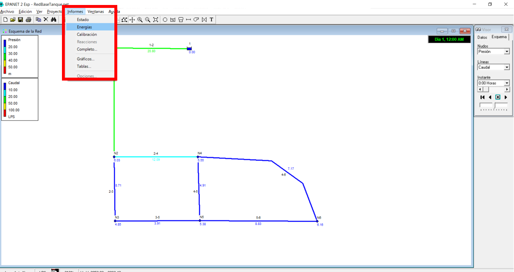
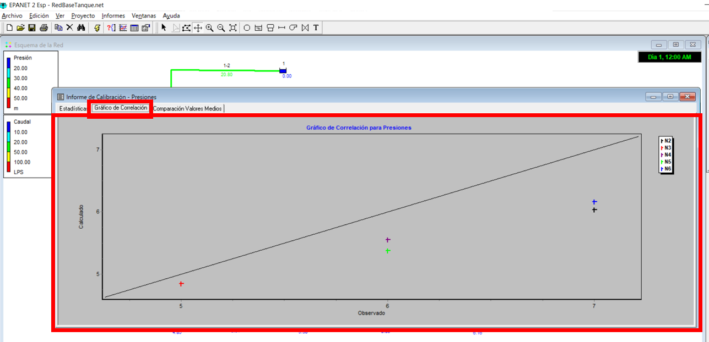
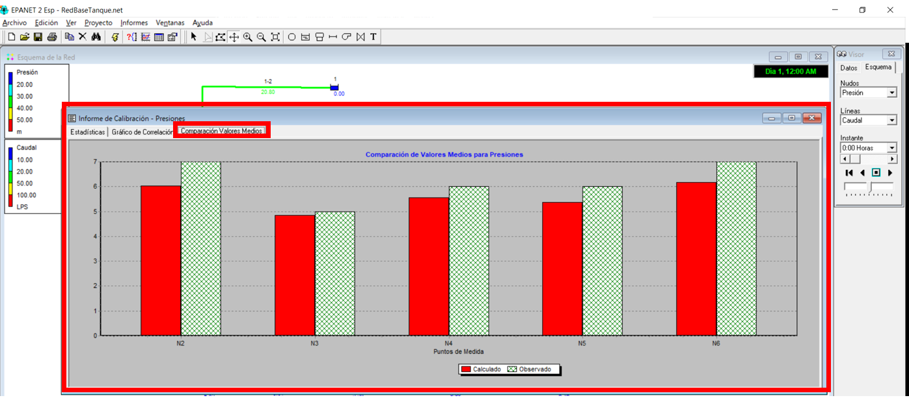

# Curso de Epanet - Módulo 3 - Incorporación de datos de calibración de una red hidráulica utilizando EPANET

  

<b> Universidad Escuela Colombiana de Ingeniería Julio Garavito</b>
 

Andrés Humberto Otálora Carmona
 

Profesor del Centro de Estudios Hidráulicos
 

andres.otalora@escuelaing.edu.co
 

Keywords: `Calibración` `Iteraciones` `Variables base`

## Introducción

En esta actividad se presenta el procedimiento para la incorporación de datos tomados en campo de una red existente, en pocas palabras información base real que puede ser utilizada para la calibración de un modelo numérico, como por ejemplo en EPANET.

## Objetivos

El objetivo principal de esta actividad es mostrarle al usuario el procedimiento sugerido para cargar información tomada en campo de un sistema hidráulico construido y en funcionamiento que servirá de base para calibrar el modelo numérico. 

## Datos base para calibración

Las herramientas "Datos de calibración" e "informe de calibración" permiten al usuario cargar los resultados de una toma de campo de diferentes variables (presión, demanda, alturas en los nodos y caudale y velocidades en las tuberías) a partir de un archivo plano previamente elaborado en un software de lectura tales como "block de nota", "note++" entre otros. 

En este [link](https://pruebacorreoescuelaingeduco-my.sharepoint.com/:u:/g/personal/andres_otalora_escuelaing_edu_co/EQM5r75s9V1OrFoeRJvThvwBxdvi0i0KgDXksAGGGK_Hmw?e=YcY1nu) podrá descargar un ejemplo del formato elaborado en "block de nota" y guardado con extensión ".dat", el cual puede utilizar para sus proyectos cambiando las columnas de "Location" (nombre del objeto: nodo, tubería, tanque, etc.), "Time" (tiempo de la modelación si se analiza con "periodo extendido") y "Value" (parámetro de calibración tomado en campo).

Una vez ingresado los datos y generado los informes, es necesario que el usuario, si así lo desea, modifique los parámetros hidráulicos o geométricos que requiera cambiar en la red (generalmente el coeficiente de rugosidad) para que los resultados obtenidos del modelo numérico se acerquen lo más posible a los datos tomados en campo y que su modelo este "calibrado"

Cabe destacar que el software EPANET no integra herramientas que le permitan realizar múltiples iteraciones modificando una variable tal que se pueda calibrar la red a partir de variables de entrada tomados en campo. Es posible crear desarrollos en otros lenguajes (o en el mismo programador de EPANET) para que esto sea posible.

 

 

       

## Ejemplo de aplicación

Utilizando la red hidráulica construida y presentada en las actividades anteriores de este módulo, se desarrollará esta actividad. 

Se requiere ingresar los datos de calibración presentados en el siguiente cuadro que corresponden a valores de presión medidos en campo en los seis (6) nodos qfr la red con el objetivo que, en posteriores procedimientos, la red pueda ser calibrada modificando los parámetros hidráulicos y geométricos, como por ejemplo el coeficiente de rugosidad:

| Nombre del Nodo | Presión (m.c.a) | 
|-----------------|:----------------|
| N2              | 7               |
| N3              | 5               |
| N4              | 6               |
| N5              | 6               |
| N6              | 7               |

## Datos para calibración e informe de calibración en EPANET

_a Se tomará como modelo hidráulico base la red presentada en la siguiente imagen._

  

_b. En la barra de herramientas "Proyecto" buscar la opción "Datos de calibración"_

  

_c. Se abrirá una ventana en la cual se presentan las variables que pueden ser ingresadas como datos base de una posible calibración_

  

_d. Se crea el archivo base en el editor de texto. Se editan las tres columnas que se presentan en el formato indicado anteriormente revisando detalladamente el nombre de los objetos a los cuales se les ingresarán estos valores de calibración_

  

_e. En la ventana de "Datos de calibración", en el campo "Presión" se da clic en el botón "Examinar" y se busca la ubicación del documento con formato ".dat" creado previamente, se selecciona y se da clic en el botón aceptar._

  

_f. Una vez ingresado los datos se procede a ejecutar el modelo. Para realizar la revisión y la comparación que hace EPANET entre los datos modelados y los datos ingresados, se procede a buscar la opción "Calibración" de la barra de herramientas "Informe"_

  

_g. Se abrirá una ventana con el tipo de variables que puede hacer un informe de comparación. En este caso seleccionamos la opción "presión"_

  

_h. Se selecciona la primera opción y se obtiene un primer reporte numérico a manera de tabla que puede ser importado o copiado a un editor de cálculo como por ejemplo Excel. En este reporte se comparan los valores modelados en los objetos seleccionados con los valores de calibración. También se presenta el error natural y error cuadrático medios entre los dos valores de cada objeto_

  

_i. En la segunda opción se abrirá una gráfica de dispersión en la cual se comparan los datos obtenidos con los datos calibrados. Entre más cerca estén los puntos a la gráfica (línea a 45°) mejor será la aproximación numérica y menor será el error._

  

_j. En la tercera opción se presenta, también de manera gráfica pero esta vez con un diagrama de barras (histograma), la comparación entre los valores obtenidos con la simulación numérica con los datos tomados en campo para cada uno de los objetos seleccionados._

  

### Control de versiones

| Versión    | Descripción   | Autor                                      | Horas |
|------------|:--------------|--------------------------------------------|:-----:|
| 2022.08.12 | Versión No. 1 | [AndresOtalora92](https://github.com/AndresOtalora92)  |  2.0  |

_CursoEpanetBasico-Intermedio es de uso libre para fines académicos.

_¡Encontraste útil este repositorio!, apoya su difusión marcando este repositorio con una ⭐ o síguenos dando clic en el botón Follow de [AndresOtalora92](https://github.com/AndresOtalora92?tab=repositories) en GitHub._

| [Anterior](../ModuloNo.3/ValvulasyAccesorios.md) | [:house: Inicio](../../README.md) | [Fin del curso](../../README.md) |
|-------------------------------------------------|-----------------------------------|--------------------------------------------------------------------------------------------------|

 Este curso guía ha sido desarrollado con el apoyo de la Escuela Colombiana de Ingeniería - Julio Garavito. Encuentra más contenidos en https://github.com/uescuelaing  
