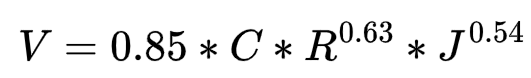
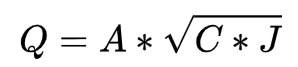
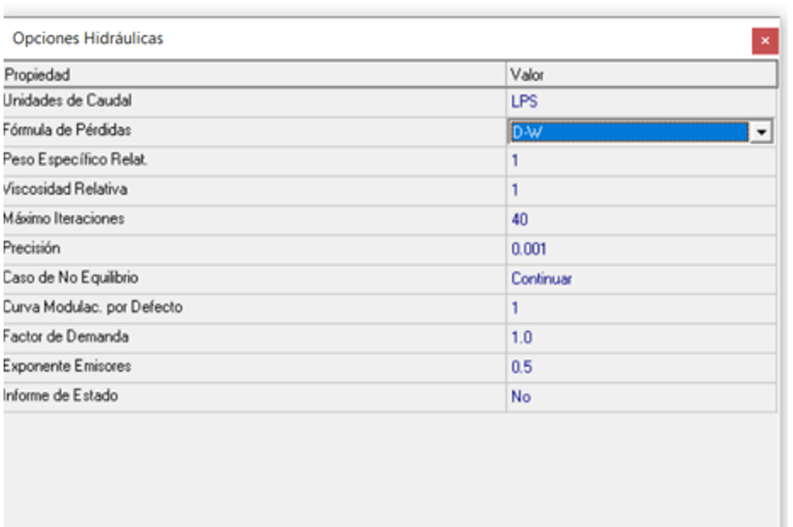
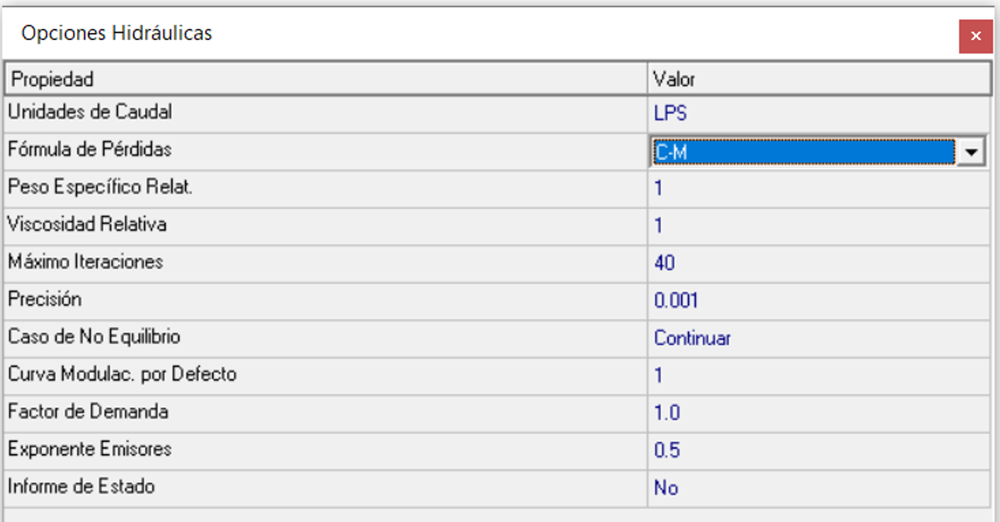

# Curso de Epanet - Módulo 3 - Ecuaciones para el cálculo de las pérdidas por fricción. Análisis de la variación de los resultados

  

<b> Universidad Escuela Colombiana de Ingeniería Julio Garavito</b>
 

Andrés Humberto Otálora Carmona
 

Profesor del Centro de Estudios Hidráulicos
 

andres.otalora@escuelaing.edu.co
 

Keywords: `Pérdidas de Energía` `Carga` `Método de estimación de caudal` `Hazen-William` `Darcy-Weisbach``Chezy-Manning`

## Introducción

En esta actividad se presentan los conceptos fundamentales de los tres métodos más utilizados para la determinación de las pérdidas de energía en un sistema a presión. Se presentan de manera resumida las ecuaciones que el software EPANET usa y se exponen sus particularidades.

## Objetivos

El objetivo principal de esta actividad es darle a conocer al usuario los diferentes métodos que EPANET incorpora en su software para la determinación de los caudales solucionando el sistema de ecuaciones (que incluye la conservación de la energía entre dos puntos). Para cumplir este objetivo se realiza un análisis de los resultados en una misma red para utilizando los tres métodos definidos por el software.

## Ejemplo de aplicación

Utilizando la red hidráulica construida y presentada en las diferentes actividades del módulo 2 se asumirá que el material de la tubería es de cemento u hormigón y se realizarán modelaciones, modificando el método de estimación de la pérdida de energía o pérdida de carga.

## Método de Hazen-William

El método de Hazen-William es utilizado mayormente en Estados Unidos y fue desarrollado principalmente para la estimación de la pérdida de carga en agua y para el diseño de redes de tubería en alcantarillados.

La ecuación original de este método corresponde a:

  

Al discretizar todos los parámetros, EPANET define el método como:

  

Donde "C" es un factor adimensional que depende del material de la tubería. En la siguiente tabla se presentan algunos valores para los materiales más usados:

  

## Método de Darcy-Weisbach

El método de Darcy-Weisbach es el método más utilizado en el mundo es mayormente utilizado para flujo a presión. Su ecuación es función del coeficiente de fricción "f" y de la columna de velocidad en el tramo de tubería evaluado.

La ecuación original de este método corresponde a:

  

Al discretizar todos los parámetros, EPANET define el método como:

  

Donde "f" es el coeficiente de fricción que puede ser determinado, tal como se vio en el módulo 1 utilizando el diagrama de Moodle o la ecuación de Colebrook and White.

La rugosidad absoluta $\epsilon$ también depende del material que recubre la tubería. En la siguiente tabla se presentan algunos valores para los materiales más usados:

  

## Método de Chezy-Manning

El método de Chezy-Manning corresponde a la unión de dos métodos. Fundamentalmente, este método aplica el método de Chezy reemplanzando su factor de pérdidas "C" en función de los parámetros de la ecuación de Manning.

La ecuación original de este método corresponde a:

Al reemplazar el valor "C" (parámetro adimensional de Chezy que depende del material) por los parámetros de la ecuación de Manning, la cual se presenta a continuación:

  

EPANET define el método como:

  

Donde "n" es el factor de rugosidad de Manning el cual depende del material que recubre la tubería. En la siguiente tabla se presentan algunos valores para los materiales más usados:

  

## Comparación de resultados modificando el método de cálculo

_a. Para iniciar con esta comparación, se procederá a modelar la red presentada en el módulo 2 y en la actividad 1 del módulo 3. Para esto en la barra de herramientas "Proyecto" en la opción "Opciones Hidráulicas" de selección en "fórmulas de pérdidas" la opción "D-W" que corresponde a "Darcy-Weisbach"_

  

_b. Seleccionando un coeficiente de rugosidad absoluta de 0.02 mm los resultados se presentan a continuación. Como parámetro de comparación se revisará el caudal en el tramo de tubería 2-4 y la presión en el nodo N4. Para esta modelación los resultados son 12.09 LPS y 5.55 m respectivamente._

  

_c. Repitiendo el proceso en la barra de herramientas "Proyecto" en la opción "Opciones Hidráulicas" de selección en "fórmulas de pérdidas" la opción "H-W" que corresponde a "Hazen-William"_

  

_d. Seleccionando un coeficiente de pérdidas de 130 (adimensional) que corresponde al mismo material que el evaluado anteriormente en "D-W" los resultados se presentan a continuación. En el tramo de tubería 2-4 y la presión en el nodo N4 los resultados son 12.05 LPS y 4.60 m respectivamente. Como se puede observar prácticamente no existen cambios en el caudal en el tramo de tuberías y un cambio sustancial en la columna de presión en el nodo._

  

_e. Repitiendo el proceso en la barra de herramientas "Proyecto" en la opción "Opciones Hidráulicas" de selección en "fórmulas de pérdidas" la opción "C-M" que corresponde a "Chezy-Manning"_

  

_f. Seleccionando un coeficiente de rugosidad de Manning "n" de 0.012 (adimensional) que corresponde al mismo material que el evaluado anteriormente en "D-W" y en "H-W" los resultados se presentan a continuación. En el tramo de tubería 2-4 y la presión en el nodo N4 los resultados son 12.09 LPS y -0.49 m respectivamente. Como se puede observar prácticamente no existen cambios en el caudal en el tramo de tuberías y un cambio sustancial en la columna de presión en el nodo._

  

**El usuario y/o diseñador debe ser muy cuidadoso a la hora de seleccionar el método de solución y la forma como ingresa los parámetros. Este curso es una guía de trabajo y no un curso de diseño o de hidráulica. El usuario debe definir las metodologías de solución con base en el origen y aplicación de las fórmulas.**

### Control de versiones

| Versión    | Descripción   | Autor                                      | Horas |
|------------|:--------------|--------------------------------------------|:-----:|
| 2022.06.12 | Versión No. 1 | [AndresOtalora92](https://github.com/AndresOtalora92)  |  1.5  |
| 2022.07.12 | Versión No. 1 | [AndresOtalora92](https://github.com/AndresOtalora92)  |  0.5  |

_CursoEpanetBasico-Intermedio es de uso libre para fines académicos.

_¡Encontraste útil este repositorio!, apoya su difusión marcando este repositorio con una ⭐ o síguenos dando clic en el botón Follow de [AndresOtalora92](https://github.com/AndresOtalora92?tab=repositories) en GitHub._

| [Anterior](../ModuloNo.3/DemandaVariableNodos.md) | [:house: Inicio](../../README.md) | [:beginner: Ayuda / Colabora] | [Siguiente](../ModuloNo.3/Rociadores.md) |
|-------------------------------------------------|-----------------------------------|--------------------------------------------------------------------------------------------------|----------------------------------------|

 Este curso guía ha sido desarrollado con el apoyo de la Escuela Colombiana de Ingeniería - Julio Garavito. Encuentra más contenidos en https://github.com/uescuelaing  
