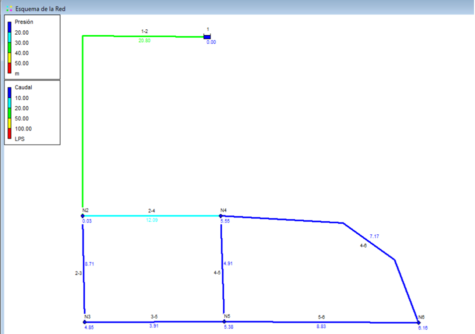

# Curso de Epanet - Módulo 3 - Inclusión de rociadores

<b> Universidad Escuela Colombiana de Ingeniería Julio Garavito</b>
 

Andrés Humberto Otálora Carmona
 

Profesor del Centro de Estudios Hidráulicos
 

andres.otalora@escuelaing.edu.co
 

Keywords: `Rociadores` `Válvulas` `Coeficiente de Caudal` `Nodos`

## Introducción

En esta actividad se presenta de manera general el concepto general de un rociador, las ecuaciones que rigen su comportamiento y el procedimiento sugerido para ingresarse un rociador en una red hidráulica a presión utilizando las herramientas de EPANET en los nodos o uniones.

## Objetivos

El objetivo principal de esta actividad es darle a conocer al usuario las metodologías sugeridas por EPANET para tener en cuenta el comportamiento hidráulico de un rociador en una red hidráulica a presión. Como se verá más adelante los rociadores descarga un caudal en función de la variación de la presión en su salida.

 

 

       

## Rociadores
Un rociador corresponde a un accesorio tipo válvula con una boquilla que permite dispersar el fluido (agua-espuma) de manera controlada en un radio de influencia definido por la presión y el caudal. Generalmente, este tipo de accesorios son utilizados en las redes contra-incendios en las edificaciones, oficinas, bodegas entre otros. 

A manera de contexto a continuación se presenta algunas imágenes de los diferentes disposiciones y diseños de geometrías:

  

  

Epanet define los rociadores a partir de la implementación de una ecuación genérica la cual depende de la relación del caudal con la presión. La ecuación se presentan a continuación:

  

El exponente, para la mayoría de los rociadores (depende del diseño y el proveedor) corresponde a 0.5. El coeficiente C, también llamado el coeficiente de gasto, corresponde a la relación del caudal descargado por el rociador sobre la presión del rociador. En pocas palabras, el caudal descargado está condicionado a la presión ejercida sobre el nodo donde se instala el rociador. 

## Ejemplo de aplicación.

Utilizando la red hidráulica construida y presentada en las actividades anteriores de este módulo (módulo 3) se asumirá que existe un rociador en el nodo 6 con un exponente de 0.5 y un coeficiente de caudal o de gasto de 0.70 LPS/m.c.a

## Emisores (Rociadores) en EPANET

A continuación se presenta de manera resumida el procedimiento utilizado para ingresar un rociador o emisor(como lo llama EPANET) en uno de los nodos del problema. 

_a. Primer debe dirigirse a la barra de herramientas del "Visor" seleccionar "Opciones" y la opción "Hidráulicas". Seleccione o pique el nodo 6 de la red y define por defecto como exponente definida en la ecuación del rociador igual a 0.5._

  

 

_b. Sobre el nudo 6 (el cual se definió que contendría el rociador) dar doble clic y en el apartado "Coeficiente del Emisor" introducir el valor "C" (coeficiente de demanda) que, para nuestro enunciado es igual a 0.70 LPS/m.c.a _

  

 

_c. A manera de comparación se mostrarán los resultados de la red ejecutada sin incluir el rociador en el nodo 6 y posteriormente la misma red incluyendo el rociador. Como puede observar, en el nodo 6 la presión es de 6.16 m.c.a. Utilizaremos este valor como patrón para evaluar como cambia al agregar nuestro rociador_

  

 

_d. Una vez ejecutado el modelo incluyendo el rociador -(emisor) la presión en el nodo 6 (donde se encuentra el rociador) cambia a una presión de 5.31 m.c.a. Cabe resaltar que esta variación de presión modifica adicionalmente la presión y el caudal en todo el sistema (nodos y tuberías), tal como se presenta en la siguiente imagen_

  

 

### Control de versiones

| Versión    | Descripción   | Autor                                      | Horas |
|------------|:--------------|--------------------------------------------|:-----:|
| 2022.07.12 | Versión No. 1 | [AndresOtalora92](https://github.com/AndresOtalora92)  |   2   |

_CursoEpanetBasico-Intermedio es de uso libre para fines académicos.

_¡Encontraste útil este repositorio!, apoya su difusión marcando este repositorio con una ⭐ o síguenos dando clic en el botón Follow de [AndresOtalora92](https://github.com/AndresOtalora92?tab=repositories) en GitHub._

| [Anterior](../ModuloNo.3/ComparacionMetodos.md) | [:house: Inicio](../../README.md) | [:beginner: Ayuda / Colabora] | [Siguiente](../ModuloNo.3/CurvasRendimiento.md) |
|-------------------------------------------------|-----------------------------------|--------------------------------------------------------------------------------------------------|---------------|

 Este curso guía ha sido desarrollado con el apoyo de la Escuela Colombiana de Ingeniería - Julio Garavito. Encuentra más contenidos en https://github.com/uescuelaing  
