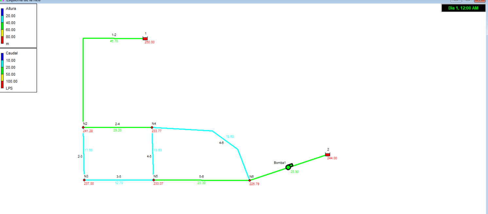
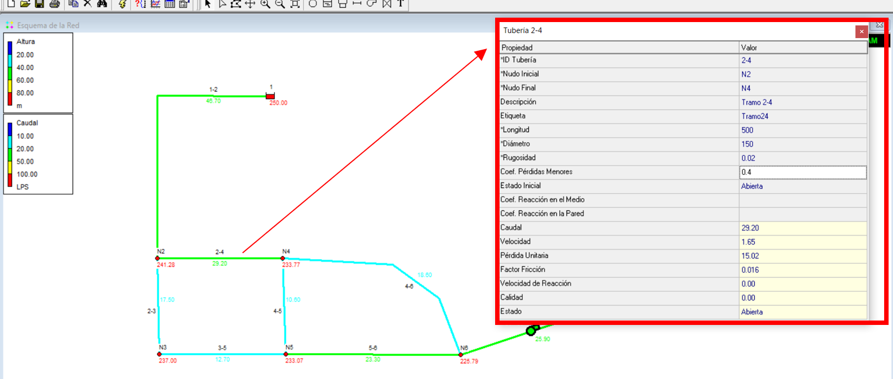

# Curso de Epanet - Módulo 3 - Válvulas y accesorios con pérdidas menores

  

<b> Universidad Escuela Colombiana de Ingeniería Julio Garavito</b>
 

Andrés Humberto Otálora Carmona
 

Profesor del Centro de Estudios Hidráulicos
 

andres.otalora@escuelaing.edu.co
 

Keywords: `Válvulas` `Accesorios` `Pérdidas Menores`

## Introducción

En esta actividad se presenta el procedimiento recomendado para tener en cuenta las pérdidas de energía localizada o menores generadas por diferentes accesorios en una red de drenaje con flujo a presión utilizando EPANET. 

## Objetivos

El objetivo principal de esta actividad es aplicar en el software los conceptos vistos en la actividad "Pérdidas de energía" del módulo 1. A partir de un ejercicio de aplicación y conociendo los coeficientes de pérdidas menores de diferentes accesorios, se ingresará la información. Adicionalmente se comprenderán los tipos de válvulas incorporadas en EPANET.

 

 

       

## Ejemplo de aplicación

Utilizando la red hidráulica construida y presentada en las actividades anteriores de este módulo (módulo 3) se desarollará esta actividad. Se adicionará los siguientes accesorios a la red (los valores de "K" de cada tramo de tubería fueron tomados de las tablas de la actividad "Pérdidas de energía" del módulo 1:

  

Adicionalmente se adicionará un nuevo tramo de tubería con una válvula Reductora de Presión o tipo VRP según EPANET.

## Tipos de válvulas en EPANET

EPANET dentro de su base de datos permite la modelación de seis (6) tipos de válvulas las cuales se resumen a continuación:

| Siglas | Tipo de válvula |
|--------|:----------------|
| PRV    | Válvula reductora de presión  | 
| PSV    | Válvula sostenedora de presión  | 
| PBV    | Válvula de rotura de carga | 
| FCV    | Válvula controladora de caudal | 
| TCV    | Válvula reguladora por estrangulación  | 
| GPV    | Válvula de proposito general | 

Las variables que deben definirse para cada una de las válvulas corresponden a:

| Siglas | "Consigna" o "restricción"             |
|--------|:---------------------------------------|
| PRV    | Presión (m o psi)                      | 
| PSV    | Presión (m o psi)                      | 
| PBV    | Presión (m o psi)                      | 
| FCV    | Caudal (en unidades de caudal)         | 
| TCV    | Coeficiente de pérdidas (adimensional) | 
| GPV    | ID o curva de pérdidas                 | 

Tomando la información del manual de ayuda al usuario de EPANET en su apartado 3.1.8 es posible distinguir los tipos de válvulas y sus usos. A continuación se transcribe este resumen:

### Válvula reductora de presión (PRV) 
La PRV limita la presión en un punto de la red, sobre un tramo de tubería. EPANET establece tres formas de operación:

• Parcialmente abierta (es decir, activa) para mantener una presión aguas abajo, siempre y cuando la presión aguas arriba sea superior a esta.

• Totalmente abierta, cuando la presión aguas arriba
está por debajo de la especificada en la propiedad Consigna (Setting); el parámetro a controlar con este tipo de válvula es la presión, razón por la  cual en la propiedad Consigna se debe introducir la presión deseada en la conexión o nudo aguas abajo de la válvula.

• Cerrada, si la presión aguas abajo es superior a la presión aguas arriba, para impedir el flujo inverso.

### Válvula sostenedora de presión (PSV) 
La PSV mantiene una presión determinada en un punto específico de la red. EPANET diferencia tres modos de funcionamiento:

• Parcialmente abierta, para mantener la presión especificada en la propiedad Consigna) aguas arriba de la válvula cuando la presión aguas abajo es menor.

• Totalmente abierta, si la presión aguas abajo es  superior a la especificada en la propiedad Consigna.

• Cerrada, si la presión aguas abajo es superior a la presión aguas arriba para impedir el flujo inverso.

### Válvula de rotura de carga (PBV)

La PBV obliga a que la caída de presión en la válvula sea siempre un valor predeterminado por el usuario. El caudal que conduce la válvula puede ir en ambas direcciones. Las PBV no son mecanismos físicos verdaderos, pero pueden usarse para modelar situaciones donde exista una caída de presión local conocida.

### Válvula limitadora o controladora de caudal (FCV)

Las FCV limitan el caudal a un valor específico. EPANET mostrará un mensaje de advertencia si el caudal no se puede mantener sin un aporte de presión en la válvula (es decir, el caudal no se podrá mantener con la válvula totalmente abierta). Se debe tener especial atención en las FCV a la hora de simular un modelo hidráulico, ya que no pueden conectarse directamente a un depósito o tanque (utilice una tubería para separarlos).

### Válvula de regulación o reguladora por estrangulación
(TCV)

Las TCV simulan una válvula parcialmente cerrada, ajustando adecuadamente el valor del coeficiente de pérdidas
menores. Normalmente, los fabricantes proporcionan una relación entre el grado de cierre de la válvula y el coeficiente de pérdidas resultante.

### Válvula de propósito general (GPV)

Las GPV se utilizan para representar un elemento con un comportamiento diferente y una relación entre el caudal y las pérdidas de energía. Además, se puede hacer uso de esta válvula para simular otro tipo de elementos físicos en un sistema de acueducto. Por ejemplo, simular turbinas, pozos de aspiración o válvulas preventivas contracorriente y reductoras de caudal (Rossman, 2000).  Para lograr modelar una GPV se requiere de una curva característica (se utiliza la misma ruta de acceso descrita para una curva característica de una bomba) que relacione las pérdidas de energía en el eje de las ordenadas (expresado en metros) y el caudal en el eje de las abscisas (expresado en litros por segundo).

## Accesorios menores, pérdidas localizadas y válvulas utilizando EPANET

_a. Para este ejericio se agregarán en cada uno de los cuatro tramos definidos en el enunciado del problema, la suma de los coeficientes de pérdidas de los accesorios que se encuentra en los tramos._

  

_b. Dando doble clic en la tubería 1-2 y escribiendo en el espacio "Coeficiente de pérdidas menores" la sumatoria de los coeficientes K de pérdidas de los accesorios en el tramo de tubería que corresponde a: 22.8._

  

_c. Dando doble clic en la tubería 2-4 y escribiendo en el espacio "Coeficiente de pérdidas menores" la sumatoria de los coeficientes K de pérdidas de los accesorios en el tramo de tubería que corresponde a: 0.40._

  

_d. Dando doble clic en la tubería 5-6 y escribiendo en el espacio "Coeficiente de pérdidas menores" la sumatoria de los coeficientes K de pérdidas de los accesorios en el tramo de tubería que corresponde a: 2.40._

  

_e. Dando doble clic en la tubería 4-6 y escribiendo en el espacio "Coeficiente de pérdidas menores" la sumatoria de los coeficientes K de pérdidas de los accesorios en el tramo de tubería que corresponde a: 0.70._

  

_f. Una vez completado los coeficientes de pérdidas menores en todos los tramos que tienen accesorios, se procede a ejecutar el modelo. Tal como es lógico, al comparar los resultados obtenidos en el primer modelo (modelo que no incluye pérdidas menores) con el nuevo modelo (inlcuyendo las pérdidas menores) se observa una clara reducción en los caudales que circulan por el sistema. Esto se debe, tal como se explica en el módulo 1, a la disminución de las pérdidas de energía entre tramos debido a estos accesorios. Estas pérdidas de energía en el sistema también afecta, como es de esperarse, a las presiones en cada uno de los nodos que conforman la red._

  

_g. Ahora se realizará un ejemplo de inclusión de una válvula reductora de presión que restrinja la presión en -8.0 m.c.a (ver el capítulo de "Válvula reductora de presión (PRV)"). Para realizar esto se eliminará el tramo de tubería que une los nodos N2 y N4 y se agregará una válvula (que incluye a su vez el tramo de tubería), utilizando el ícono de la válvula que se encuentra en la barra de herramientas de "atajos"_

  

_h. Una los nodos N2 y N4 con la válvula. Diligencia los campo solicitados por el programa al dar doble clic sobre la válvula que acaba de crear.  En la opción "tipo válvula" seleccione, para este caso, "Reductor". En la opción "Consigna" escriba la restricción de presión, que en este caso es -8.0 m.c.a. En la opción "Estado Forzado" escriba "ninguno" (también es posible abierto o cerrado dependiendo de lo que se quiere hacer una vez se alcance esta presión). Finalmente, para representar el tramo que se eliminó, en la opción "Coef. Pérdidas" digite la sumatoria de pérdidas menores que había en el tramo 2-4_

  

_i. Ejecute el modelo y revise la información. Como se podrá dar cuenta viendo la siguiente imagen, debido a que la presión aguas abajo es mayor a la presión aguas arriba y mayor que -8.0 m.c.a, la válvula se ha cerrado cuando el flujo en este punto (N4) alcanzó la presión límite, restringiendo el caudal que llega al N6 y por tanto, restringiendo el caudal en el tramo de tubería 2-4_

  

### Control de versiones

| Versión    | Descripción   | Autor                                      | Horas |
|------------|:--------------|--------------------------------------------|:-----:|
| 2022.08.12 | Versión No. 1 | [AndresOtalora92](https://github.com/AndresOtalora92)  |   2   |

_CursoEpanetBasico-Intermedio es de uso libre para fines académicos.

_¡Encontraste útil este repositorio!, apoya su difusión marcando este repositorio con una ⭐ o síguenos dando clic en el botón Follow de [AndresOtalora92](https://github.com/AndresOtalora92?tab=repositories) en GitHub._

| [Anterior](../ModuloNo.3/TanqueAsimetricos.md) | [:house: Inicio](../../README.md) | [:beginner: Ayuda / Colabora] | [Siguiente](../ModuloNo.3/Calibracion.md) |
|-------------------------------------------------|-----------------------------------|--------------------------------------------------------------------------------------------------|---------------|

 Este curso guía ha sido desarrollado con el apoyo de la Escuela Colombiana de Ingeniería - Julio Garavito. Encuentra más contenidos en https://github.com/uescuelaing  
