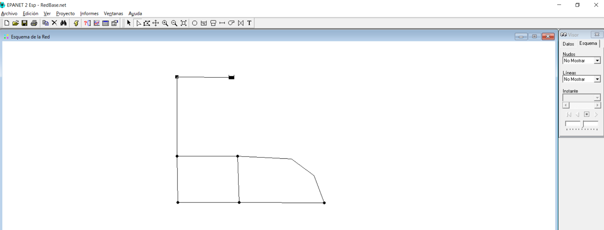
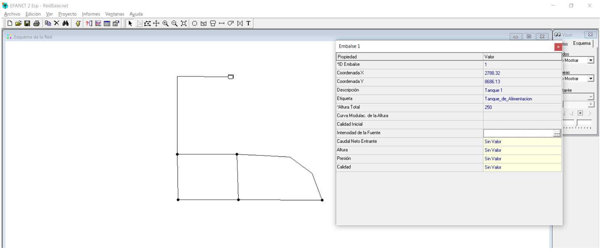
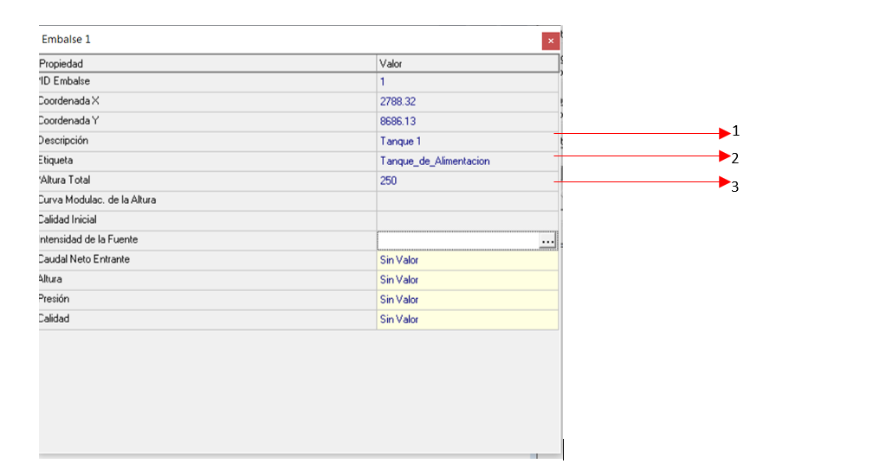
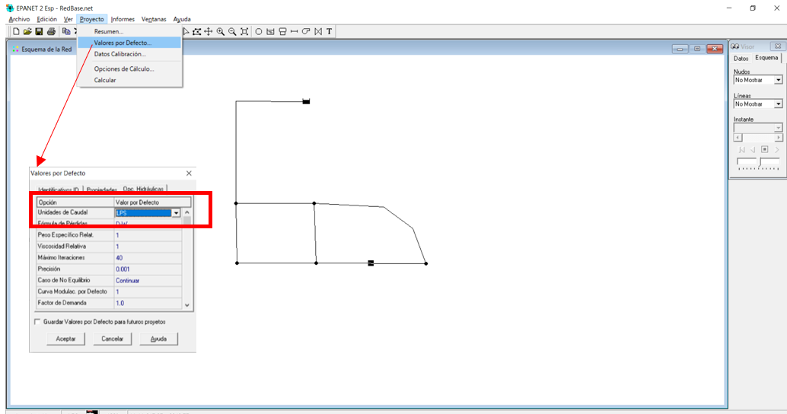
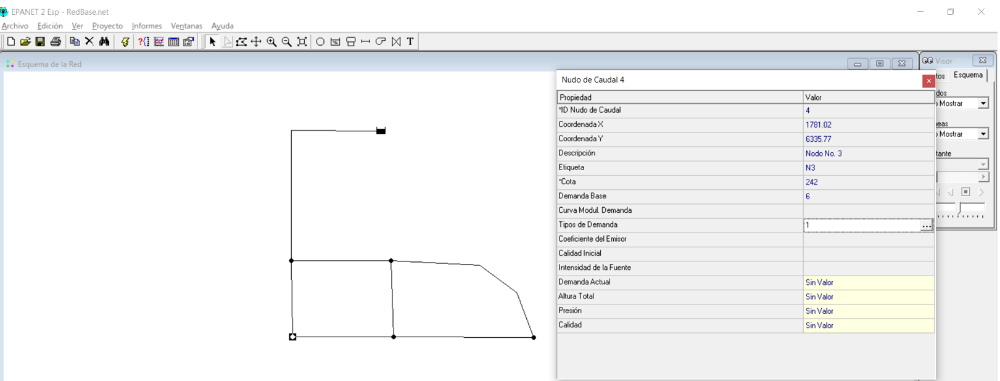
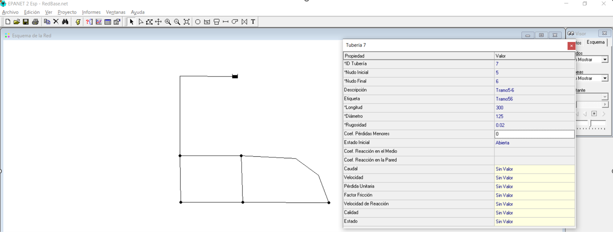
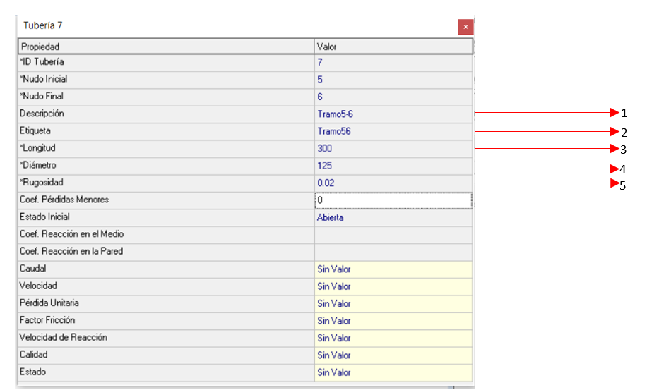
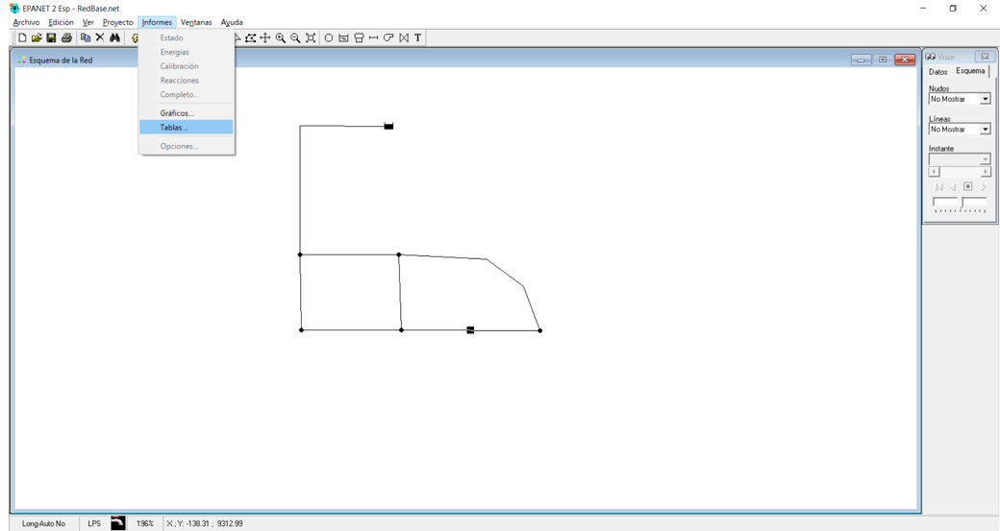
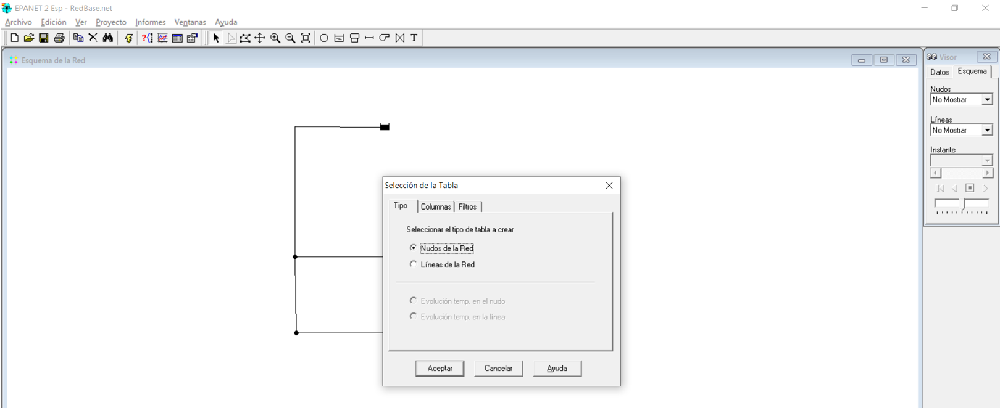
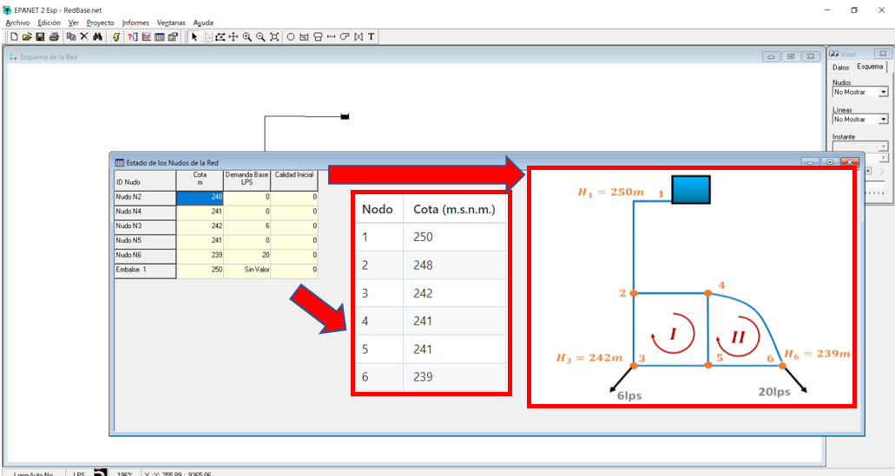

# Curso de Epanet - Módulo 2 - Alimentación del modelo Epanet. Elementos de la red

  

<b> Universidad Escuela Colombiana de Ingeniería Julio Garavito</b>
 

Andrés Humberto Otálora Carmona
 

Profesor del Centro de Estudios Hidráulicos
 

andres.otalora@escuelaing.edu.co
 

Keywords: `EPANET` `geometría` `Cargue información`

## Introducción

En este módulo se muestra el procedimiento sugerido para el cargue de información básica que deben tener los elementos u objetos básicos que componen una red de tuberías utilizando el software EPANET.

## Objetivos

El objetivo principal de esta actividad es mostrarle al usuario como cargar, ingresar y editar la información básica necesaria para alimentar adecuadamente la red. Para realizar este objetivo se utilizará un problema base teórico con información de longitudes, materiales, diámetros, niveles y caudales demandados en alguno de los nodos que componen una red cerrada con un solo ciclo, cuyo caudal es generado por el nivel constante en un tanque. 

 

 

       

## Enunciado del problema para la aplicación de la actividad.

A continuación se presenta la información base correspondiente a la red de tuberías (sistema cerrado con un ciclo) alimentada por un tanque elevado de nivel constante que descarga a varios tramos de red. La información de la geometría, demanda en los niveles y nivel del tanque se presentan resumidos en la siguiente imagen:

  

**Notas:** 

**1. Las cotas de cada nodo se presentan en la siguiente tabla:**

| Nodo | Cota (m.s.n.m.) | 
|------|:----------------|
| 1    | 250             |
| 2    | 248             |
| 3    | 242             |
| 4    | 241             |
| 5    | 241             |
| 6    | 239             |

 

**2. La rugosidad del material de las tuberías es de 0.02 mm:**
 
**3. Se asumirá que no existen pérdidas de energía localizadas o menores:**

 

## Cargar información en el tanque de alimentación de nivel constante

_a. Una vez haya creado el esqueleto o geometría base del problema (ver las actividades anteriores de este módulo), abra el archivo donde lo creo y revise con cuidado_

  

_b.De doble clic sobre la imagen que representa el tanque. Se abrirá la ventana de información del tanque. Una vez esté abierta esta ventana proceda a editar de la siguiente manera:_

  

  

 

**1) Asigne un nombre corto que permita identificar la descripción**
 
**2) Asigne un nombre corto que permita identificar la etiqueta**
 
**3) Escriba el valor del nivel del agua en el tanque en unidades de metros sobre el nivel de mar (m.s.n.m.)**
 

## Cargar información en los nodos (incluyendo caudales de demanda)

_c. Antes de cargar la información correspondiente a los nodos, revise las unidades del caudal. Para este caso, diríjase a la barra de herramientas "Proyecto", después en la opción "Valores por defecto" y revise si las unidades del caudal se encuentra en litros/segundo (LPS o L/s)_

  

_d.De doble clic sobre la imagen que representa uno de los nodos. Se abrirá la ventana de información del nodo. Una vez esté abierta esta ventana proceda a editar de la siguiente manera (debe repetir este procedimiento para todos los nodos del sistema):_

  

  

**1) Asigne un nombre corto que permita identificar la descripción**
 
**2) Asigne un nombre corto que permita identificar la etiqueta**
 
**3) Escriba el valor del nivel del agua en el tanque en unidades de metros sobre el nivel de mar (m.s.n.m.)**
 
**4) Escriba el valor del caudal en LPS. Si el nodo no requiere de una demanda (consumo) escriba (0)**

## Cargar información en las tuberías y tramos de la red

_e.De doble clic sobre la imagen que representa un tramo de tubería. Se abrirá la ventana de información de la tubería. Una vez esté abierta esta ventana proceda a editar de la siguiente manera (debe repetir este procedimiento para todos los nodos del sistema):_

  

  

**1) Asigne un nombre corto que permita identificar la descripción**
 
**2) Asigne un nombre corto que permita identificar la etiqueta**
 
**3) Escriba la longitud del tramo de la tubería (si tiene inclinación debe ingresar la longitud total real y no la longitud del trazado en planta de un posible plano) en unidades de (m)**
 
**4) Escriba el diámetro de la tubería en unidades de milímetros (mm)**
 
**5) Escriba la rugosidad absoluta del material de la tubería en unidades de (mm)**

## Revisar la información cargada 

_f.Una vez cargada la información el siguiente paso es revisar que esta haya sido cargada adecuadamente. Una de las formas más fáciles de hacerlo (ya que puede visualizarse todo el sistema de manera resumida) es con la herramienta de "informes" y la categoría "Tablas"_

  

_g.Una vez ejecutada la categoría "Tablas" seleccionada "Línea de la red" y dar clic en aceptar_

  

_h.Se abrirá una tabla la cual puede comparar con la tabla inicial del problema_

  

_i.Repita el mismo procedimiento del numeral "f" pero esta vez seleccione la opción "Nodos o Nudos en la red" y de clic en aceptar_

  

_j. Al igual que con el paso "h" se abrirá una tabla la cual puede comparar con la tabla y el esquem inicial del problema_

  

### Control de versiones

| Versión    | Descripción   | Autor                                      | Horas |
|------------|:--------------|--------------------------------------------|:-----:|
| 2022.04.12 | Versión No. 1 | [AndresOtalora92](https://github.com/AndresOtalora92)  |   1   |
| 2022.05.12 | Versión No. 1 | [AndresOtalora92](https://github.com/AndresOtalora92)  |  3  |

_CursoEpanetBasico-Intermedio es de uso libre para fines académicos..

_¡Encontraste útil este repositorio!, apoya su difusión marcando este repositorio con una ⭐ o síguenos dando clic en el botón Follow de [AndresOtalora92](https://github.com/AndresOtalora92?tab=repositories) en GitHub._

| [Anterior](../ModuloNo.2/ImportardesdeCAD.md)| [:house: Inicio](../../README.md) | [:beginner: Ayuda / Colabora] | [Siguiente](../ModuloNo.2/AnalisisResultados.md) |
|----------------------------|-----------------------------------|--------------------------------------------------------------------------------------------------|--------------------------------------------------|

 Este curso guía ha sido desarrollado con el apoyo de la Escuela Colombiana de Ingeniería - Julio Garavito. Encuentra más contenidos en https://github.com/uescuelaing  
