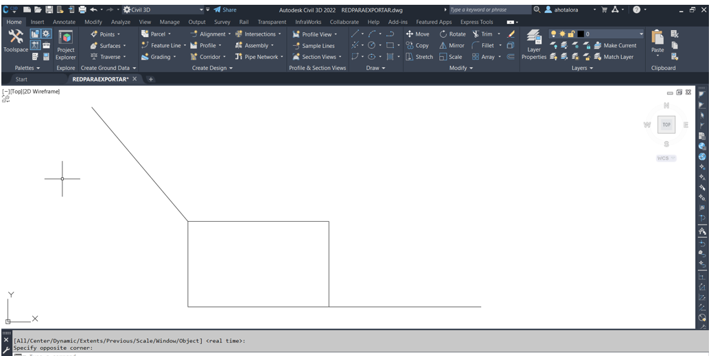
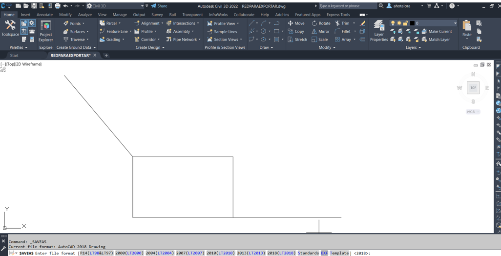
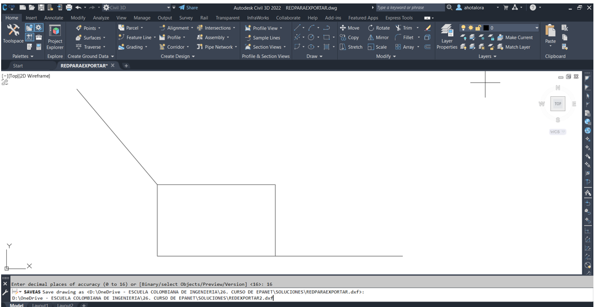
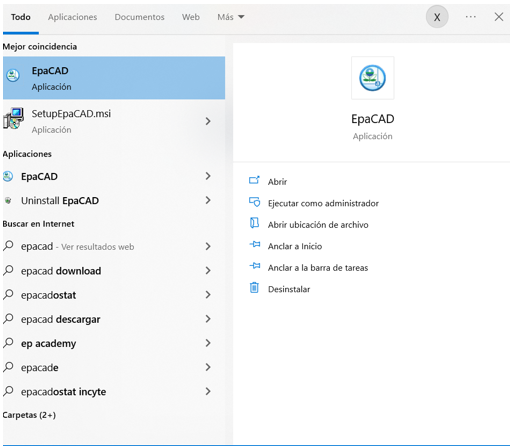
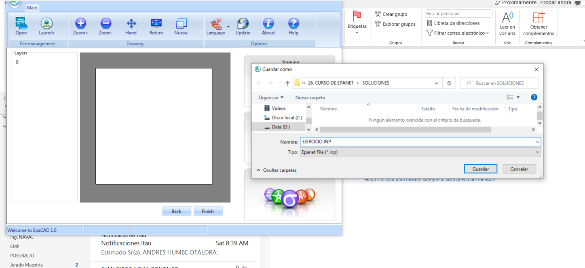
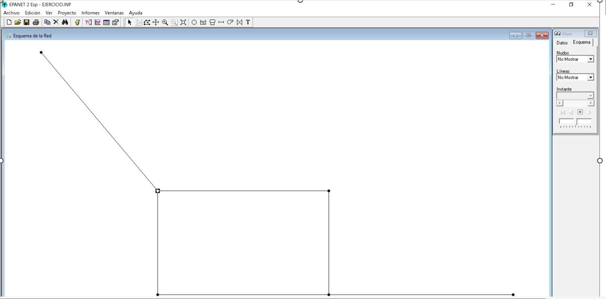

# Curso de Epanet - Módulo 2 - Importación de elementos desde AutoCAD a EPANET utilizando EPACAD

  

<b> Universidad Escuela Colombiana de Ingeniería Julio Garavito</b>
 

Andrés Humberto Otálora Carmona
 

Profesor del Centro de Estudios Hidráulicos
 

andres.otalora@escuelaing.edu.co
 

Keywords: `EPANET` `geometría` `EPACAD` `AUTOCAD` `Importar red`

## Introducción

En este módulo se describe un procedimiento particular para el cargue o importación de la geometría básica de una red de tuberías (incluyendo sus nodos) tomando un archivo previamente elaborado el AUTOCAD o CIVIL3D utilizando el software complementario EPACAD.

## Objetivos

El objetivo principal de esta actividad es permitirle al usuario aprender una metodología adicional para la elaboración del esqueleto o geometría de una red utilizando AUTOCAD o CIVIL3D. En los casos de la ingeniería aplicada, como por ejemplo redes complejas de edificaciones o red de acueducto, el manejo de la información gráfica requiere que la red sea construida o elaborada en software de dibujo técnico. 

 

 

       

### Carga una red previamente construido en AutoCAD (uso de EPACAD)

Otra manera de tener una red en EPANET consiste en cargar una red previamente elaborada en CAD, bien sea en AutoCAD clásico o en Civil3D. 

Al crear polilíneas independientes, divididas en los vertices que se convertirán en nodos y trabajando todo sobre una capa, es posible cargar el archivo en EPANET utilizando el software EPACAD, software que puede ser descargado en el siguiente link:

[Link de descarga del aplicativo EPACAD](https://www.google.com/search?q=epacad&rlz=1C1SQJL_esCO854CO854&oq=epacad&aqs=chrome..69i57j0i512l4j0i10i512l2j0i512.1360j0j7&sourceid=chrome&ie=UTF-8)

_a. Abrir el AUTOCAD o el CIVIL3D en el cual se haya construido previamente la red (se debe tener en cuenta que cada final de un polilínea se convertirá en un nodo_

  

_b. En la barra de menu del AUTOCAD o del CIVIL3D buscar la opción "guardar como" o "guardar con otro formato"_

  

_c. Seleccionar la opción formato ".dxf"_

  

_d. Seleccionar la ruta en la cual guardará el archivo con este formato_

  

_e. Buscar y abrir el software EPACAD previamente instalado_

  

_f. En la barra de herramientas dar click en "abrir" o "abrir archivo" y buscar la ruta donde guardó el archivo ".dfx"_

  

_g. Seleccionar la capa donde creó todA la red (en este caso la capa se construyó en la capa "0". Seleccionar en el "modo de conversión" la opción "Modo Node" y dar clic en "siguiente"_

  

_h. Guardar el archivo en formato ".inp" en la ruta que el usuario decida y pueda encontrarla fácilmente_

  

_i. Abrir el EPANET y en la barra de herramientas "Archivo" busca la opción "abrir" y busque el archivo con extensión ".inp"_

  

_j. Revise que las tuberías y los nodos hayan sido cargados exitosamente. Revise las propiedades y comparé si su red creado en AUTOCAD o CIVIL3D coincide con lo importado al EPANET._

  

### Control de versiones...

| Versión    | Descripción   | Autor                                      | Horas |
|------------|:--------------|--------------------------------------------|:-----:|
| 2022.04.12 | Versión No. 1 | [AndresOtalora92](https://github.com/AndresOtalora92)  |   2   |

_CursoEpanetBasico-Intermedio es de uso libre para fines académicos.

_¡Encontraste útil este repositorio!, apoya su difusión marcando este repositorio con una ⭐ o síguenos dando clic en el botón Follow de [AndresOtalora92](https://github.com/AndresOtalora92?tab=repositories) en GitHub._

| [Anterior](../ModuloNo.2/Trazado_red_EPANET.md)| [:house: Inicio](../../README.md) | [:beginner: Ayuda / Colabora] | [Siguiente](../ModuloNo.2/AlimentacionEPANET.md) |
|----------------------------|-----------------------------------|--------------------------------------------------------------------------------------------------|---------------|

 Este curso guía ha sido desarrollado con el apoyo de la Escuela Colombiana de Ingeniería - Julio Garavito. Encuentra más contenidos en https://github.com/uescuelaing  
