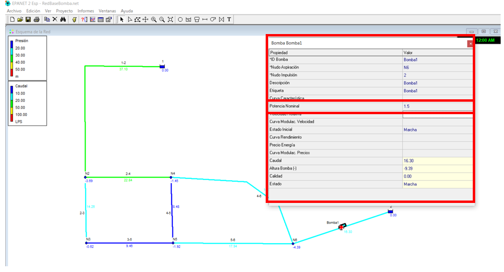
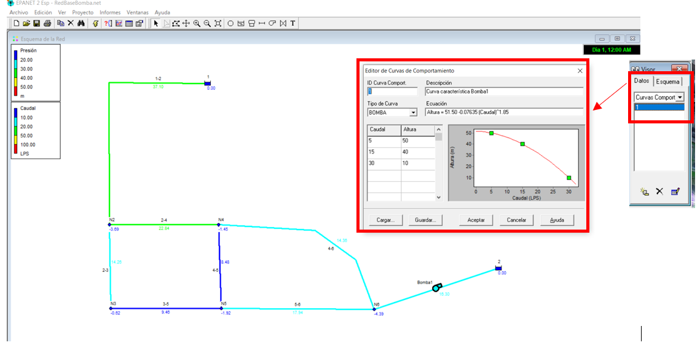
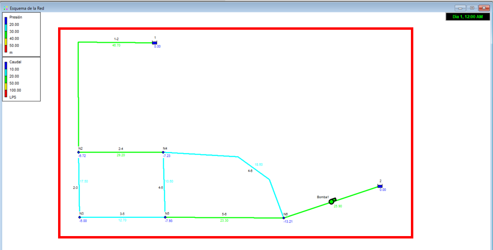

# Curso de Epanet - Módulo 3 - Curvas de rendimiento de bombas hidráulicas

  

<b> Universidad Escuela Colombiana de Ingeniería Julio Garavito</b>
 

Andrés Humberto Otálora Carmona
 

Profesor del Centro de Estudios Hidráulicos
 

andres.otalora@escuelaing.edu.co
 

Keywords: `Bombas` `Curva de rendimientos` `Sistemas de bombeo`

## Introducción

En esta actividad se presenta la metodología sugerida para la asignación de una bomba en un sistema de tuberías con flujo a presión incluyendo su curva de calibración o curvas de rendimientos utilizando el software EPANET.

## Objetivos

El objetivo principal de esta actividad es, con base en los conceptos analizados en el módulo 1 de la actividad "Conceptos de bombas hidráulicas", darle a conocer al usuario el procedimiento sugerido para ingresar una curva de rendimiento o curva característica de una bomba en una red hidráulica. 

 

 

       

## Ejemplo de aplicación

Utilizando la red hidráulica construida y presentada en las actividades anteriores de este módulo (módulo 3) se le adicionará a la red un nuevo tramo en el que se incluye una bomba centrífuga.

Para este ejercicio se realizarán dos modelaciones:

1. Asumiendo una bomba de arranque directo con potencia constante de 15 kW.
2. Asumiendo una bomba de arranque directo con una curva de rendimiento o curva característica que presenta los siguientes puntos de operación:

| Caudal (LPS) | Ht(m) | 
|--------------|:------|
| 5            | 50    | 
 | 15           | 40    | 
 | 30           | 10    | 

## Concepto de bomba centrífuga y curva característica

Se recomienda que antes de revisar esta actividad el lector y usuario de EPANET revise nuevamente los conceptos detallados y explicados en la actividad> [Conceptos_bombas_hidraulicas](../ModuloNo.3/Conceptos_bombas_hidraulicas.md) presentada en el módulo 1 de este curso.

## Bomba Centrífuga en EPANET.

_a. Para iniciar con este ejericio se deberá abrir la red que se trazó y modeló en las actividades anteriores_

  

 

_b. Se creará un nuevo tramo de red que comprenda una tubería virtual sin longitud que conecte a un tanque elevado con una cota de 244.0 m.s.n.m. El tanque se debe crear, tal como se vio en las actividades del módulo 2. Una vez creado el tanque elevado, en la barra de herramientas dar clic en el ícono de bombas y unir el nodo 6 con el tanque 2 (se debe dar clic en los objetos mencionados en el orden indicado)_

  

 

_c. Como primer ensayo, no se introducirá una curva característica en la bomba sino una potencia nominal constante (el caudal es el mismo sin importar la cota a la cual se requiere llegar) de 1.5 kW. Esto se debe hacer al dar dos clic en la bomba cread y diligenciar el campo "Potencia Nominal"_

  

 

_d. Los resultados de la variación de los caudales en cada nodo y en cada tramo de tubería, en especial el tramo compuesto entre el nodo 6 y el tanque 2 se presentan a continuación:_

  

 

_e. Ahora se realizará el mismo procedimiento pero incluyendo la curva característica de la bomba definida en el enunciado del problema. Para este caso en la barra de herramientas "Visor" en la opción "Curva Compuesta" diligenciar los campos correspondientes al caudal (LPS) y a la altura de bombeo (metros). A medida que el usuario introduce los valores, el software dibuja la curva con base en una función cuadrática tipo Q=A-B*x², tal como se observa en la siguiente imagen_

  

 

_f. Una vez construida la curva se procede a asignar dicha curva a la bomba creada en la geometría. Al dar doble clic en la bomba, en la opción "Curva Caractarística" asignarle el nombre de la curva creada, que en este caso es "1"_

  

 

_g. Al realizar los anteriores procedimientos y ejecutar el programa (utilizando la barra de herramientas) es posible revisar los resultados de las presiones, caudales, velocidad, entre otras variables, utilizando las metodologías y herramientas detalladas en el módulo 2. En el siguiente ejemplo se muestra los resultados utilizando el visor y las "leyendas"_

  

### Control de versiones

| Versión    | Descripción   | Autor                                      | Horas |
|------------|:--------------|--------------------------------------------|:-----:|
| 2022.07.12 | Versión No. 1 | [AndresOtalora92](https://github.com/AndresOtalora92)  |  1.5  |

_CursoEpanetBasico-Intermedio es de uso libre para fines académicos.

_¡Encontraste útil este repositorio!, apoya su difusión marcando este repositorio con una ⭐ o síguenos dando clic en el botón Follow de [AndresOtalora92](https://github.com/AndresOtalora92?tab=repositories) en GitHub._

| [Anterior](../ModuloNo.3/Rociadores.md) | [:house: Inicio](../../README.md) | [:beginner: Ayuda / Colabora] | [Siguiente](../ModuloNo.3/TanqueAsimetricos.md) |
|-------------------------------------------------|-----------------------------------|--------------------------------------------------------------------------------------------------|----------------------------------------|

 Este curso guía ha sido desarrollado con el apoyo de la Escuela Colombiana de Ingeniería - Julio Garavito. Encuentra más contenidos en https://github.com/uescuelaing  
