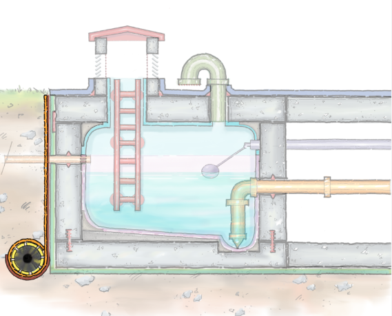
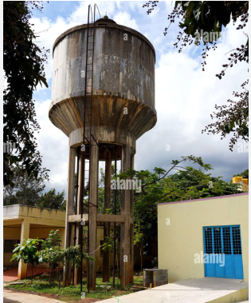
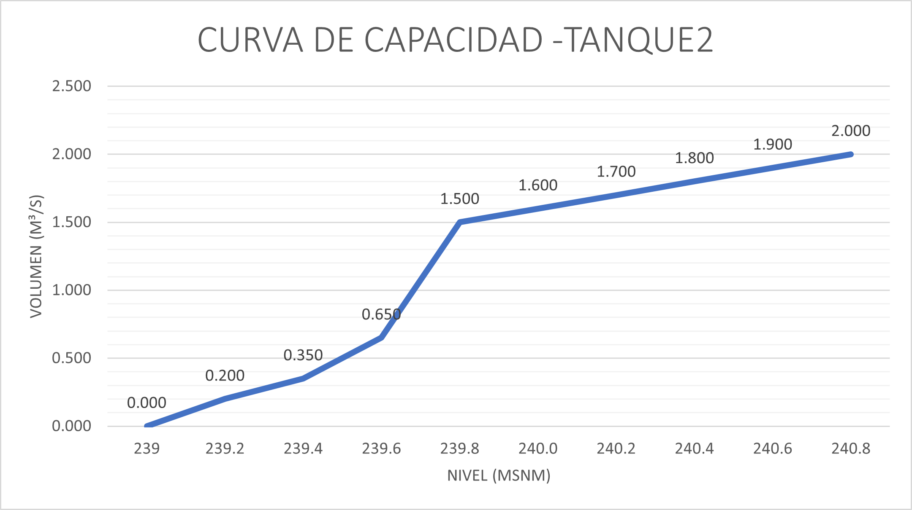
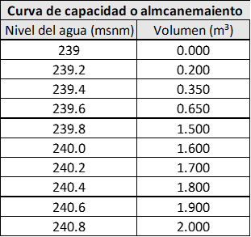
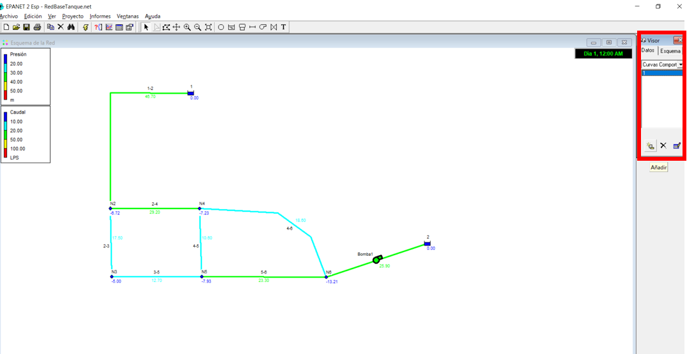
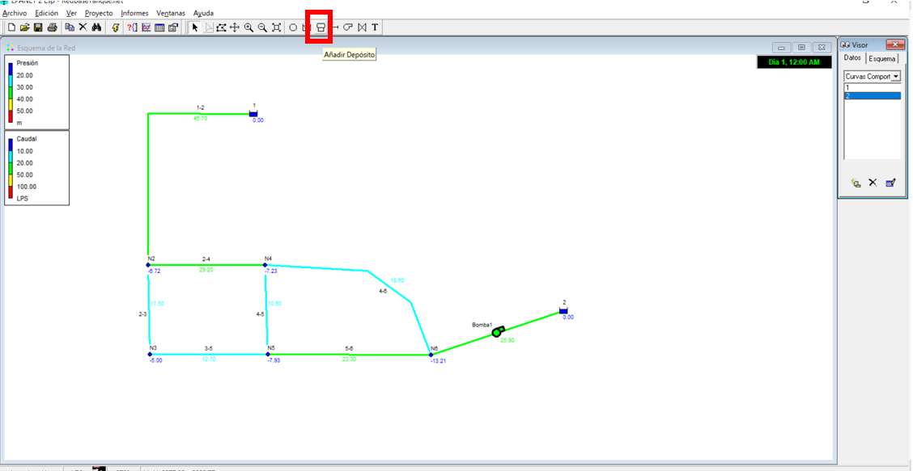
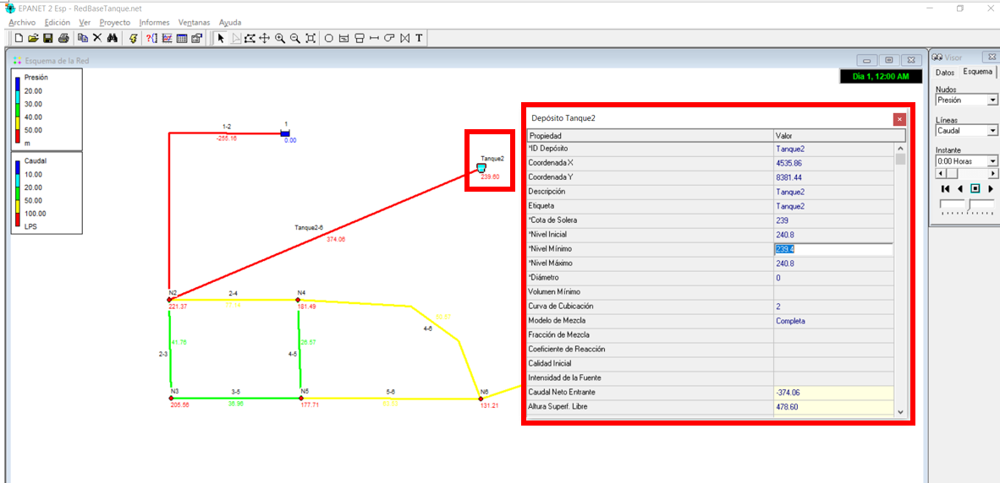
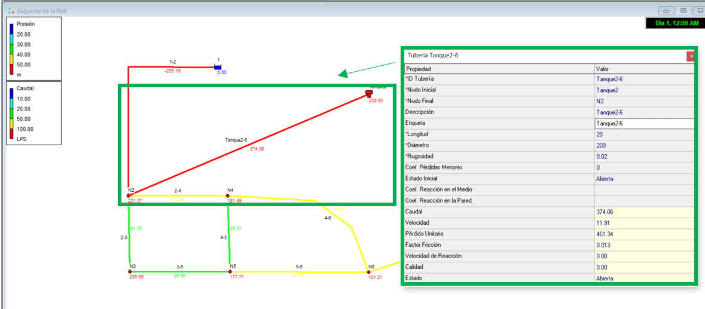
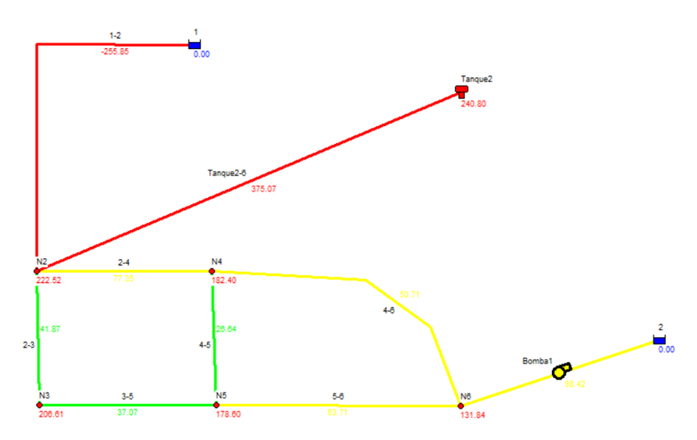

# Curso de Epanet - Módulo 3 - Tanque de alimentación asimétricos

  

<b> Universidad Escuela Colombiana de Ingeniería Julio Garavito</b>
 

Andrés Humberto Otálora Carmona
 

Profesor del Centro de Estudios Hidráulicos
 

andres.otalora@escuelaing.edu.co
 

Keywords: `Tanques` `Asimétricos` `Alimentación`

## Introducción

En esta actividad se presenta la metodología y los conceptos para trabajar con un tanque asimétrico trabajando a partir de su curva de almacenamiento o curva de capacidad.

## Objetivos

El objetivo principal de esta actividad es darle a conocer el usuario las posibilidades que tiene para incorporar tanques simétricos o asimétricos a partir del ingres de su curva de almacenamiento o capacidad. 

 

 

       

## Tanque asimétricos y curva de capacidad

Como su nombre lo indica, un tanque asimétrico corresponde a aquel tanque cuya geometría no es regular y por tanto, el volumen de almacenado (cuando el tanque es alimentado)  o volumen de descarga (cuando el tanque es alimentado) cambia en función del nivel del agua en dicho tanque. Los tanques irregulares son generalmente usados en viviendas, edicificaciones de poca altura, hospitales, zonas de extracción de minerales, zonas con reservorios temporales, entre otros.

A continuación se presentan algunos ejemplos de tanque asimétricos.

  

  

Una curva de capacidad o curva de almacenamiento corresponde al gráfico y/o función que representa el volumen acumulado para cada nivel de agua que se mida en el tanque.  

A continuación se presentan un ejemplo de una curva de capacidad o de almacenamiento.

  

## Ejemplo de aplicación

Utilizando la red hidráulica construida y presentada en las actividades anteriores de este módulo (módulo 3) se desarollará esta actividad. Se adicionará a la red un nuevo tramo que descargará al nodo 2 y que inicia en un tanque o reservorio asimétrico con la siguiente curva de almacenamiento o curva de capacidad:

  

 

  

Se asumirá que el nivel inicial del tanque en la modelación es de 240.8 m.s.n.m (siendo este también el nivel máximo) y con un nivel mínimo e 239.4 m.s.n.m

## Tanque asimétrico con curva de almacenamiento en EPANET

_a. Tomando como referencia la red de drenaje construida y trabajando en las actividades anteriores se procederá a adicionarle un tanque asimétrico con curva de almacenamiento el cual alimentará de manera variable el nodo N2. En la siguiente imagen se presenta es esquema base de trabajo._

  

_b. Para crear la curva de capacidad del tanque o reservorio es necesario seleccionar la opción "Curva de Comportamiento" presente en "Datos" de la barra de herramientas "Visor"_

  

_c. Una vez dentro en la opción "Curva de comportamiento"  seleccionar "Tipo de Curva" y buscar la opción "Cubicación". En las dos columnas que se presenta en esta ventana escriba digite los valores que corresponden a la curva de almacenamiento_

  

_d. Ahora se adicionará el tanque dando clic en el símbolo de la imagen y picando en cualquier lugar del área de trabajo._

  

_e. Una vez construido, de doble clic en el tanque dibujado y se abrirá la ventana de opciones del tanque. Escriba la información requerida en el tanque la cual corresponde a: Cota de la solera (fondo del tanque), Nivel Inicial, Nivel Máximo y Nivel Mínimo. En la opción "Curva de Cubicación" escriba el nombre de la curva de almacenamiento que acaba de crear, que en este caso corresponde a "2"_

  

_f. Para unir el tanque que se ha creado con uno de los nodos existentes (nodo 2) procederemos a crear un tramo de tubería, siguiendo el procedimiento explicado en la actividad 2 y 3 del módulo 2. Se diligencia la información respectiva y se revisan los valores por defecto_

  

_g. Una vez unido el tanque con el nodo 2 y revisado la información ingresada al modelo, se procede a ejecutarlo. Como se puede observar en la siguiente imagen, existe una variación importante del caudal transitado en cada una de las tuberías y en las presiones de los nodos. La tarea del usuario y del diseñador es tomar la decisión sobre la lógica de los resultados y como estos se acomodan a los diseños planteados en su proyecto_

  

### Control de versiones

| Versión    | Descripción   | Autor                                      | Horas |
|------------|:--------------|--------------------------------------------|:-----:|
| 2022.08.12 | Versión No. 1 | [AndresOtalora92](https://github.com/AndresOtalora92)  |   2   |

_CursoEpanetBasico-Intermedio es de uso libre para fines académicos.

_¡Encontraste útil este repositorio!, apoya su difusión marcando este repositorio con una ⭐ o síguenos dando clic en el botón Follow de [AndresOtalora92](https://github.com/AndresOtalora92?tab=repositories) en GitHub._

| [Anterior](../ModuloNo.3/CurvasRendimiento.md) | [:house: Inicio](../../README.md) | [:beginner: Ayuda / Colabora] | [Siguiente](../ModuloNo.3/ValvulasyAccesorios.md) |
|-------------------------------------------------|-----------------------------------|--------------------------------------------------------------------------------------------------|----------------------------------------|

 Este curso guía ha sido desarrollado con el apoyo de la Escuela Colombiana de Ingeniería - Julio Garavito. Encuentra más contenidos en https://github.com/uescuelaing  
